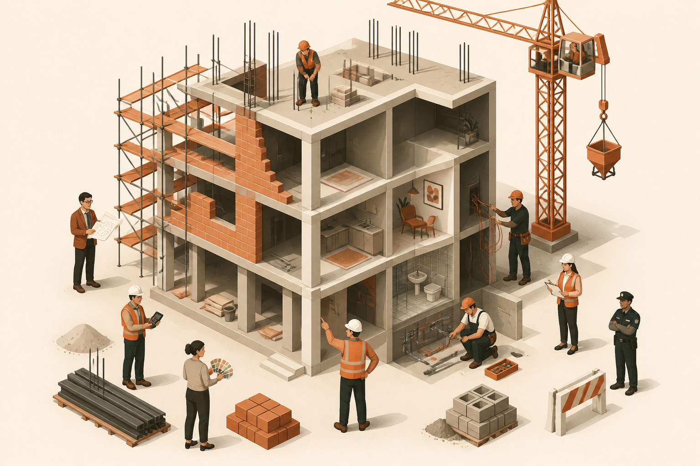

## WHAT · 9 角色蓋一棟樓

METAPHOR · 蓋大樓

# 軟體開發 = 蓋一棟大樓

<!-- _class: compact -->

| # | 軟體角色 | 蓋大樓對應 | 一句話 |
|---|---|---|---|
| 1 | PM | 建案企劃 | 決定蓋什麼、賣給誰 |
| 2 | UX/UI | 室內設計 | 設計動線、樣品屋 |
| 3 | SA | 建築師 | 跟甲方對齊機能、畫平面圖 |
| 4 | Architect | 結構技師 | 承重、耐震、未來擴建 |
| 5 | SD | 施工圖繪製 | 拆成可施工的細部圖 |
| 6 | DBA | 地基 + 水塔 + 管線 | 資料是建物命脈 |
| 7 | Dev | 工班師傅 | 真的把樓蓋起來 |
| 8 | QA | 驗收員 | 檢查門開不開、結構合規 |
| 9 | DevOps/SRE | 物業 + 保全 + 消防 | 上線後 24h 維運 |

 

這個比喻貫穿全書三本，每張案例頁都會回到這張表。

> Source: software_develop_journey/ppt/01-big-picture/01_building_metaphor.md
