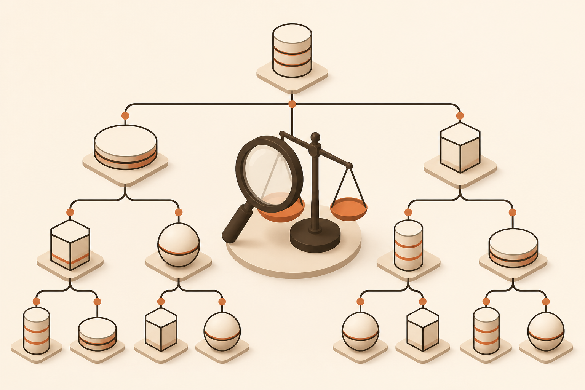

<!-- _class: chapter -->

MODULE · B

# 技術選型與資料策略

## *30 秒做出正確的資料層選型*

 

對應 software_architect Ch.4 + hero diagrams 02/04

---

## B · 你會帶走什麼

 

讀完 Module B，你能：

- 30 秒判斷 SQL vs NoSQL（不再 google）
- 看一眼資料模式就知道該用哪類 DB
- 算出 PostgreSQL 撐到幾 QPS 該分片
- 用 CAP / PACELC 做出可解釋的取捨
- 計算 TCO（不只 server，含人 + 移轉）
- 用 Claude Code 跑「技術選型辯論」

 

**金句**：選型錯了，3 年內每天還債。選型對了，3 年內忘了它存在。

> Source: software_architect/ppt/_source/04_Tech_Stack_Data.md
