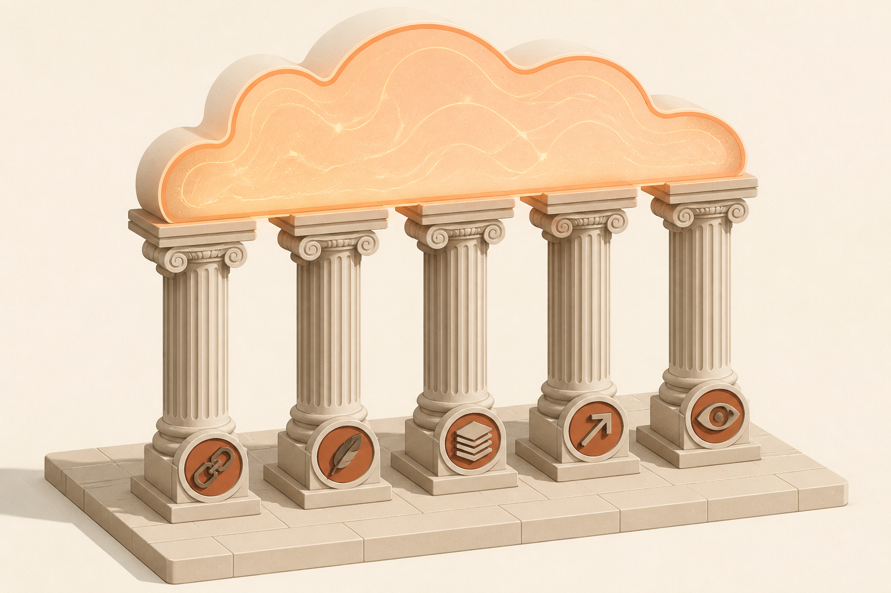

<!-- _class: chapter -->

MODULE · C

# 品質屬性 與 分散式五支柱

## *系統為何擴不動、為何掛了、為何救不回—根因都在這*

 

對應 software_architect Ch.5 + Ch.7 + hero 03/05/06

---

## C · 你會帶走什麼

 

讀完 Module C，你能：

- 列出 10 大 *-ilities 並指出兩兩衝突
- 解釋分散式系統的 5 大支柱（鬆耦合 / 無狀態 / cache / 通訊 / 監控）
- 設計斷路器、重試、超時、隔離艙
- 設定 SLO 並算出 error budget
- 規劃 metrics / logs / traces 三本柱
- 從 1K 演進到 100K QPS 不返工

 

**金句**：複雜性是萬惡之源—引入任何一個模式前，問「我為什麼需要它」。

> Source: software_architect/ppt/_source/05_ilities.md
