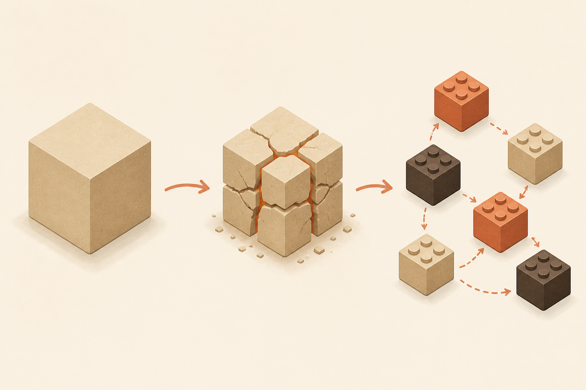

<!-- _class: chapter -->

MODULE · D

# 設計模式與進階架構

## *知道何時引入複雜度，何時拒絕引入*

 

對應 software_architect Ch.6 + Ch.8 + hero 01/07

---

## D · 你會帶走什麼

 

讀完 Module D，你能：

- SOLID 5 原則 + 分層架構
- 20 個高頻設計模式速查
- 判斷「該不該拆微服務」的 5 個訊號
- 區分 Saga / Event Sourcing / CQRS（不再混）
- 同步 vs 非同步通訊的取捨
- API 設四選一：REST / gRPC / GraphQL / WebSocket

 

**金句**：複雜度是借的，總要還—只在真正需要時才借。

> Source: software_architect/ppt/_source/06_Components_Patterns.md
