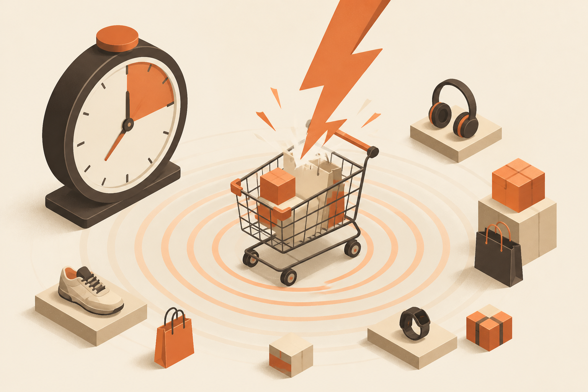

<!-- _class: chapter -->

CASE · 1

# 電商秒殺系統

## *OLTP + 快取 + 削峰 · 強一致庫存*

 

從 MVP 1K QPS 到秒殺 100K QPS

---

## Case 1 · 業務背景

 

**情境**：某品牌週年慶秒殺，1000 件 iPhone 半價。

**真實壓力**：
- 開賣前 1 小時：50K 同時在線等候
- 開賣瞬間：100K req/s 衝擊 + 庫存扣減
- 開賣後 10 秒：庫存售完
- 公平性：先到先得，不能超賣
- 體驗：用戶能立刻知道結果，不能 spinner 10 秒

 

**核心挑戰**：強一致庫存 + 高並發削峰 + 公平排隊

> Source: software_develop_journey/ppt/12-case-study/01_ecommerce.md
