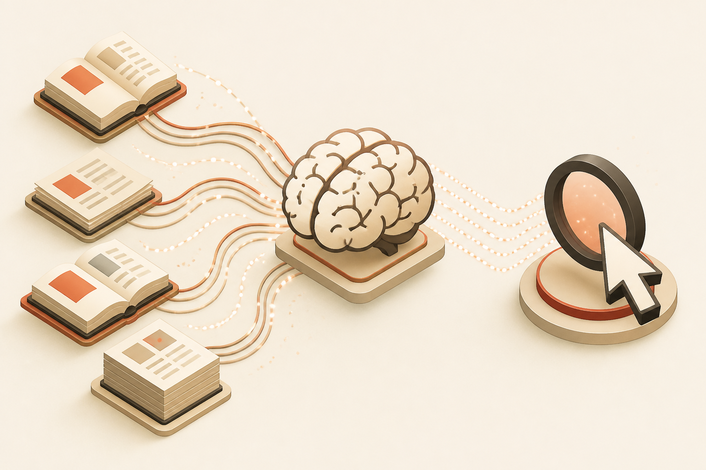

<!-- _class: chapter -->

CASE · 3

# RAG / AI 應用平台

## *向量檢索 + LLM 整合 + 成本控管*

 

從 1 user PoC 到 100K user 企業級 RAG

---

## Case 3 · 業務背景

 

**情境**：企業內部知識庫問答系統。員工問問題，系統從公司文件中找答案並用 LLM 生成回應。

**真實壓力**：
- 文件量：50K 文件、500K chunks、平均 chunk 200 token
- 使用者：100K 員工，併發 5K
- 查詢量：50K queries/day，峰值 200 QPS
- 延遲：first token < 1s、完整回答 < 5s
- 準確度：> 85% 員工滿意（measured by thumbs up）
- 成本：每查詢 < $0.01（LLM + vector search + cache）
- 安全：文件權限要 respect（員工只看得到自己有權限的）

 

**核心挑戰**：低延遲檢索 + 成本控管 + 權限隔離 + 答案品質

> Source: software_develop_journey/ppt/12-case-study/03_ai_video.md
