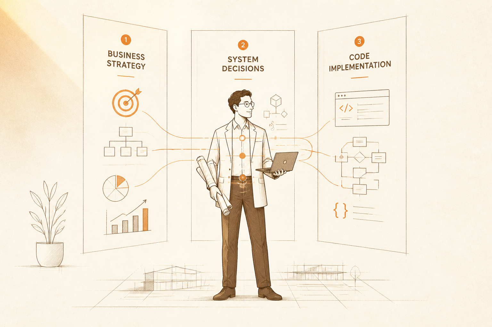
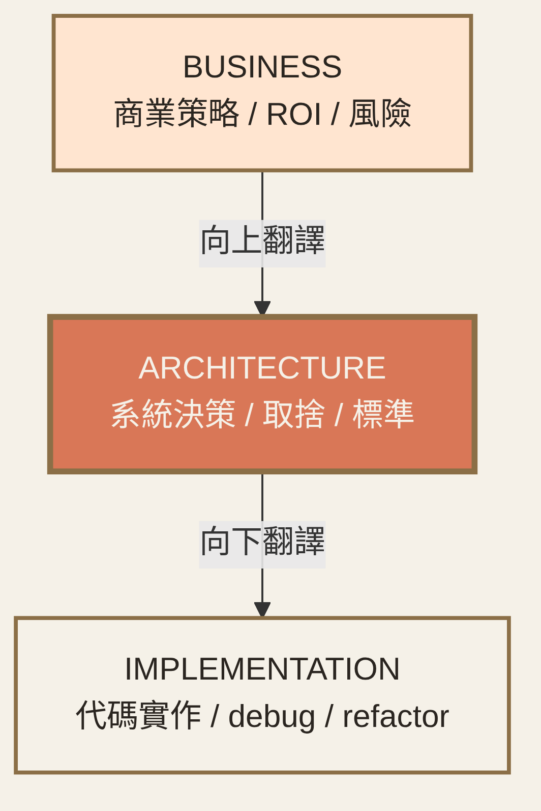
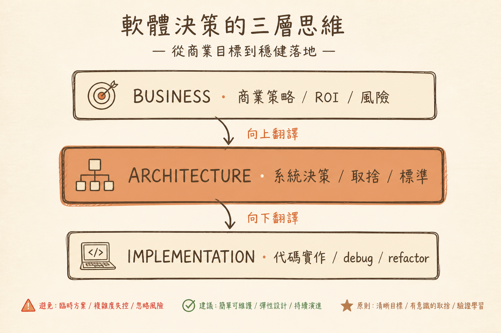

<!-- _class: chapter -->

<div class="ch-no">CHAPTER · 01 · OVERVIEW</div>

# Role & Value
## *AI 時代的稀缺，不是寫碼，是判斷*

<!--
開場 30 秒：
- 拋 Copilot 已能完成 80% 編碼這個事實
- 但「該寫哪個 function、該不該做這個 feature」AI 不會
- 講者語氣：穩、不帶輕視開發者
-->


---

<!-- _class: cover -->

<div style="text-align:center;">



</div>


---


<!-- _class: cover -->

<div style="text-align:center;">



</div>


---


<!-- _class: cover -->

<div style="text-align:center;">



</div>


---


## OBJECTIVES · 學習目標

看完本章，你能回答：

<div class="stack">
  <div class="layer client"><strong>① 架構師到底做什麼？</strong>　 與 Senior Dev、Tech Lead、CTO 的差異</div>
  <div class="layer app"><strong>② 為何 AI 取代不了架構師？</strong>　 決策層級的價值在哪</div>
  <div class="layer data"><strong>③ 從 Dev → Architect 思維轉變</strong>　 5 個維度的模式切換</div>
  <div class="layer infra"><strong>④ 三大職涯價值主張</strong>　 影響力 / 彈性 / 複利</div>
</div>

> Source: `_source/sa_ppt.md` Ch.1 · `SA簡報/S1-S3.pdf`


---


## MENTAL MODEL · 架構師三層責任

```
┌──────────────────────────────────────────────────┐
│  BUSINESS        商業策略 / ROI / 風險           │  ← 向上翻譯
├──────────────────────────────────────────────────┤
│  ARCHITECTURE    系統決策 / 取捨 / 標準          │  ← 自己的戰場
├──────────────────────────────────────────────────┤
│  IMPLEMENTATION  代碼實作 / debug / refactor     │  ← 向下翻譯
└──────────────────────────────────────────────────┘
   架構師 = 中間層 · 兩邊都要會講同一種語言
```

<span class="muted">**Linus 哲學**：架構師不是「最強的工程師」，是「能讓技術跟商業對齊」的工程師。</span>

> Source: 整理自 `S1_Slides.pdf` + `S3_Slides.pdf`


---


<!-- _class: end -->

# Overview 完
## *先打破迷思，下一站。*

<br>

<span class="lead">→ 1.1 Myth vs Truth</span>
