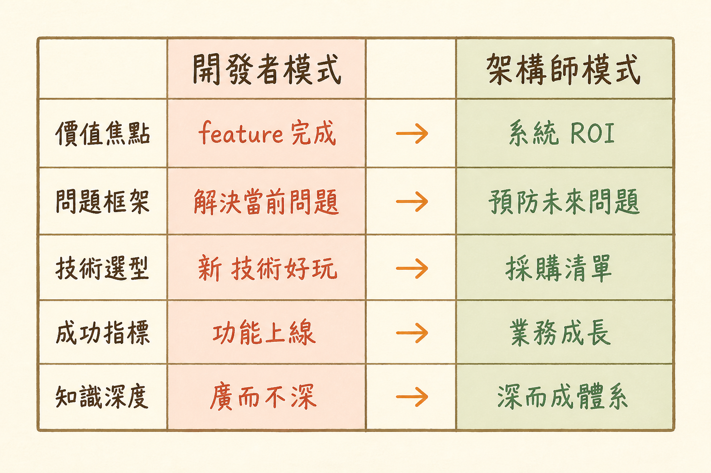

<!-- _class: chapter -->

CHAPTER · 01 · TOPIC 02

# Mindset Shift
## *從「How」到「Should」的五個維度轉變*

---

<!-- _class: cover -->

---

## MINDSET · WHY

# 為何不是「升級」是「換系統」？

 

**開發者**問的是 *How to implement?*
**架構師**問的是 *Should we build?*

這不是同一個問題加上更多細節——
是**整個思考座標系**的旋轉。

 

- 開發者：在「給定問題」下找最佳解
- 架構師：先決定「該不該解這個問題」
- 換系統 ≠ 否定開發者價值，而是**換戰場**

> Source: `S2_Slides.pdf` · §思維模式轉變

---

<!-- _class: compact -->

## MINDSET · 五維矩陣

# 思維模式對照

| 維度 | 🔧 開發者模式 | ➔ | 🏗️ 架構師模式 |
|---|---|---|---|
| **價值焦點** | 功能完成度（It works!） | → | ROI 與商業影響（It makes money!） |
| **問題框架** | How to implement? | → | Should we build? |
| **技術選型** | 最新最潮 | → | 成熟穩定 |
| **成功指標** | Coverage / Performance | → | Revenue / User Growth |
| **知識深度** | T 型專家（深度優先） | → | π 型通才（廣度 + 深度） |

 

五個維度同時切換——不是慢慢過渡，是 **mode switch**。

> Source: `S2_Slides.pdf` · §The Mindset Transformation Matrix

---

## MINDSET · 案例：要不要重構？

# 同一個問題，兩種答案

  

    <h3>開發者視角</h3>
    <ul>
      <li>「這段 legacy code 寫得醜」</li>
      <li>「重構成乾淨架構」</li>
      <li>估計：2 sprint</li>
      <li>產出：好維護的代碼</li>
      <li><em>沒回答的問題：值得做嗎？</em></li>
    </ul>
  

  

    <h3>架構師視角</h3>
    <ul>
      <li>「這段 code 一年改幾次？」</li>
      <li>「重構救幾小時/月？」</li>
      <li>「會影響 release timeline？」</li>
      <li>「有 bug 風險嗎？」</li>
      <li><em>答案常是：先不要</em></li>
    </ul>
  

**反模式**：升任架構師後仍憑「程式碼美感」決策。沒有商業數字支持的重構，是技術自嗨。

> Source: 整合 `S2.pdf` + `_source/01_Role_Value.md`

---

## MINDSET · HOW

# 三個練習，把模式切過去

  
<strong>① 每個 PR 多問一句</strong>　 「這個改動，3 個月後對誰有價值？」

  
<strong>② 把技術 RFC 翻成商業案例</strong>　 找個非技術 stakeholder 對講

  
<strong>③ 每週寫一份「不做」清單</strong>　 列出本週決定 *不* 做的事與原因

 

**判斷力是肌肉，不是天賦。**
每天練 30 分鐘「決策思考」——3 個月後切得過去。

> Source: `S3_Slides.pdf` · §轉型實作建議

---

## MINDSET · 反模式

# 三個常見的「沒切過去」訊號

**訊號 1**：架構評審時還在挑變數命名

**訊號 2**：選技術只看「新不新」、不看「招得到人嗎」

**訊號 3**：被問「ROI 多少」時答不出來

 

出現任一訊號 → 退一步問自己：**我在解決誰的問題？**

> Source: `S2_Slides.pdf` · §轉型陷阱

---

<!-- _class: end -->

# Mindset Shift 完
## *思維切過去，下一站看市場給多少錢。*

 

→ 1.3 Value Pillars
