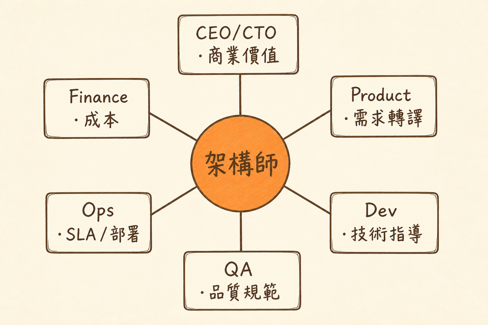

<!-- _class: chapter -->

<div class="ch-no">CHAPTER · 01 · TOPIC 03</div>

# Value Pillars
## *三大價值支柱與市場行情*


---

<!-- _class: cover -->

<div style="text-align:center;">



</div>


---


## VALUE · WHY

<span class="kicker">SECTION · MARKET</span>

# 為何「越老越值錢」？

<br>

<div class="highlight">

寫 code 是體力活——35 歲開始下坡。
**做決策是知識活——50 歲還在加分。**

架構師的職涯曲線跟開發者**形狀完全不同**。

</div>

<br>

- 開發者：技術迭代快、經驗易折舊（5 年前的 framework 已過時）
- 架構師：判斷模式、商業洞察、跨產業經驗——**經驗複利**
- AI 工具：放大架構師的設計能力，但無法替代判斷

> Source: `S3_Slides.pdf` · §職涯曲線


---


## VALUE · 薪資進階（2025 市場）

```
開發者        →  資深開發者  →  架構師       →  資深架構師
$90K          →  $120K       →  $180K        →  $250K+
              (+33%)         (+50%)         (+39%)
```

<br>

| 級別 | 重點工作 | 市場稀缺度 |
|------|---------|-----------|
| Developer | 實作 + bug fix | 普通（AI 替代率高） |
| Senior Dev | 設計 + mentoring | 中（單點深度） |
| Architect | 跨團隊決策 + 選型 | 高（45% YoY 需求） |
| Senior Architect | 技術戰略 + 商業翻譯 | 極高（10 年經驗溢價 120%） |

<span class="muted">2025 美國市場數據 · 台灣對應級距約為 0.4–0.6 倍，但成長曲線形狀相同。</span>

> Source: `_source/01_Role_Value.md` · 2025 薪資報告


---


## VALUE · HOW

# 三大價值支柱

<div class="matrix-2x2">
  <div class="featured">
    <strong>🎯 策略影響力</strong>
    參與技術戰略<br>
    影響產品方向<br>
    定義技術標準
  </div>
  <div>
    <strong>💼 職涯彈性</strong>
    可走 CTO / VP Eng<br>
    可轉技術顧問<br>
    遠端工作機會多
  </div>
  <div>
    <strong>🚀 技能複利</strong>
    經驗跨產業可轉<br>
    AI 工具放大產出<br>
    年資 = 溢價
  </div>
  <div>
    <strong>📊 市場需求</strong>
    YoY 45% 增長<br>
    85% 支持遠端<br>
    10 年經驗 +120%
  </div>
</div>

> Source: `S3_Slides.pdf` · §三大價值支柱


---


## VALUE · 影響力地圖

# 架構師的 360° 利害關係人

```
              CEO / CTO
                  │ 商業價值
                  │
   Finance ──── ARCHITECT ──── Product Manager
   成本               │              需求轉譯
                      │
              Dev / QA / Ops
              技術指導 / 標準 / SLA
```

<br>

<span class="muted">**架構師沒有實線下屬**，但每個方向都要會講對方的語言——這就是「無實權的影響力」。</span>

> Source: `S2_Slides.pdf` · §利益相關者地圖


---


## VALUE · TRADE-OFF

# 跳過去之前的三個自問

<div class="tradeoff">
  <div class="pro">
    <h3>適合往架構走</h3>
    <ul>
      <li>對商業邏輯感興趣</li>
      <li>願意做 60% 非編碼工作</li>
      <li>能對非技術人講白話</li>
      <li>容忍模糊與不確定</li>
      <li>喜歡 mentoring</li>
    </ul>
  </div>
  <div class="con">
    <h3>建議留在開發</h3>
    <ul>
      <li>就是熱愛純粹寫 code</li>
      <li>討厭開會與政治</li>
      <li>追求技術極致深度</li>
      <li>個人貢獻者性格強</li>
      <li>不想負商業責任</li>
    </ul>
  </div>
</div>

<div class="highlight">

**Staff Engineer** 是另一條路——技術深度同樣值錢、但不背商業 KPI。
不必硬擠架構師路徑。

</div>

> Source: 整合 `S3.pdf` + 業界 Staff Eng 職涯資料


---


<!-- _class: end -->

# Value Pillars 完
## *市場值錢的形狀知道了，看怎麼開始轉。*

<br>

<span class="lead">→ Ch.1 Recap</span>
