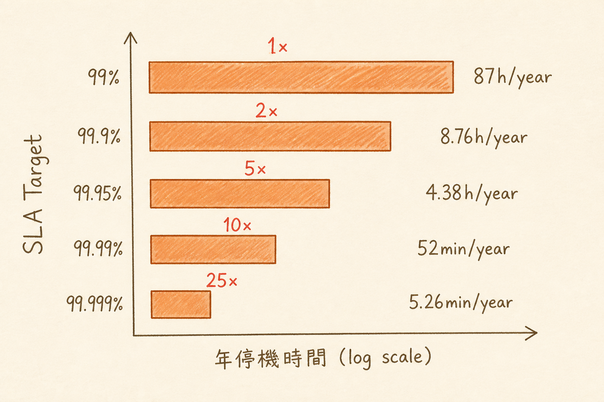

<!-- _class: chapter -->

<div class="ch-no">CHAPTER · 02 · TOPIC 02</div>

# SLA Math
## *99.99% 不是行銷詞，是預算數字*


---

<!-- _class: cover -->

<div style="text-align:center;">



</div>


---


## WHY · 為何 SLA 是數學問題？

<br>

<div class="highlight">

「我們承諾 99.99% 可用性」——
聽起來像 99.9% 多 0.1%，**成本卻是 5-10 倍**。

每多一個 9，預算指數成長。

</div>

<br>

- 99% (兩個 9) → 一年容忍 87 小時停機
- 99.99% (四個 9) → 一年容忍 52 分鐘
- 跨過 3 個 9 → 必須上多 AZ + 自動 failover
- 跨過 4 個 9 → 必須上多 region + 24/7 oncall

> Source: `S5_Slides.pdf` · §SLA Cost Curve


---


## HOW · 9 的對照表（必背）

| Uptime | 一年停機 | 一月停機 | 一週停機 | 等級 |
|--------|---------|---------|---------|------|
| 90% | 36.5 天 | 73 hr | 16.8 hr | 內部工具 |
| 99% | 3.65 天 | 7.3 hr | 1.68 hr | MVP / 小服務 |
| 99.9% | 8.76 hr | 43.8 min | 10.1 min | 標準 SaaS |
| 99.95% | 4.38 hr | 21.9 min | 5.04 min | 業界中段 |
| 99.99% | 52.6 min | 4.38 min | 1.01 min | AWS / GCP |
| 99.999% | 5.26 min | 26.3 s | 6.05 s | 電信 / 金融 |

<br>

<span class="muted">**面試金句**：「99.9% 已能涵蓋 95% 系統」——上面那兩個 9 是真金白銀。</span>

> Source: `S5_Slides.pdf` · §Five Nines


---


## HOW · 複合 SLA 計算

# 鏈式系統的 availability 是相乘的

```
   ┌──── LB (99.99%) ──── API (99.95%) ──── DB (99.95%) ────┐
   │                                                          │
   └──────────────── Cache (99.9%) ──────────────────────────┘

   依賴鏈式：0.9999 × 0.9995 × 0.9995 = 0.9989  → 只有 99.89%
   並行容錯：1 - (1-A)(1-B) → 提升至 99.99%+
```

<br>

<div class="highlight">

**洞察**：任一環節掛 → 整體掛。
要拉高 SLA，要嘛**減少依賴鏈長度**，要嘛**加冗餘**。

</div>

> Source: `S5_Slides.pdf` · §Composite SLA


---


## HOW · 9 的成本

```
SLA 等級       架構需求                      相對成本
─────────────────────────────────────────────────
99%            單機 + 監控                   1×
99.9%          負載均衡 + 健康檢查           2×
99.95%         多 AZ + 自動 failover         5×
99.99%         多 region + 24/7 oncall      10×
99.999%        全冗餘 + chaos engineering   25×
```

<br>

<div class="alert">

**反模式**：對 stakeholder 承諾「five nines」前沒算過成本——預算炸鍋後產品就死了。

</div>

> Source: `_source/02_Requirements_SLA.md` · §SLA Cost Analysis


---


## TRADE-OFF · 該追哪個 9？

<div class="tradeoff">
  <div class="pro">
    <h3>追到 99.99%（金流 / 醫療 / 電信）</h3>
    <ul>
      <li>單筆交易價值高</li>
      <li>監管要求</li>
      <li>1 分鐘停機 = 數萬美元損失</li>
      <li>客戶會走人</li>
    </ul>
  </div>
  <div class="con">
    <h3>停在 99.9%（SaaS / 內部工具）</h3>
    <ul>
      <li>停機可接受</li>
      <li>客戶有重試機制</li>
      <li>夜間維護有窗口</li>
      <li>成本可控</li>
    </ul>
  </div>
</div>

<div class="highlight">

**經驗法則**：先問 *Error Budget* —— 「如果這個月用完 8.76 小時 down time 還能再 down 嗎？」答案是「不能」才該往更高 9 推。

</div>

> Source: `S5_Slides.pdf` · §Error Budget


---


<!-- _class: end -->

# SLA Math 完
## *9 算清楚了，下一站處理極端流量。*

<br>

<span class="lead">→ 2.3 Throughput vs Load</span>
