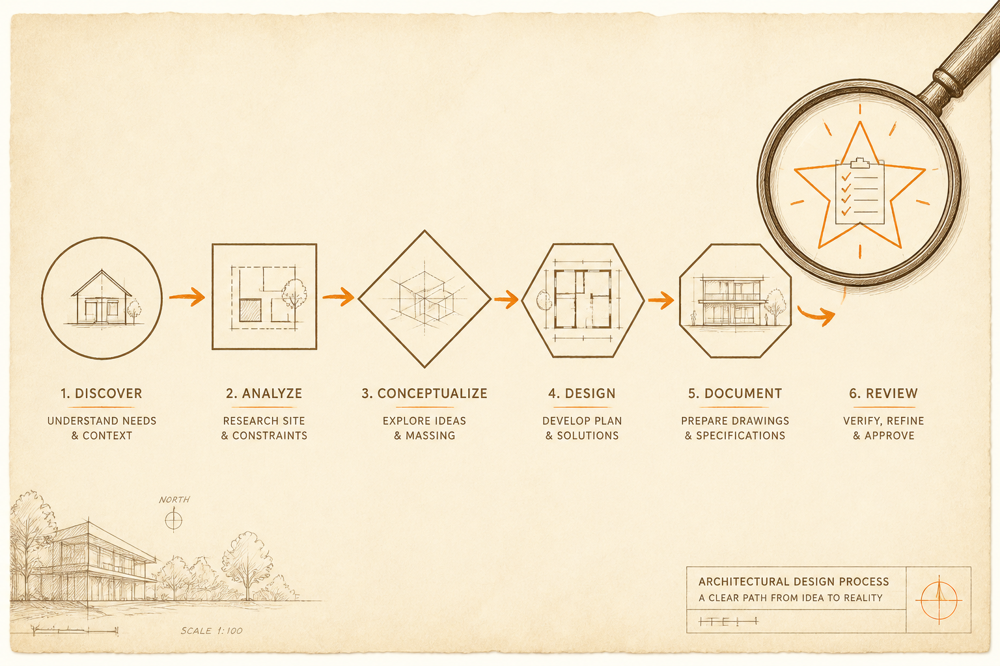
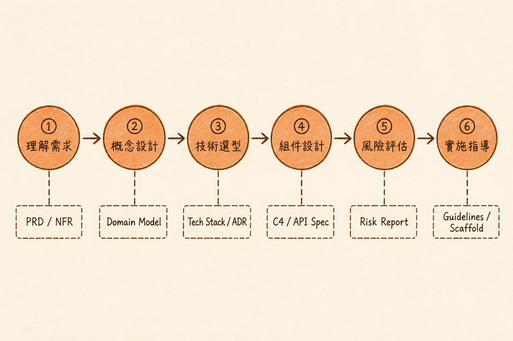

<!-- _class: chapter -->

<div class="ch-no">CHAPTER · 03 · OVERVIEW</div>

# Process & App Types
## *架構設計有 SOP，不是靈感創作*


---

<!-- _class: cover -->

<div style="text-align:center;">



</div>


---


<!-- _class: cover -->

<div style="text-align:center;">



</div>


---


## OBJECTIVES · 學習目標

看完本章，你能回答：

<div class="stack">
  <div class="layer client"><strong>① 架構設計六步驟是什麼？</strong>　 標準 SOP</div>
  <div class="layer app"><strong>② Web vs Mobile vs Service 怎麼選？</strong></div>
  <div class="layer data"><strong>③ 為何「文件即代碼」是必要紀律？</strong></div>
  <div class="layer infra"><strong>④ 怎麼用文件指揮 AI 寫程式？</strong></div>
</div>

> Source: `_source/sa_ppt.md` Ch.3 · `SA簡報/S4, S6.pdf`


---


## MENTAL MODEL · 設計的兩個產出

```
   設計過程              產出 1：架構文件           產出 2：團隊共識
   ─────────────         ──────────────             ──────────────
   ① 需求 →              PRD + NFR matrix          PM 與你對齊
   ② 概念 →              Domain model               業務專家認可
   ③ 選型 →              Tech stack + ADR          財務 / Ops 同意
   ④ 設計 →              C4 + API spec              Dev 能開工
   ⑤ 驗證 →              Risk + failure analysis    QA 知道測什麼
   ⑥ 落地 →              Guidelines + scaffold      新人上手快
```

<span class="muted">**Linus 哲學**：文件是給未來的你看的——3 個月後你會感謝今天寫了 ADR。</span>

> Source: `S4_Slides.pdf` · §Design Process Overview


---


<!-- _class: end -->

# Overview 完
## *先學六步驟 SOP。*

<br>

<span class="lead">→ 3.1 Six-Step Process</span>
