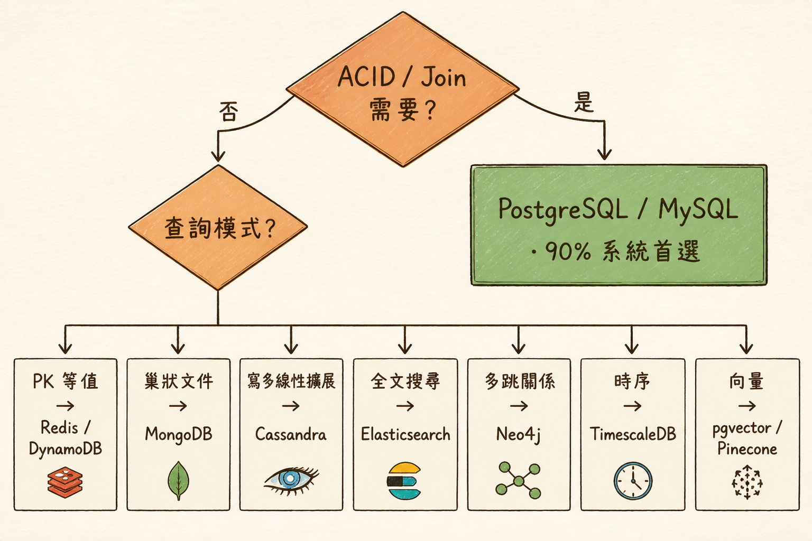
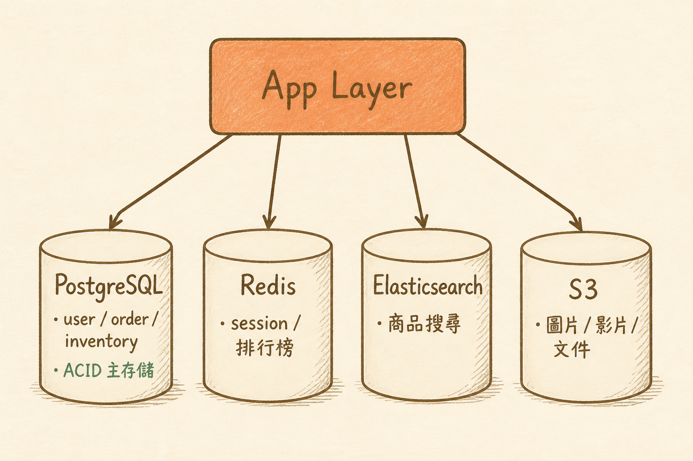

<!-- _class: chapter -->

<div class="ch-no">CHAPTER · 04 · TOPIC 02</div>

# SQL vs NoSQL
## *先 PostgreSQL，再說*


---

<!-- _class: cover -->

<div style="text-align:center;">



</div>


---


<!-- _class: cover -->

<div style="text-align:center;">



</div>


---


## WHY · 為何不是「誰比較快」的問題？

<br>

<div class="highlight">

**SQL ≠ slow，NoSQL ≠ fast**。
真正的問題是：
- 資料**有 schema** 嗎？
- 查詢**有 join** 嗎？
- 寫入**需要 ACID** 嗎？

3 個 yes → SQL。2+ no → 才考慮 NoSQL。

</div>

<br>

- SQL：50 年磨出來的 query optimizer
- NoSQL：用「拋棄某些 SQL 特性」換取**特定維度**的擴展
- 90% 系統根本不該離開 PostgreSQL

> Source: `S7_Slides.pdf` · §SQL Misconception


---


## HOW · 決策樹

```
   需要 ACID 事務 / 複雜 join？
   ├─ 是 → PostgreSQL / MySQL
   │
   └─ 否 → 看主要查詢模式
           │
           ├─ Primary Key 等值查詢 → KV (Redis / DynamoDB)
           ├─ 巢狀文件 + flexible schema → Document (MongoDB)
           ├─ 寫多 + 線性擴展需求 → Wide-column (Cassandra)
           ├─ 全文搜尋 → Search (Elasticsearch)
           ├─ 多跳關係 → Graph (Neo4j)
           ├─ 時序 metric → TimeSeries (InfluxDB)
           └─ 向量相似 → Vector (pgvector / Pinecone)
```

<span class="muted">**Linus 哲學**：先 PostgreSQL · 撞牆再換 · 90% 系統永遠撞不到牆。</span>

> Source: `_source/04_Tech_Stack_Data.md` · §DB Decision Tree


---


## HOW · SQL vs NoSQL 對照

| 維度 | SQL (PostgreSQL) | NoSQL (Cassandra) |
|------|------------------|-------------------|
| **Schema** | 強型別 · migration 嚴格 | flexible · schema-on-read |
| **事務** | ACID 完整 | 弱 / 最終一致 |
| **Join** | 多表 join · subquery | 應用層處理 |
| **擴展** | 主寫從讀 · 分片較難 | 線性水平擴展 |
| **典型 QPS** | 5k-50k / 主節點 | 100k+ / cluster |
| **複雜查詢** | SQL 表達力強 | 受限於 partition key |

<br>

<span class="muted">**面試金句**：「選 NoSQL 之前先問——你願意放棄 join 嗎？」</span>

> Source: `S7_Slides.pdf` · §SQL vs NoSQL Comparison


---


## HOW · 多 DB 混用是常態

# Polyglot Persistence 範例

<div class="stack">
  <div class="layer client"><strong>PostgreSQL</strong>　 用戶 / 訂單 / 庫存（ACID 主存儲）</div>
  <div class="layer app"><strong>Redis</strong>　 Session / Rate limit / 排行榜</div>
  <div class="layer data"><strong>Elasticsearch</strong>　 商品搜尋 / log 查詢</div>
  <div class="layer infra"><strong>S3</strong>　 圖片 / 影片 / 文件 blob</div>
</div>

<br>

<div class="highlight">

**洞察**：一個系統用 3–5 種儲存是 2026 標配。
每種儲存負責一種**資料模式**——這就是 polyglot persistence。

</div>

> Source: `S7_Slides.pdf` · §Polyglot Storage


---


## TRADE-OFF · 何時離開 PostgreSQL？

<div class="tradeoff">
  <div class="pro">
    <h3>該離開的訊號</h3>
    <ul>
      <li>單表 > 100M rows + 寫入慢</li>
      <li>查詢無 join，KV 模式</li>
      <li>分散式寫入需求</li>
      <li>非結構化資料佔比 > 50%</li>
      <li>需要全文搜尋 ranking</li>
    </ul>
  </div>
  <div class="con">
    <h3>不該離開的訊號</h3>
    <ul>
      <li>QPS < 10k</li>
      <li>單庫 < 1TB</li>
      <li>「未來可能會大」（沒驗證）</li>
      <li>團隊沒人會 NoSQL</li>
      <li>合規要求強一致</li>
    </ul>
  </div>
</div>

<div class="alert">

**反模式**：QPS 100 的小工具就上 Cassandra。維運成本 > 業務價值 10 倍。

</div>

> Source: `S7_Slides.pdf` · §When to Leave PG


---


<!-- _class: end -->

# SQL vs NoSQL 完
## *儲存選好，下一站看前後端。*

<br>

<span class="lead">→ 4.3 Frontend / Backend</span>
