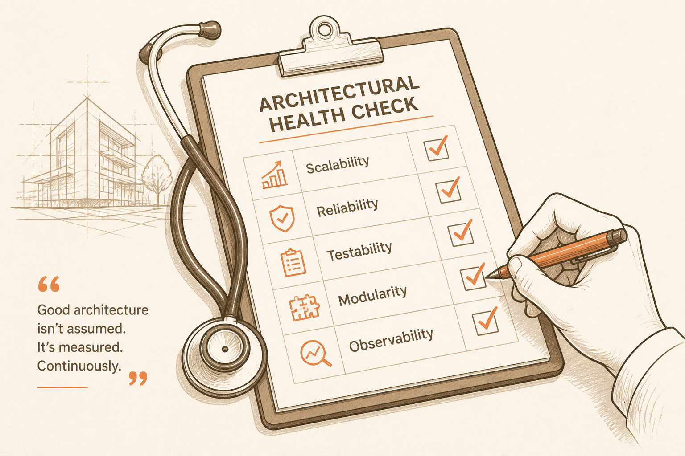
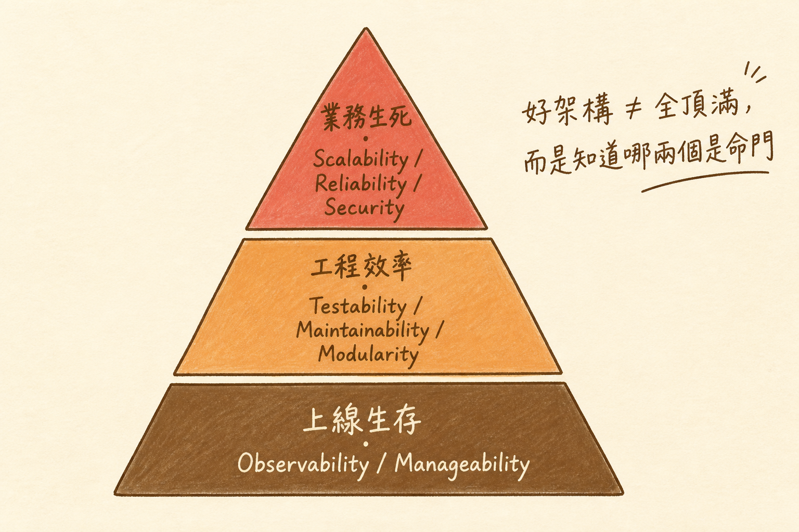

<!-- _class: chapter -->

<div class="ch-no">CHAPTER · 05 · OVERVIEW</div>

# *-ilities
## *系統的健康檢查表*


---

<!-- _class: cover -->

<div style="text-align:center;">



</div>


---


<!-- _class: cover -->

<div style="text-align:center;">



</div>


---


## OBJECTIVES · 學習目標

看完本章，你能回答：

<div class="stack">
  <div class="layer client"><strong>① Scalability 怎麼設計？</strong>　 Out 不是 Up</div>
  <div class="layer app"><strong>② Testability 怎麼量？</strong>　 SRP + DI</div>
  <div class="layer data"><strong>③ Modularity 的判準？</strong>　 換掉一塊不會炸</div>
  <div class="layer infra"><strong>④ 其他 -ilities 速覽</strong>　 Maintain / Manage / Observe</div>
</div>

> Source: `_source/sa_ppt.md` Ch.5 · `SA簡報/S8.pdf`


---


## MENTAL MODEL · 品質屬性的優先級

```
   ── 業務生死 ──
   Scalability      不能擴展 = 業務上限
   Reliability      不可用 = 信任崩盤
   Security         被駭 = 公司結束

   ── 工程效率 ──
   Testability      不能測 = 不敢動
   Maintainability  維護貴 = 工程師流失
   Modularity       不能換 = 技術債滾大

   ── 上線生存 ──
   Observability    看不到 = 修不好
   Manageability    部署難 = 不敢發版
```

<span class="muted">**Linus 哲學**：好架構不是所有 -ility 都頂——是知道哪兩個是這個業務的命門，把它頂滿。</span>

> Source: `S8_Slides.pdf` · §Quality Attribute Stack


---


<!-- _class: end -->

# Overview 完
## *先學 Scalability。*

<br>

<span class="lead">→ 5.1 Scalability</span>
