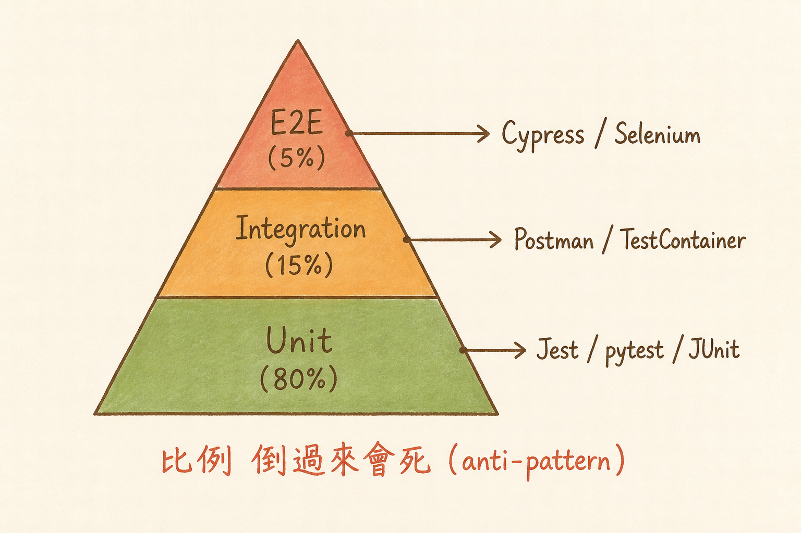

<!-- _class: chapter -->

<div class="ch-no">CHAPTER · 05 · TOPIC 02</div>

# Testability
## *不能測 = 不敢改 = 技術債滾大*


---

<!-- _class: cover -->

<div style="text-align:center;">



</div>


---


## WHY · 為何 Testability 是架構決策？

<br>

<div class="highlight">

「沒時間寫測試」是表面原因。
真正的原因是**架構讓寫測試很痛**——
- 一個 class 要 mock 20 個依賴
- 一個 function 要起整個 server 才能測
- DB 邏輯跟 UI 黏一起

**Testability 在架構層決定，不是在 sprint 末尾補救。**

</div>

<br>

- Testable 架構 = 模組邊界清楚 + 依賴可替換
- AI 寫代碼時代 → testability 反而更重要（AI 寫太快，沒測會出包）

> Source: `S8_Slides.pdf` · §Testability as Architecture


---


## HOW · 三層測試金字塔

```
              ┌─────────────┐
              │   E2E (5%)  │       Cypress · Playwright
              ├─────────────┤
              │ Integration │       測 component 間互動
              │   (15%)     │
              ├─────────────┤
              │             │
              │ Unit (80%)  │       測單一邏輯 · 無外部依賴
              │             │
              └─────────────┘
```

<br>

<div class="highlight">

**比例倒過來會死**：80% E2E → 跑一次半小時 → 沒人敢改 code。

</div>

> Source: `S8_Slides.pdf` · §Test Pyramid


---


## HOW · Testability 三件套

<div class="stack">
  <div class="layer client"><strong>① 單一職責原則 (SRP)</strong>　 一個 class 只做一件事 · 才容易 mock</div>
  <div class="layer app"><strong>② 依賴注入 (DI)</strong>　 外部依賴從參數傳入 · 不在內部 new</div>
  <div class="layer data"><strong>③ Pure Function 優先</strong>　 同樣輸入同樣輸出 · 無副作用</div>
</div>

<br>

<div class="def">
<span class="term">三件套效果</span>
SRP 讓你**知道在測什麼**；DI 讓你**能替換依賴**；Pure Function 讓你**斷言結果**。
缺一即「能跑但不能測」。
</div>

> Source: `S8_Slides.pdf` · §Testability Principles


---


## HOW · 反模式速覽

| 反模式 | 為何不可測 | 解法 |
|--------|-----------|------|
| `new Database()` 在 class 內 | mock 不掉 | constructor 注入 |
| 直接讀 `process.env` | 環境變數綁死 | 包成 config 物件 |
| 直接呼叫 `Date.now()` | 時間相關測試 flaky | 注入 clock 物件 |
| 直接 HTTP fetch | 網路測試慢 / 不穩 | 包 HTTP client 介面 |
| Singleton + 全域狀態 | 測試間互相污染 | 改成 instance + DI |

<br>

<div class="alert">

**Linus 鐵律**：能 mock 不代表該 mock 太多。Mock 整個世界 = 測了個寂寞。整合測試該打真 DB。

</div>

> Source: `S8_Slides.pdf` · §Test Anti-Patterns


---


## TRADE-OFF · 100% Coverage？

<div class="tradeoff">
  <div class="pro">
    <h3>追求高覆蓋率</h3>
    <ul>
      <li>對核心商業邏輯 ≥ 90%</li>
      <li>對金流 / 安全 = 100%</li>
      <li>對 public API 簽名 100%</li>
      <li>覆蓋率作為 PR gate</li>
    </ul>
  </div>
  <div class="con">
    <h3>不必追求的部分</h3>
    <ul>
      <li>UI 細節（讓 E2E / 視覺迴歸測）</li>
      <li>第三方 library 包裝層</li>
      <li>實驗性 spike 程式碼</li>
      <li>純 config 檔</li>
    </ul>
  </div>
</div>

<div class="highlight">

**經驗值**：核心邏輯 80%、整體 60% 即可。**沒測過的關鍵路徑** > **覆蓋率 90% 但都是 getter 測試**。

</div>

> Source: `S8_Slides.pdf` · §Coverage Reality


---


<!-- _class: end -->

# Testability 完
## *能測了，下一站學能換。*

<br>

<span class="lead">→ 5.3 Modularity</span>
