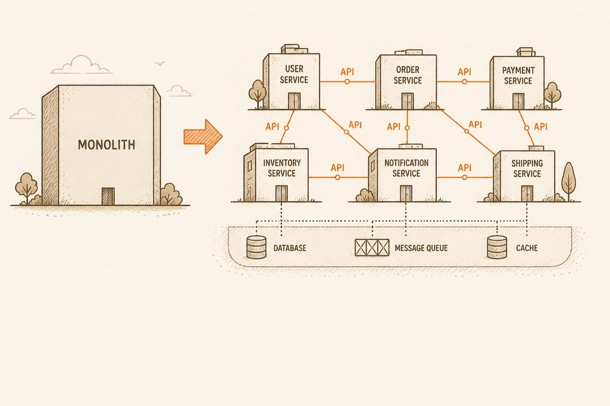
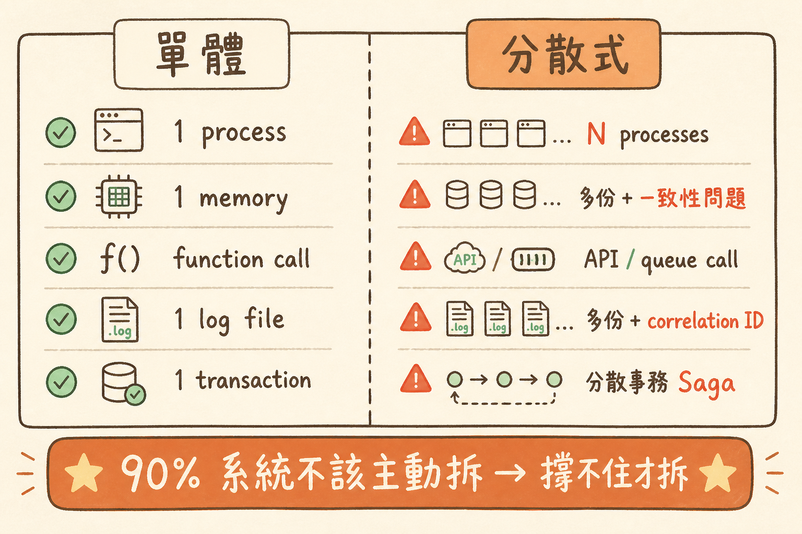

<!-- _class: chapter -->

<div class="ch-no">CHAPTER · 07 · OVERVIEW</div>

# System Architecture
## *從單體跨到分散式的三個關鍵決策*


---

<!-- _class: cover -->

<div style="text-align:center;">



</div>


---


<!-- _class: cover -->

<div style="text-align:center;">



</div>


---


## OBJECTIVES · 學習目標

看完本章，你能回答：

<div class="stack">
  <div class="layer client"><strong>① 為何 Stateless 是分散式的入場券？</strong></div>
  <div class="layer app"><strong>② Cache + Queue 怎麼擋住高並發？</strong></div>
  <div class="layer data"><strong>③ 分散式 debug 的命脈：Correlation ID</strong></div>
  <div class="layer infra"><strong>④ 鬆耦合通訊：REST vs Queue 何時用哪個？</strong></div>
</div>

> Source: `_source/sa_ppt.md` Ch.7 · `SA簡報/S11.pdf`


---


## MENTAL MODEL · 從單體到分散式

```
   單體 (Monolith)               分散式 (Distributed)
   ─────────────                ──────────────────
   一個 process                  N 個 process / region
   一份 memory                   多份 + 一致性問題
   call function                 call API / queue
   一份 log                      多份 + correlation ID
   一個事務                      分散事務 / Saga

   90% 系統不該主動拆 → 撐不住才拆
```

<span class="muted">**Linus 哲學**：分散式系統是「**萬不得已的解法**」——能單體解決就單體。</span>

> Source: `S11_Slides.pdf` · §Monolith vs Distributed


---


<!-- _class: end -->

# Overview 完
## *先學 Stateless。*

<br>

<span class="lead">→ 7.1 Stateless</span>
