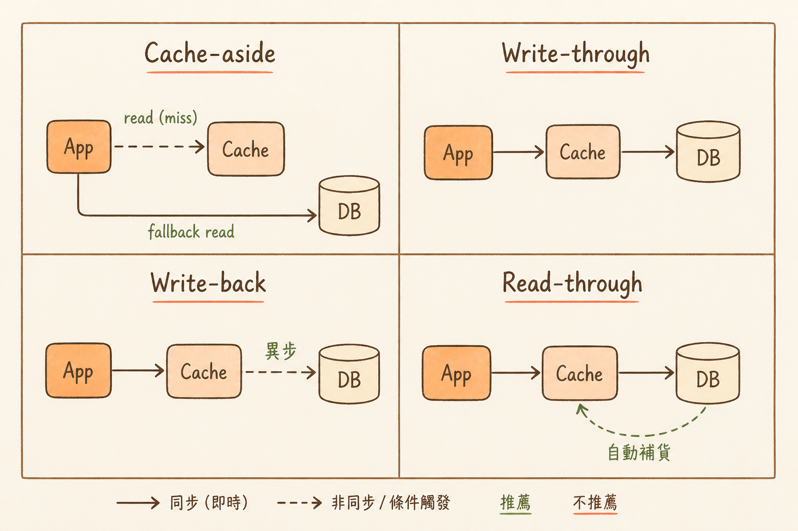

<!-- _class: chapter -->

<div class="ch-no">CHAPTER · 07 · TOPIC 02</div>

# Cache + Queue
## *擋住高並發的兩個王牌*


---

<!-- _class: cover -->

<div style="text-align:center;">



</div>


---


## WHY · 為何這兩件兵器必學？

<br>

<div class="highlight">

**Cache** 擋掉 90% 讀請求 → 保護 DB。
**Queue** 把同步操作改異步 → 削峰 + 解耦。

99% 撐住高並發的系統，都靠這兩件武器組合拳。

</div>

<br>

- 沒 cache 的系統：每個請求打 DB → 1000 QPS 就掛
- 沒 queue 的系統：流量尖峰直接打爆下游
- 兩者組合：撐起 10× 流量沒問題

> Source: `S11_Slides.pdf` · §Cache + Queue Why


---


## HOW · Cache 的四種模式

| 模式 | 寫入時 | 讀取時 | 適用 |
|------|-------|--------|------|
| **Cache-aside** | 應用清 cache | 先 cache miss → DB → 寫 cache | 通用，最常見 |
| **Read-through** | 應用清 cache | cache library 自己撈 DB | 讀為主、cache 邏輯統一 |
| **Write-through** | 同時寫 cache + DB | 直接讀 cache | 一致性要求高 |
| **Write-back** | 寫 cache → 異步寫 DB | 直接讀 cache | 寫密集、容忍丟失 |

<br>

<div class="alert">

**反模式**：用 Cassandra（AP）存帳戶餘額再放 Redis cache——兩層 eventually consistent 疊加，雙花災難。

</div>

> Source: `S11_Slides.pdf` · §Cache Patterns


---


## HOW · Cache 三大災難 + 防禦

```
   ① Penetration（穿透）
      查詢不存在的 key → 每次都打 DB
      防：Bloom filter / 快取 null 值
   ─────────────────────────────────────
   ② Avalanche（雪崩）
      大量 key 同時過期 → 瞬間打爆 DB
      防：TTL 加 jitter / 多級 cache
   ─────────────────────────────────────
   ③ Stampede（熱點）
      單一熱點 key 過期 → 千個請求齊撲 DB
      防：single-flight / 永不過期 + 背景更新
```

> Source: `S11_Slides.pdf` · §Cache Disasters


---


## HOW · Queue 的兩種角色

<div class="stack">
  <div class="layer client"><strong>① 削峰（Buffer）</strong>　 流量尖峰先進 queue · 後端按穩態消費</div>
  <div class="layer app"><strong>② 解耦（Decouple）</strong>　 服務 A 發訊息 · 服務 B 異步處理 · A 不等 B</div>
</div>

<br>

| 訊息系統 | 強項 | 適用 |
|---------|------|------|
| **Kafka** | 高吞吐 · 可 replay · stream | 事件流 · log pipeline |
| **RabbitMQ** | 複雜路由 · ACK 控制 | task queue · workflow |
| **SQS** | AWS 整合 · serverless | 簡單異步 · 雲原生 |
| **Redis Streams** | 低延遲 · 輕量 | 即時通知 · 小規模 |

> Source: `S11_Slides.pdf` · §Queue Selection


---


## TRADE-OFF · 同步 vs 異步何時切？

<div class="tradeoff">
  <div class="pro">
    <h3>該用 Queue（異步）</h3>
    <ul>
      <li>處理耗時 > 1 秒</li>
      <li>第三方 API 不穩定</li>
      <li>需要 retry / dedupe</li>
      <li>流量尖峰大</li>
      <li>不需即時回應</li>
    </ul>
  </div>
  <div class="con">
    <h3>該用 REST（同步）</h3>
    <ul>
      <li>使用者等回應</li>
      <li>需要強一致</li>
      <li>簡單 CRUD</li>
      <li>規模還沒到</li>
      <li>需要立即錯誤回饋</li>
    </ul>
  </div>
</div>

<div class="alert">

**反模式**：MVP 階段就上 Kafka 處理 100 QPS 的訂單——維運成本 > 系統價值。

</div>

> Source: `S11_Slides.pdf` · §Sync vs Async


---


<!-- _class: end -->

# Cache + Queue 完
## *兵器到手，下一站講可觀測性。*

<br>

<span class="lead">→ 7.3 Logging & Monitoring</span>
