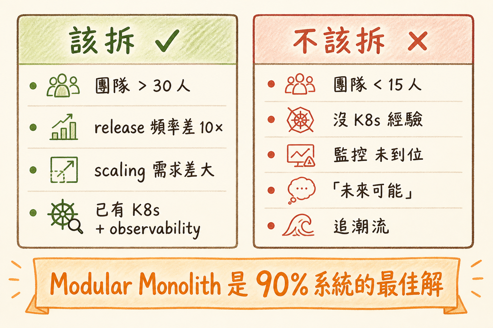

<!-- _class: chapter -->

<div class="ch-no">CHAPTER · 08 · TOPIC 01</div>

# Microservices
## *貴族病——團隊夠大才該得*


---

<!-- _class: cover -->

<div style="text-align:center;">



</div>


---


## WHY · 為何不是「拆得越細越好」？

<br>

<div class="highlight">

微服務解決的不是「技術問題」，是「**團隊規模問題**」。

50 人團隊都改同一份 codebase → merge 衝突地獄、release 互相卡。
拆成 10 個服務 × 5 人組 → 各自獨立 deploy。

**少於 20 人團隊，微服務帶來的代價遠超回報。**

</div>

<br>

- 微服務 = 用「**運維複雜度**」換「**團隊自主性**」
- 沒到那規模，這筆交易划不來

> Source: `MicroServicesReading.pdf` · §Why Microservices


---


## HOW · 微服務的 5 個前置條件

<div class="stack">
  <div class="layer client"><strong>① 容器化 + K8s 熟練</strong>　 沒有自動部署 → 不要拆</div>
  <div class="layer app"><strong>② CI/CD 成熟</strong>　 每個服務獨立 pipeline</div>
  <div class="layer data"><strong>③ 觀測性完整</strong>　 trace / log / metric 三件套</div>
  <div class="layer infra"><strong>④ 服務發現 + LB</strong>　 service mesh / k8s ingress</div>
  <div class="layer infra"><strong>⑤ 跨服務事務工具</strong>　 Saga / Outbox pattern</div>
</div>

<br>

<div class="alert">

**前置缺一即失敗**。一年內看過 N 家公司拆完微服務後悔→花 2 年合回單體。

</div>

> Source: `MicroServicesReading.pdf` · §Prerequisites


---


## HOW · 拆分原則

| 原則 | 內容 | 反模式 |
|------|------|--------|
| **按業務邊界** | 用 DDD Bounded Context | 按技術層拆（auth-controller / auth-db） |
| **資料獨立** | 每服務有自己的 DB | 多服務共用一個 DB |
| **介面穩定** | 公開 API 版本控管 | 隨意改公開 schema |
| **獨立部署** | 一個服務改不影響其他 | 一改要重新 deploy 整個 system |
| **容錯設計** | 下游掛了我還能跑（降級） | 一個服務掛 = 全系統掛 |

<br>

<span class="muted">**Conway's Law**：系統架構會反映團隊結構——拆服務前先拆團隊。</span>

> Source: `MicroServicesReading.pdf` · §Splitting Principles


---


## HOW · 通訊與一致性

```
   同步通訊 (REST / gRPC)
   ──────────────────────
   ✓ 簡單直覺
   ✗ 鏈式依賴 · 雪崩風險
   ✗ SLA 相乘 (4 個 99.9% = 99.6%)

   異步通訊 (Kafka / RabbitMQ)
   ──────────────────────────
   ✓ 解耦 · 容錯
   ✓ 事件可 replay
   ✗ 一致性靠 Saga
   ✗ debug 更難

   原則：對外同步、對內異步
```

> Source: `MicroServicesReading.pdf` · §Communication


---


## TRADE-OFF · 拆 vs 不拆

<div class="tradeoff">
  <div class="pro">
    <h3>該拆的訊號</h3>
    <ul>
      <li>團隊 > 30 人</li>
      <li>不同模組 release 頻率差 10×</li>
      <li>不同模組 scaling 需求差大</li>
      <li>不同模組需不同技術棧</li>
      <li>已有 K8s + observability 基礎</li>
    </ul>
  </div>
  <div class="con">
    <h3>不該拆的訊號</h3>
    <ul>
      <li>團隊 < 15 人</li>
      <li>沒 K8s 經驗</li>
      <li>監控告警還沒到位</li>
      <li>「未來可能會大」（沒驗證）</li>
      <li>追潮流</li>
    </ul>
  </div>
</div>

<div class="highlight">

**Modular Monolith** 是中間路：邏輯模組清楚 + 統一部署。
**90% 系統的最佳解**，不是微服務。

</div>

> Source: `MicroServicesReading.pdf` · §Modular Monolith


---


<!-- _class: end -->

# Microservices 完
## *知道何時不該拆，下一站講 Event Sourcing。*

<br>

<span class="lead">→ 8.2 Event Sourcing</span>
