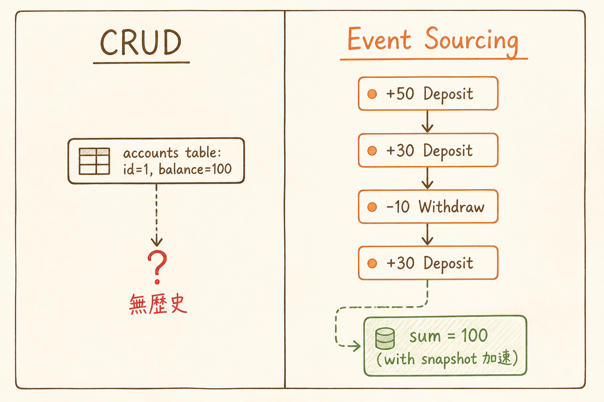

<!-- _class: chapter -->

<div class="ch-no">CHAPTER · 08 · TOPIC 02</div>

# Event Sourcing
## *存「發生了什麼」，不是「現在是什麼」*


---

<!-- _class: cover -->

<div style="text-align:center;">



</div>


---


## WHY · 為何「儲存所有事件」？

<br>

<div class="highlight">

傳統 CRUD：DB 存「目前餘額 = 100」。
過去發生什麼？**遺失了。**

Event Sourcing：DB 存「+50, +30, -10, +30」每筆事件。
任何時刻的餘額 = 從頭播放事件。

**對需要完整稽核軌跡的系統（金流 / 醫療）至關重要。**

</div>

> Source: `EventSourcingReading.pdf` · §Why Event Sourcing


---


## HOW · 核心結構

```
   傳統 CRUD                   Event Sourcing
   ─────────                  ──────────────
   Table: accounts            Table: events
   ┌────┬─────┐               ┌────┬──────────┬───────┐
   │ id │ bal │               │ id │ event    │ data  │
   ├────┼─────┤               ├────┼──────────┼───────┤
   │ 1  │ 100 │               │ 1  │ Deposit  │ +50   │
   └────┴─────┘               │ 2  │ Deposit  │ +30   │
                              │ 3  │ Withdraw │ -10   │
   問題：無歷史               │ 4  │ Deposit  │ +30   │
                              └────┴──────────┴───────┘
                              當前餘額 = sum() = 100
                              + snapshot 加速
```

> Source: `EventSourcingReading.pdf` · §Core Structure


---


## HOW · 適用情境

<div class="stack">
  <div class="layer client"><strong>① 金融帳戶</strong>　 每筆交易必留軌跡 · 合規要求</div>
  <div class="layer app"><strong>② 醫療紀錄</strong>　 病歷不可篡改 · 時序重要</div>
  <div class="layer data"><strong>② 訂單流程</strong>　 status 變化路徑要可追溯</div>
  <div class="layer infra"><strong>④ IoT 設備</strong>　 event stream 天然就是 events</div>
  <div class="layer infra"><strong>⑤ 撤銷功能</strong>　 ctrl-Z 設計 / 編輯歷史</div>
</div>

<br>

<div class="highlight">

**判斷準則**：問「我能不能丟掉 history？」
能丟 → 別用 ES（過度設計）。
不能丟 → ES 是天然選擇。

</div>

> Source: `EventSourcingReading.pdf` · §Use Cases


---


## HOW · 三大難題

| 難題 | 解法 |
|------|------|
| **重播慢** | Snapshot 機制（每 N event 存 state） |
| **Event schema 演進** | Event versioning · upcaster |
| **查詢困難** | 配合 CQRS（projection 出讀模型） |

<br>

<div class="alert">

**反模式**：用 ES 但沒做 snapshot——10 年後重建一個帳戶要 replay 1M 事件，請求 30 秒才回。

</div>

> Source: `EventSourcingReading.pdf` · §Common Pitfalls


---


## TRADE-OFF · ES 的真實成本

<div class="tradeoff">
  <div class="pro">
    <h3>ES 紅利</h3>
    <ul>
      <li>完整稽核軌跡</li>
      <li>時間旅行 debug</li>
      <li>支援多 projection</li>
      <li>事件可 replay 修 bug</li>
      <li>天然 event-driven</li>
    </ul>
  </div>
  <div class="con">
    <h3>ES 代價</h3>
    <ul>
      <li>學習曲線陡</li>
      <li>查詢必須建 projection</li>
      <li>Event schema 變更難</li>
      <li>儲存空間翻倍</li>
      <li>整套團隊培訓成本高</li>
    </ul>
  </div>
</div>

<div class="highlight">

**經驗法則**：**只在 audit log 是法律要求**或業務本質就是事件流時，才完整上 ES。
其他情況「**outbox table + 一般 CRUD**」夠用。

</div>

> Source: `EventSourcingReading.pdf` · §Cost-Benefit


---


<!-- _class: end -->

# Event Sourcing 完
## *事件存好了，下一站講讀寫分離。*

<br>

<span class="lead">→ 8.3 CQRS</span>
