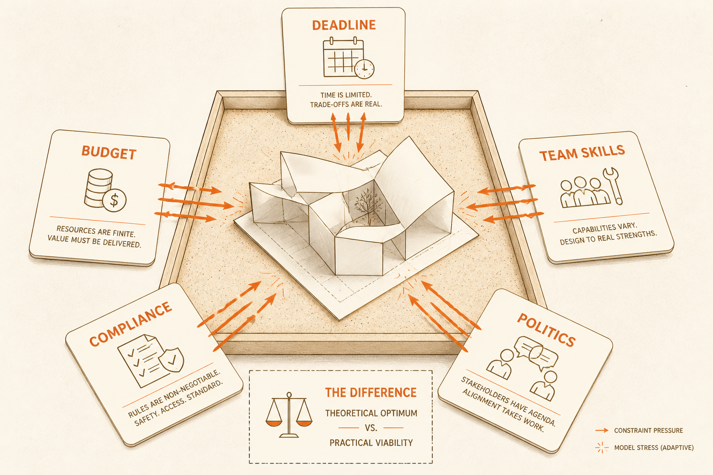
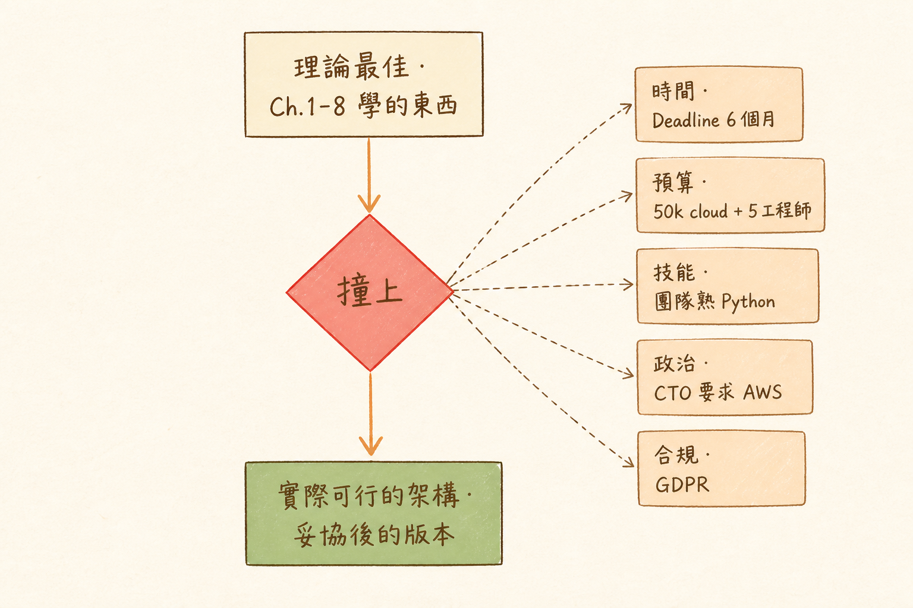

<!-- _class: chapter -->

<div class="ch-no">CHAPTER · 09 · OVERVIEW</div>

# Case Study & Constraints
## *把 Ch.1–8 用到真實案例上*


---

<!-- _class: cover -->

<div style="text-align:center;">



</div>


---


<!-- _class: cover -->

<div style="text-align:center;">



</div>


---


## OBJECTIVES · 學習目標

看完本章，你能回答：

<div class="stack">
  <div class="layer client"><strong>① IoT 監控系統怎麼從零設計？</strong>　 全流程演練</div>
  <div class="layer app"><strong>② 成本 / 期限 / 完美技術衝突時怎麼取捨？</strong></div>
  <div class="layer data"><strong>③ 為何「團隊技能」常勝過「先進技術」？</strong></div>
  <div class="layer infra"><strong>④ 真實架構師的決策手稿長什麼樣？</strong></div>
</div>

> Source: `_source/sa_ppt.md` Ch.9 · `SA簡報/S12, S14.pdf`


---


## MENTAL MODEL · 真實案例的三層約束

```
   理論最佳 (Ch.1-8 學的東西)
            ↓
   ─────── 撞上 ───────
            ↓
   ┌──────────────────────────────┐
   │ 時間 · Deadline 6 個月        │
   │ 預算 · $50k cloud + 5 工程師  │
   │ 技能 · 團隊熟 Python，沒人懂 Rust │
   │ 政治 · CTO 要求用 AWS         │
   │ 合規 · GDPR + ISO27001        │
   └──────────────────────────────┘
            ↓
   實際可行的架構（妥協後的版本）
```

<span class="muted">**Linus 哲學**：架構師最重要的能力，是知道「**理想**」和「**可行**」的差距。</span>

> Source: `S12_Slides.pdf` · §Reality Constraints


---


<!-- _class: end -->

# Overview 完
## *用 IoT 案例練全流程。*

<br>

<span class="lead">→ 9.1 IoT Case</span>
