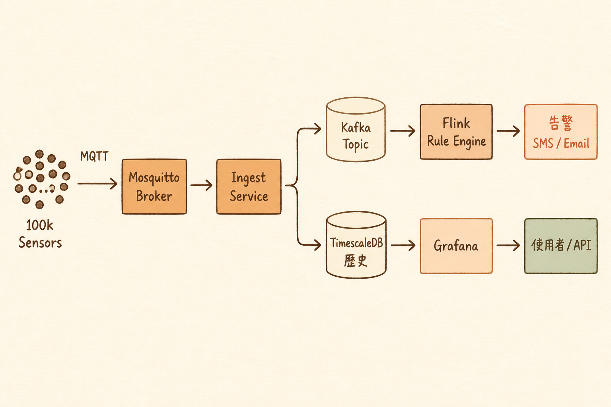

<!-- _class: chapter -->

<div class="ch-no">CHAPTER · 09 · TOPIC 01</div>

# IoT Monitoring System
## *從零設計：10 萬個感測器即時監控*


---

<!-- _class: cover -->

<div style="text-align:center;">



</div>


---


## REQUIREMENTS · 客戶說

<br>

<div class="highlight">

> 我們在全台工廠部署 10 萬個感測器（溫度 / 振動 / 電流）。
> 需要即時監控、異常告警、3 年歷史查詢、月報表。
> 預算有限，6 個月內上線。

</div>

<br>

**架構師第一步**：把這段話翻譯成數字。

> Source: `S14_Slides.pdf` · §IoT Scenario


---


## ESTIMATION · 規模計算

```
   感測器數          100,000
   每秒回報          1 reading / 10 sec
   ─────────────────────────────────
   寫入 QPS          10,000 QPS（穩態）
   單筆 payload      ~100 bytes
   ─────────────────────────────────
   每日資料量        100k × 8640 × 100 bytes ≈ 86 GB/day
   3 年保留          ~95 TB
   ─────────────────────────────────
   讀取                 即時告警 < 1s
                       歷史查詢 5s 可接受
                       月報表 30s OK
```

<span class="muted">**寫多讀少 · 時序資料 · 大量但每筆小**——典型時序資料庫場景。</span>

> Source: `S14_Slides.pdf` · §Estimation


---


## DECISION · 技術選型

<!-- _class: compact -->

| 元件 | 選擇 | 為什麼 |
|------|------|--------|
| 設備接入 | MQTT (Mosquitto) | 低頻寬 · QoS · IoT 標準 |
| 主存儲 | TimescaleDB | 時序優化 · SQL · 團隊熟 PG |
| 即時告警 | Kafka + Flink | 規則引擎 · stream 處理 |
| Cache | Redis | 最新讀數 · 排行榜 |
| 報表 | Grafana | 內建 TimescaleDB driver |
| 前端 | Next.js | 既有技能 |
| 部署 | AWS ECS | 已有合約 · 不上 K8s |

<br>

<span class="muted">**沒用 InfluxDB / Cassandra**：團隊熟 PG，TimescaleDB 是 PG extension——比學新 DB 快 3 個月。</span>

> Source: `S14_Slides.pdf` · §Tech Stack Decision


---


## ARCHITECTURE · 整體圖

```
   100k Sensors ──MQTT──→ [Mosquitto Broker]
                                  ↓
                          [Ingest Service]
                                  ↓
                ┌─────────────────┴─────────────────┐
                ▼                                    ▼
           [Kafka topic]                      [TimescaleDB]
                ↓                                    ↑
           [Flink Rule Engine]                       │
                ↓                                    │
           告警 → SMS / Email                  [Grafana]
                                                     │
                                              使用者 / API
```

<br>

<span class="muted">**設計哲學**：寫端與分析端**走兩條路**——TimescaleDB 存歷史、Kafka 走即時。</span>

> Source: `_source/09_Case_Study_Constraints.md` · §Architecture


---


## RISK · 風險評估

<div class="alert">

**Risk 1**：MQTT broker 單點 → mosquitto cluster + DNS failover

</div>

<div class="alert">

**Risk 2**：TimescaleDB 寫入瓶頸（10k QPS）→ 分時段批次 + hypertable 分區

</div>

<div class="alert">

**Risk 3**：Kafka topic 累積過快 → retention 7 天 · 重要事件持久化到 DB

</div>

<br>

<span class="muted">**沒有零風險的架構**——架構師的責任是把風險**識別出來、文件化、有 mitigation**。</span>

> Source: `S14_Slides.pdf` · §Risk Mitigation


---


<!-- _class: end -->

# IoT Case 完
## *案例懂了，下一站講取捨。*

<br>

<span class="lead">→ 9.2 Cost & Timeline</span>
