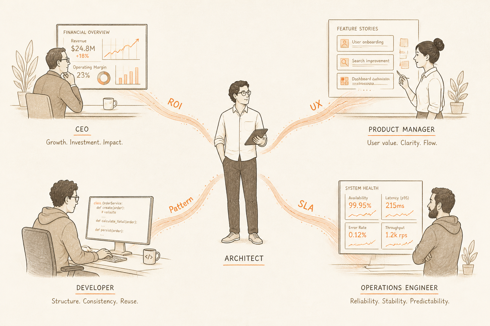
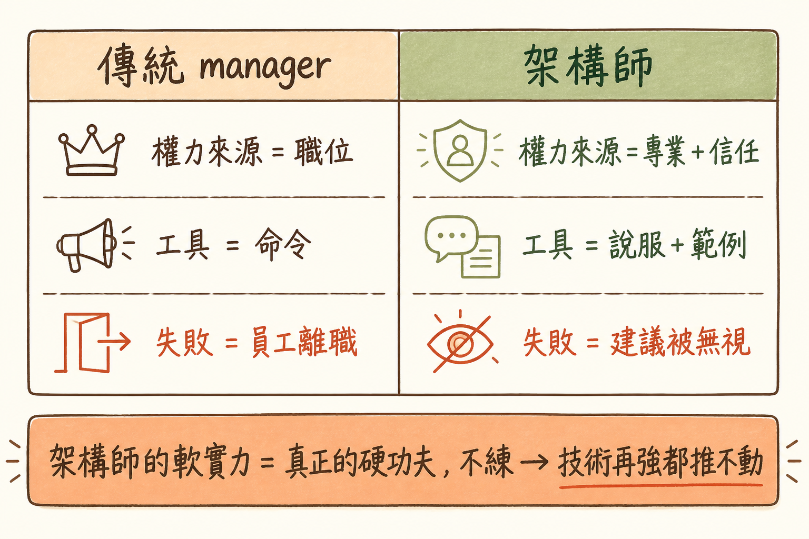

<!-- _class: chapter -->

<div class="ch-no">CHAPTER · 10 · OVERVIEW</div>

# Soft Skills
## *沒實權的職位，要靠專業說服*


---

<!-- _class: cover -->

<div style="text-align:center;">



</div>


---


<!-- _class: cover -->

<div style="text-align:center;">



</div>


---


## OBJECTIVES · 學習目標

看完本章，你能回答：

<div class="stack">
  <div class="layer client"><strong>① 沒有下屬，怎麼推動決策？</strong></div>
  <div class="layer app"><strong>② 對 CEO 講什麼、對工程師講什麼？</strong></div>
  <div class="layer data"><strong>③ 公眾演講與技術評審怎麼準備？</strong></div>
  <div class="layer infra"><strong>④ 怎麼保持「不被淘汰」？</strong></div>
</div>

> Source: `_source/sa_ppt.md` Ch.10 · `SA簡報/S16, S3.pdf`


---


## MENTAL MODEL · 架構師的權力模型

```
   傳統 manager                架構師
   ────────────                ──────
   權力來源：職位               權力來源：專業 + 信任
   工具：命令                   工具：說服 + 範例
   失敗：員工離職               失敗：建議被無視

   架構師的「軟」實力 = 真正的硬功夫
   不練 → 技術再強都推不動
```

<span class="muted">**Linus 哲學**：強的不是寫得多酷的代碼，是讓**正確的代碼被寫出來**。</span>

> Source: `S16_Slides.pdf` · §Influence Without Authority


---


<!-- _class: end -->

# Overview 完
## *先學影響力。*

<br>

<span class="lead">→ 10.1 Influence</span>
