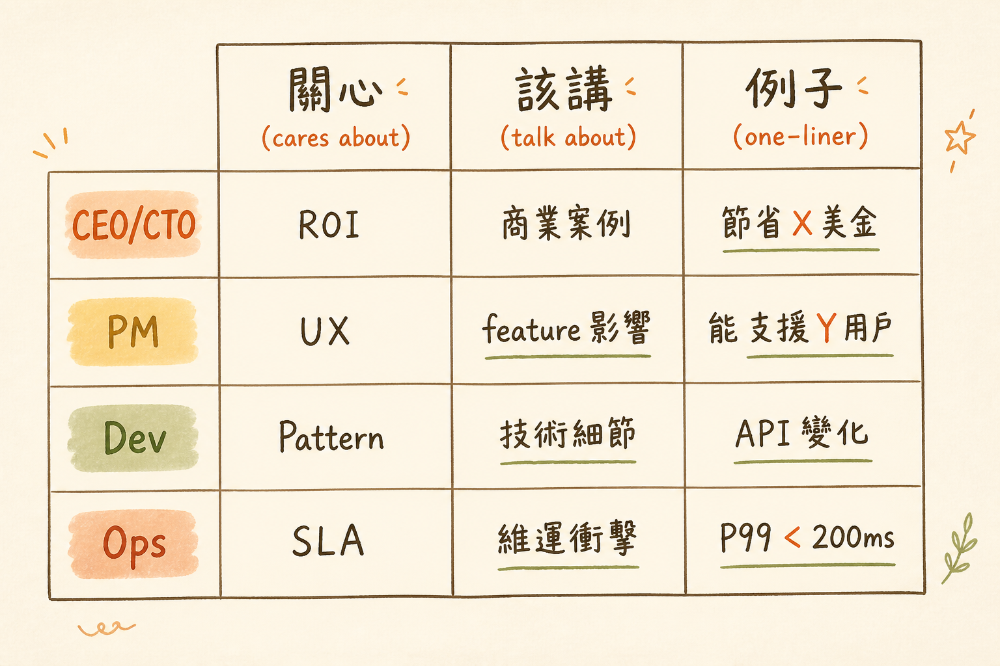

<!-- _class: chapter -->

<div class="ch-no">CHAPTER · 10 · TOPIC 02</div>

# Audience-Tuned Communication
## *對 CEO 講 ROI，對工程師講 trade-off*


---

<!-- _class: cover -->

<div style="text-align:center;">



</div>


---


## WHY · 為何同一份技術決策，要講三種版本？

<br>

<div class="highlight">

CEO 不在乎 PostgreSQL 是 ACID 還是 BASE。
工程師不在乎 ROI 12% 還是 25%。
PM 在乎使用者體驗變好還是變差。

**用對方的語言講對方關心的事**——是架構師的基本功。

</div>

<br>

- 一份決策 → 三種「翻譯」
- 沒翻譯 → 對方聽不懂 → 通不過

> Source: `S16_Slides.pdf` · §Multi-audience


---


## HOW · 四種角色的關注點

<!-- _class: compact -->

| 對象 | 關心 | 你該講 | 例子 |
|------|------|-------|------|
| **CEO / CTO** | ROI · 風險 · TTM | 商業案例 | 「降低成本 30%、上市快 2 個月」 |
| **PM / 產品** | 使用者體驗 · 交付節奏 | feature 影響 | 「加 cache 後頁面快 3×，轉換率提升」 |
| **Dev** | 模式 · trade-off · 工作量 | 技術細節 | 「Strategy + DI，減少 50% if/else」 |
| **Ops / QA** | 部署 · 監控 · SLA | 維運衝擊 | 「新增 Redis HA，需 SOP 更新」 |

<br>

<span class="muted">**同一張投影片給四種人看 = 失敗 = 90% 機率**。準備 3 版略不同的講解。</span>

> Source: `S16_Slides.pdf` · §Audience Matrix


---


## HOW · 三層金字塔結構

```
   ┌─────────────────────────────┐
   │  TOP: 結論一句話              │  ← CEO 只看這層
   │  「上 PostgreSQL，6 個月內」  │
   ├─────────────────────────────┤
   │  MID: 3 個支撐論點            │  ← PM 看到這層
   │  ① 招人易 ② 成本可控 ③ 風險低 │
   ├─────────────────────────────┤
   │  BOTTOM: 資料 / 細節          │  ← 工程師看完整
   │  ADR + benchmark + 對比     │
   └─────────────────────────────┘
```

<br>

<span class="muted">**McKinsey 金字塔原則**——結論在上，細節在下。閱讀者可在任一層停下。</span>

> Source: `S16_Slides.pdf` · §Pyramid Principle


---


## HOW · 技術評審 SOP

<div class="stack">
  <div class="layer client"><strong>① 文件先發</strong>　 評審前 2 天寄出 · 讓參與者有時間讀</div>
  <div class="layer app"><strong>② 30 分鐘原則</strong>　 簡報 < 15 min · 留 15 min 討論</div>
  <div class="layer data"><strong>③ 預設反對方</strong>　 想 3 個最常被質疑的問題 · 準備答案</div>
  <div class="layer infra"><strong>④ 結尾要有 next step</strong>　 不是「通過」就是「下一輪」 · 不留空白</div>
</div>

<br>

<div class="alert">

**反模式**：1 小時簡報 + 5 分鐘 Q&A。對方根本沒時間反饋——評審變成獨白。

</div>

> Source: `S16_Slides.pdf` · §Review SOP


---


## TRADE-OFF · 簡化 vs 失真

<div class="tradeoff">
  <div class="pro">
    <h3>該簡化</h3>
    <ul>
      <li>對 CEO 講細節</li>
      <li>對非技術人解釋架構</li>
      <li>第一次溝通的範圍</li>
      <li>趕時間的決策</li>
    </ul>
  </div>
  <div class="con">
    <h3>不該簡化</h3>
    <ul>
      <li>對 Dev 講實作</li>
      <li>關鍵 trade-off</li>
      <li>有合規 / 安全衝擊</li>
      <li>長期影響的決策</li>
    </ul>
  </div>
</div>

<div class="highlight">

**Albert Einstein**: 「Make things as simple as possible, but no simpler.」
**過度簡化** → 失真 → 後來被罵「你說的不是這樣！」

</div>

> Source: `S16_Slides.pdf` · §Simplify Right


---


<!-- _class: end -->

# Audience-Tuned 完
## *溝通框架到手，下一站講持續成長。*

<br>

<span class="lead">→ 10.3 Continuous Learning</span>
