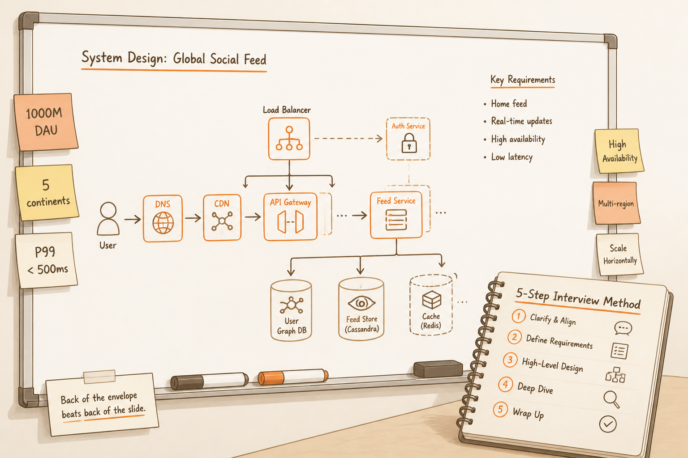
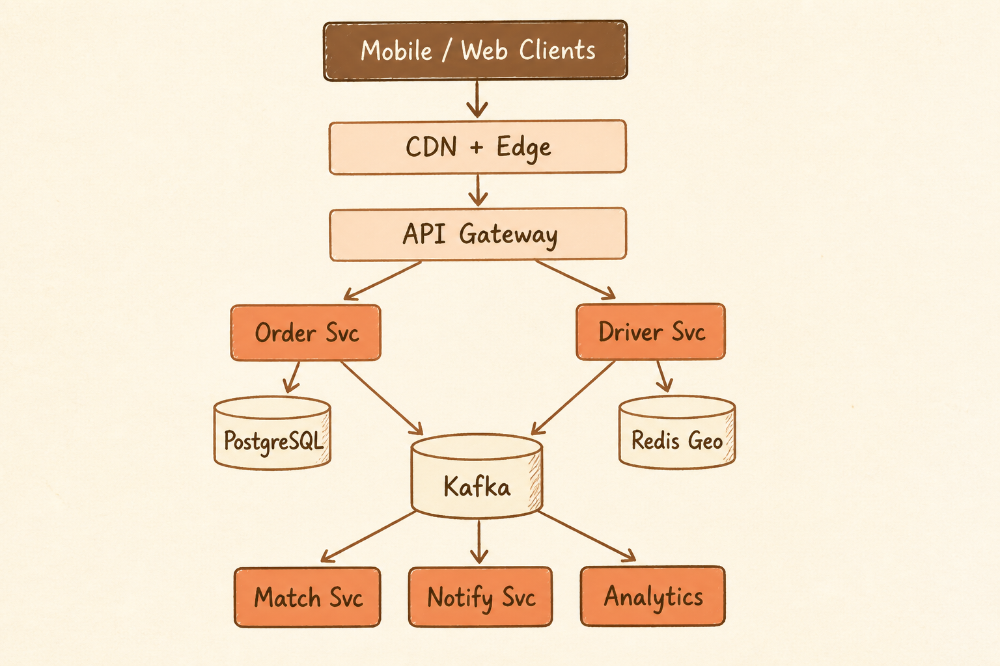

<!-- _class: chapter -->

<div class="ch-no">APPENDIX · 00 · CAPSTONE</div>

# Capstone Case Study
## *把整本書用在一個系統設計面試題*


---

<!-- _class: cover -->

<div style="text-align:center;">



</div>


---


<!-- _class: cover -->

<div style="text-align:center;">



</div>


---


## PROBLEM · 題目

<br>

<div class="highlight">

**面試官**：
> 請設計一個全球版的 Uber Eats 競品。
> 預計 1000 萬 DAU、覆蓋 5 大洲、即時派單、訂單金流、商家入駐。

</div>

<br>

**45 分鐘** · 白板畫圖 + 講解 trade-off

> Source: 整合 Ch.1-10 + 業界面試題庫


---


## STEP 1 · REQUIREMENTS（5 分鐘）

```
   功能 (Functional)
   ── 顧客下單 → 派單 → 配送追蹤 → 評價
   ── 商家接單 → 製餐 → 出餐
   ── 外送員領單 → 取餐 → 送達
   ── 即時定位、推播、金流

   非功能 (NFR)
   ── 1000 萬 DAU · peak 5000 訂單/秒
   ── P99 訂單建立 < 500ms
   ── 99.95% availability
   ── 即時定位更新 < 5s
   ── 多區、合規 (GDPR / PCI)
```

<br>

<span class="muted">**Ch.2 的功夫**——把模糊問題拆成可量化指標。</span>

> Source: Ch.2 + 系統設計面試框架


---


## STEP 2 · ESTIMATION（3 分鐘）

```
   寫入 QPS
   ── 訂單寫入: 5000 / sec
   ── 位置更新: 100k 外送員 × 1/5s = 20k / sec
   ── 總: ~25k QPS peak

   儲存
   ── 訂單: 5000 × 86400 × 1KB ≈ 432 GB/day
   ── 5 年保留: ~800 TB
   ── 位置軌跡: 短保留 (30 天) ~ 5 TB

   頻寬
   ── 推播 + 即時定位: ~5 Gbps peak
```

<br>

<span class="muted">**Ch.2 §3 的速算**——架構師面試必背的公式。</span>

> Source: Ch.2 §Throughput


---


## STEP 3 · HIGH-LEVEL（15 分鐘）

```
   [Mobile/Web Clients]
           │
      [CDN + Edge]                  ← Ch.4 靜態 + 邊緣
           │
      [API Gateway]                 ← Ch.7 LB + auth
           │
   ┌───────┴───────┐
   ▼               ▼
 [Order Svc]    [Driver Svc]        ← Ch.6 Modular Monolith
   │               │
   ▼               ▼
 [PostgreSQL] [Redis Geo]           ← Ch.4 Polyglot
   │
   ▼
 [Kafka] ──→ [Match Svc]            ← Ch.7 異步派單
              [Notify Svc]
              [Analytics]
```

> Source: Ch.6 + Ch.7 組合


---


## STEP 4 · DEEP DIVE（15 分鐘）

# 即時派單演算法

<div class="stack">
  <div class="layer client"><strong>① 地理索引</strong>　 H3 / Geohash · Redis GEORADIUS</div>
  <div class="layer app"><strong>② 候選人篩選</strong>　 5km 內活躍司機 · 評分排序</div>
  <div class="layer data"><strong>② 派發策略</strong>　 連續通知 3 人 · 5 秒 timeout · 下一輪</div>
  <div class="layer infra"><strong>④ 鎖機制</strong>　 Redis SETNX 防止重複派單</div>
</div>

<br>

<div class="highlight">

**關鍵**：分散式鎖 + 即時定位 + retry——三件 Ch.7 學的功夫合用。

</div>

> Source: Ch.7 §Cache + Ch.6 §Strategy Pattern


---


## STEP 5 · TRADE-OFFS（7 分鐘）

<div class="tradeoff">
  <div class="pro">
    <h3>本架構強項</h3>
    <ul>
      <li>Stateless · 水平擴展容易</li>
      <li>Polyglot 存儲適配多場景</li>
      <li>異步派單耐流量尖峰</li>
      <li>多區域 + CDN 加速</li>
    </ul>
  </div>
  <div class="con">
    <h3>本架構弱點</h3>
    <ul>
      <li>Kafka SPOF 風險（需 3-broker）</li>
      <li>跨區域一致性弱（接受最終一致）</li>
      <li>派單演算法需迭代優化</li>
      <li>金流需獨立服務（Ch.8 拆）</li>
    </ul>
  </div>
</div>

<div class="alert">

**面試金句**：「在 X 約束下我選 Y，犧牲 Z。如果規模到 100M DAU，會考慮把金流拆成獨立服務 + Saga」

</div>

> Source: 整合 Ch.1-10


---


<!-- _class: end -->

# Capstone 完
## *45 分鐘走完，下一站速查表。*

<br>

<span class="lead">→ 91 Cheatsheet</span>
