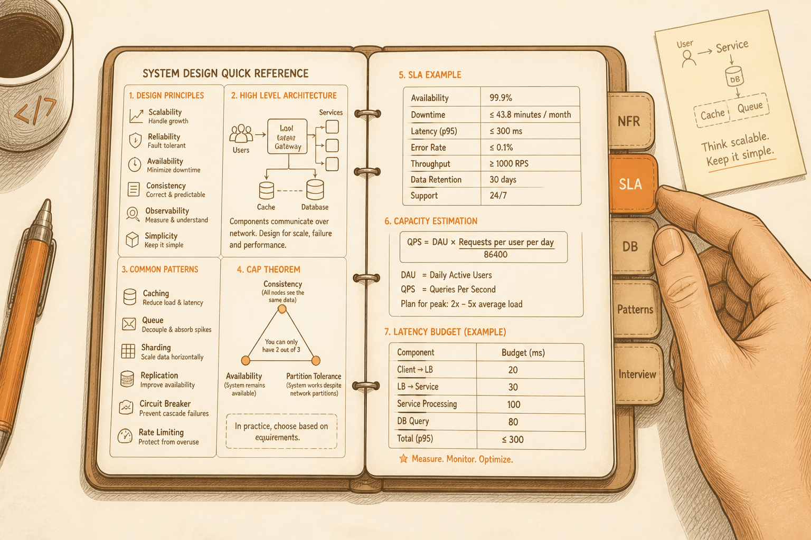

<!-- _class: chapter -->

<div class="ch-no">APPENDIX · 01 · CHEATSHEET</div>

# Architect Cheatsheet
## *面試 / 工作時，1 分鐘可以查到的決策表*


---

<!-- _class: cover -->

<div style="text-align:center;">



</div>


---


## INDEX · 速查表目錄

<div class="stack">
  <div class="layer client"><strong>① NFR 量化六問</strong>　 把形容詞變數字</div>
  <div class="layer app"><strong>② SLA 9 對照表</strong>　 必背</div>
  <div class="layer data"><strong>③ DB 選型決策樹</strong></div>
  <div class="layer infra"><strong>④ 進階模式判斷表</strong></div>
  <div class="layer infra"><strong>⑤ ADR 範本</strong></div>
  <div class="layer infra"><strong>⑥ 面試 5 步驟 SOP</strong></div>
</div>

> Source: 提煉自 Ch.1-10 全部章節


---


## ① NFR 量化六問

| 模糊形容詞 | 逼問的問題 | 期望輸出 |
|-----------|-----------|---------|
| 「要很快」 | P50? P99? 同步異步？ | P99 < 200ms |
| 「要穩定」 | 容忍幾分鐘停機？ | 99.95% |
| 「人會很多」 | DAU? Peak QPS？成長？ | 100k DAU · 5k QPS |
| 「資料很多」 | 每日新增? 保留多久？ | 1GB/day · 5 年 |
| 「全球用」 | 哪些地區? 合規？ | NA/EU/APAC · GDPR |
| 「會擴展」 | 6 個月? 上限？ | 10× · 1M 上限 |

> Source: Ch.2 §1


---


## ② SLA 9 對照表

| Uptime | 一年 | 一月 | 等級 |
|--------|------|------|------|
| 99% | 87.6 hr | 7.3 hr | MVP |
| 99.9% | 8.76 hr | 43.8 min | 標準 SaaS |
| 99.95% | 4.38 hr | 21.9 min | 業界中段 |
| 99.99% | 52.6 min | 4.38 min | AWS / GCP |
| 99.999% | 5.26 min | 26.3 s | 電信 / 金融 |

<br>

<div class="highlight">

**口訣**：每多 1 個 9，**成本 × 2-5 倍**。99.9% 已涵蓋 95% 系統。

</div>

> Source: Ch.2 §2


---


## ③ DB 選型決策樹

```
   需要 ACID 事務 / 複雜 join？
   ├─ 是 → PostgreSQL（先選）/ MySQL
   │
   └─ 否 → 看主要查詢模式
           │
           ├─ KV 等值查詢 → Redis / DynamoDB
           ├─ 巢狀文件 → MongoDB
           ├─ 寫多 + 線性擴展 → Cassandra
           ├─ 全文搜尋 → Elasticsearch
           ├─ 多跳關係 → Neo4j
           ├─ 時序 metric → TimescaleDB / InfluxDB
           └─ 向量相似 → pgvector / Pinecone
```

<span class="muted">**Linus 哲學**：先 PG · 撞牆再換 · 90% 永遠撞不到。</span>

> Source: Ch.4 §2


---


## ④ 進階模式判斷表

| 模式 | 該用的訊號 | 不該用的訊號 |
|------|-----------|-------------|
| **Microservices** | 團隊 > 30 · K8s 熟 | < 15 人 · 沒 observability |
| **Event Sourcing** | 合規需軌跡 · 業務本質事件流 | 一般 CRUD · 查詢複雜 |
| **CQRS** | 讀寫比 > 100:1 · 多 projection | < 10:1 · 簡單 CRUD |
| **Saga** | 跨服務事務 | 單服務內 transaction |
| **Modular Monolith** | 大多數情況 | 真正需要獨立部署時 |

> Source: Ch.8 全章


---


## ⑤ ADR 範本

```markdown
# ADR-N · 標題

Status: Accepted | Superseded | Deprecated
Date:   2026-MM-DD
Decider: @architect-name

## Context
為什麼有這個決策需求？

## Decision
我們決定...

## Consequences
+ 好處 1
+ 好處 2
− 壞處 1
− 壞處 2

## Alternatives Considered
- 方案 B：...為何拒絕
- 方案 C：...為何拒絕
```

> Source: Ch.3 §3


---


## ⑥ 面試 5 步驟 SOP

```
   ① REQUIREMENTS    3-5 min  · 功能 + NFR + 規模假設
   ② ESTIMATION      2-3 min  · QPS / storage / bandwidth
   ③ HIGH-LEVEL      10-15 min · 5-7 個方塊 + 資料流
   ④ DEEP DIVE       15-20 min · 1-2 個 component 深挖
   ⑤ TRADE-OFFS      5-10 min · 哪邊壞了會怎樣
```

<br>

<div class="highlight">

**第 3-4 步驟在畫圖**。前 2 步驟「設定情境」，第 5 步驟「展現深度」。

</div>

> Source: Capstone §Method


---


## INTERVIEW · 答題金句

<div class="stack">
  <div class="layer client"><strong>不確定時</strong>　 「我假設 X，如果 Y 我會改成 Z」</div>
  <div class="layer app"><strong>講選型</strong>　 「我選 A 因為 B，但 C 場景會選 D」</div>
  <div class="layer data"><strong>主動提失敗</strong>　 「如果 cache 掛了，這裡會...」</div>
  <div class="layer infra"><strong>承認局限</strong>　 「這個方案在 X 情況下會失效」</div>
  <div class="layer infra"><strong>引用真實系統</strong>　 「Uber 的做法是... 因為...」</div>
</div>

<br>

<span class="muted">**面試官最怕**：講 best practice 但講不出 trade-off。**講出 trade-off 就 senior 了。**</span>

> Source: 整合 Ch.1-10


---


## ANTI-PATTERNS · 反模式清單

<div class="alert">

**這些做法經驗證會失敗**

</div>

<div class="stack">
  <div class="layer client"><strong>① 3 人團隊上微服務</strong>　 維運時間 > 業務時間</div>
  <div class="layer app"><strong>② MVP 直接 Event Sourcing</strong>　 過度設計、學習曲線炸鍋</div>
  <div class="layer data"><strong>③ Cassandra 存帳戶餘額</strong>　 雙花災難</div>
  <div class="layer infra"><strong>④ 用 Word 寫架構決策</strong>　 一個月後就失同步</div>
  <div class="layer infra"><strong>⑤ 「未來會大」過早優化</strong>　 上線晚 6 個月、用戶流失</div>
  <div class="layer infra"><strong>⑥ 選技術只看「酷不酷」</strong>　 招不到人 + vendor lock-in</div>
</div>

> Source: 整合 Ch.1-10 反模式區


---


## RECAP · 一頁速查總覽

<div class="tradeoff">
  <div class="pro">
    <h3>Decision Tools</h3>
    <ul>
      <li>NFR 量化六問</li>
      <li>9 對照表</li>
      <li>DB 選型決策樹</li>
      <li>進階模式判斷表</li>
      <li>ADR 範本</li>
    </ul>
  </div>
  <div class="con">
    <h3>Communication Tools</h3>
    <ul>
      <li>5 個影響力工具</li>
      <li>4 角色溝通對照</li>
      <li>金字塔結構</li>
      <li>面試 5 步驟 SOP</li>
      <li>5 句答題金句</li>
    </ul>
  </div>
</div>


---


<!-- _class: end -->

# Cheatsheet 完
## *該記的都在這了。*

<br>

<span class="lead">祝你成為值錢的架構師。</span>
