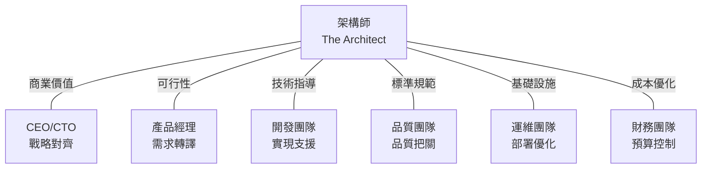

# 第一章：架構師的角色與價值定位
## Chapter 1: The Architect's Role & Value Proposition

基於 **S1_Slides.pdf**、**S2_Slides.pdf**、**S3_Slides.pdf** 及 2025年業界最佳實踐

---

## 🎯 章節目標 (Chapter Objectives)
- 打破架構師角色的迷思，建立正確的職業認知
- 理解架構師在 AI 輔助編程時代的獨特價值
- 掌握從開發者到架構師的思維轉變路徑

---

## 📊 投影片架構 (5張核心投影片)

### **Slide 1: 開場定位 - AI時代的架構師價值**
#### **The Architect in the Age of AI**

**麥肯錫風格設計要點：**
- **視覺主軸**：金字塔結構，頂端是商業價值，底層是技術實現
- **色系**：深藍(#003A70) + 金色(#FFB81C) 重點標示
- **版面配置**：70-30法則（70%視覺，30%文字）

**核心訊息（One Key Message）：**
> "AI 能寫出完美的函式，但無法決定該寫哪個函式來賺錢"

**三大支撐點（Rule of Three）：**
1. **決策權重** > 編碼能力：架構師是「Why」的守護者
2. **商業翻譯** > 技術實現：將營收目標轉化為系統設計
3. **全局思維** > 局部優化：見樹又見林的系統觀

### **Slide 2: 思維模式轉變矩陣**
#### **The Mindset Transformation Matrix**

**麥肯錫風格設計要點：**
- **視覺框架**：2x2矩陣或對比式流程圖
- **圖示系統**：統一的icon語言（Material Design圖標）
- **動畫順序**：漸進式揭露，從左到右的轉變動畫

**對比矩陣（Comparison Matrix）：**

| **思考層次** | **🔧 開發者模式** | **➔** | **🏗️ 架構師模式** | **💡 2025關鍵洞察** |
|:---|:---|:---:|:---|:---|
| **價值焦點** | 功能完成度<br>"It works!" | **→** | ROI與商業影響<br>"It makes money!" | AI時代：從執行到決策 |
| **問題框架** | How to implement?<br>如何實現？ | **→** | Should we build?<br>該不該做？ | 機會成本思維 |
| **技術選型** | 最新最潮<br>"Latest & Greatest" | **→** | 成熟穩定<br>"Proven & Scalable" | 風險vs創新平衡 |
| **成功指標** | 代碼品質<br>Coverage, Performance | **→** | 業務指標<br>Revenue, User Growth | 可量化商業價值 |
| **知識廣度** | T型專家<br>深度優先 | **→** | π型通才<br>廣度+深度 | 跨領域整合能力 |

### **Slide 3: 職涯價值主張與薪資數據**
#### **Career Value Proposition & Market Reality**

**麥肯錫風格設計要點：**
- **數據視覺化**：使用瀑布圖展示薪資進階
- **證據支撐**：引用2025年最新薪資報告
- **色彩編碼**：綠色上升箭頭，金色強調重點數據

**薪資進階路徑（2025年數據）：**

```
開發者 → 資深開發者 → 架構師 → 資深架構師
$90K  →  $120K    →  $180K  →  $250K+
       (+33%)      (+50%)    (+39%)
```

**三大價值支柱（Three Value Pillars）：**

| **價值維度** | **具體表現** | **2025市場需求** |
|:---|:---|:---|
| **🎯 策略影響力** | • 直接參與公司技術戰略<br>• 影響產品方向與投資決策<br>• 定義技術標準與最佳實踐 | 需求增長45% YoY |
| **💼 職涯彈性** | • 可橫向發展至CTO/VP Engineering<br>• 可轉型技術顧問或創業<br>• 遠程工作機會多 | 85%支持遠程 |
| **🚀 技能複利** | • 經驗可跨產業轉移<br>• AI工具放大設計能力<br>• 越老越值錢的職業 | 10年經驗溢價120% |

### **Slide 4: 組織定位與影響力地圖**
#### **Organizational Positioning & Influence Map**

**麥肯錫風格設計要點：**
- **網絡圖設計**：架構師位於中心的輻射狀結構
- **互動元素**：hover顯示不同角色的溝通重點
- **層級表現**：使用大小和顏色深淺表示影響力

**360度利益相關者地圖：**



**關鍵溝通策略（Communication Strategy）：**

| **對象** | **溝通語言** | **價值主張** | **2025最佳實踐** |
|:---|:---|:---|:---|
| **C-Level** | ROI, Risk, Time-to-Market | 降低技術債務30% | 使用商業案例而非技術細節 |
| **產品團隊** | User Story, Feature Impact | 加速交付週期40% | 共創設計工作坊 |
| **開發團隊** | Pattern, Best Practice | 減少重工50% | Pair Architecture Sessions |
| **運維團隊** | SLA, Monitoring, Scale | 提升可用性至99.99% | DevOps協作模式 |

### **Slide 5: 行動呼籲與轉型路徑**
#### **Call to Action & Transformation Journey**

**麥肯錫風格設計要點：**
- **路線圖設計**：清晰的階段性里程碑
- **行動導向**：每階段配套具體行動項
- **視覺引導**：從左到右的進程條設計

**90天轉型路徑圖（90-Day Transformation）：**

| **階段** | **Day 1-30<br/>認知轉變** | **Day 31-60<br/>技能建構** | **Day 61-90<br/>實戰應用** |
|:---|:---|:---|:---|
| **🎯 目標** | 建立架構思維 | 掌握核心工具 | 交付首個設計 |
| **📚 學習** | • 商業模式理解<br>• 利益相關者分析<br>• 系統思考訓練 | • 架構模式學習<br>• 雲原生架構<br>• AI工具應用 | • 實際專案參與<br>• 架構評審<br>• 技術決策 |
| **🛠️ 實踐** | • 參與架構評審會<br>• 閱讀架構文檔<br>• 影子學習資深架構師 | • 設計POC系統<br>• 撰寫ADR文檔<br>• 技術選型練習 | • 主導小型專案<br>• 跨團隊協作<br>• 成果展示 |
| **📊 衡量** | 理解5個商業指標 | 完成3個設計模式 | 交付1個完整架構 |

**2025年架構師必備能力矩陣：**

```
技術深度 ████████░░ 80%  - 保持技術敏銳度
商業思維 ██████████ 100% - 價值驅動決策
溝通協作 █████████░ 90%  - 跨部門影響力
AI 應用  ████████░░ 80%  - 工具賦能設計
系統思考 ██████████ 100% - 全局優化視角
```

---

## 🎨 麥肯錫簡報設計規範

### 色彩系統（Color System）
- **主色**：深藍 #003A70（專業、信任）
- **強調色**：金色 #FFB81C（價值、重點）
- **輔助色**：淺灰 #F0F0F0（背景）、深灰 #4A4A4A（文字）
- **語意色**：綠 #00B388（成長）、紅 #DC3545（風險）

### 排版原則（Typography）
- **標題**：思源黑體 Bold 32pt
- **副標題**：思源黑體 Medium 24pt
- **內文**：思源黑體 Regular 16pt
- **行距**：1.5倍
- **對齊**：左對齊為主，數據置中

### 視覺層次（Visual Hierarchy）
1. **大標題**：一句話核心訊息
2. **支撐論點**：3個關鍵支撐點
3. **證據數據**：具體數字與案例
4. **行動指引**：下一步該做什麼

### 動畫原則（Animation）
- **進場順序**：從上到下，從左到右
- **強調動畫**：縮放 + 顏色變化
- **過渡時間**：0.3-0.5秒
- **避免**：過度花俏的特效

---

## 📝 演講備註（Speaker Notes）

### 開場勾子（Opening Hook）
> "在座各位，如果我告訴你，GitHub Copilot已經能完成80%的編碼工作，那剩下的20%是什麼？就是今天要談的——架構決策。"

### 故事案例（Story Examples）
1. **Netflix 2008年轉型雲端**：架構師的一個決定，造就千億美元公司
2. **Uber 微服務拆分**：從單體到2000+微服務的架構演進
3. **抖音推薦系統**：架構如何支撐10億日活用戶

### 互動環節（Interaction Points）
- **提問1**："你認為ChatGPT能取代架構師嗎？"
- **提問2**："誰能分享一個因架構不當導致的事故？"
- **小組討論**："如果要設計下一個抖音，你會考慮什麼？"

### 總結金句（Closing Statement）
> "架構師不是寫代碼最快的人，而是知道什麼代碼不該寫的人。在AI時代，這種判斷力比任何時候都更有價值。"