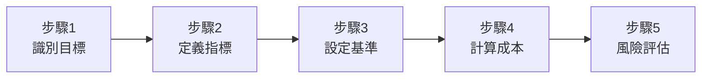

# 第二章：需求分析與量化思維
## Chapter 2: Requirements Analysis & Quantitative Thinking

基於 **S3_Slides.pdf** (The Architect's Mindset)、**S5_Slides.pdf** (Understanding System Requirements) 及 2025年業界最佳實踐

---

## 🎯 章節目標 (Chapter Objectives)
- 區分商業目標(Goals)與系統需求(Requirements)的本質差異
- 掌握非功能性需求(NFR)的量化技巧與談判策略
- 建立以數據驅動的架構決策框架

---

## 📊 投影片架構 (5張核心投影片)

### **Slide 1: 開場定位 - 從模糊願景到精準指標**
#### **From Fuzzy Vision to Precise Metrics**

**麥肯錫風格設計要點：**
- **視覺主軸**：漏斗模型，從上到下逐層精煉
- **色系**：深藍(#003A70) + 橙色(#FF6900) 數據強調
- **版面配置**：60-40法則（60%視覺漏斗，40%關鍵訊息）

**核心訊息（One Key Message）：**
> "客戶說『要很快』是願望，架構師說『100ms內』是承諾"

**三層轉化漏斗（Transformation Funnel）：**

```
層次1: 商業願景 (Business Vision)
    "我們要成為業界最快的平台"
         ↓ [架構師介入]
層次2: 商業目標 (Business Goals)
    "減少50%用戶等待時間，提升30%轉換率"
         ↓ [量化分析]
層次3: 技術指標 (Technical Metrics)
    "API延遲 < 100ms, 吞吐量 > 10K req/s"
```

---

### **Slide 2: 目標vs需求 - 關鍵思維轉換**
#### **Goals vs Requirements: The Critical Distinction**

**麥肯錫風格設計要點：**
- **視覺框架**：雙軌對比圖（Dual-Track Comparison）
- **圖示系統**：目標用靶心🎯，需求用齒輪⚙️
- **動畫順序**：先顯示錯誤認知，再展示正確理解

**對比矩陣（Distinction Matrix）：**

| **維度** | **🎯 商業目標 (Goals)** | **⚙️ 系統需求 (Requirements)** | **🚨 2025關鍵洞察** |
|:---|:---|:---|:---|
| **本質定義** | 對組織的影響<br>"Impact on Organization" | 系統該做什麼<br>"What System Should Do" | AI時代：目標驅動開發 |
| **誰來定義** | CEO/業務團隊<br>商業視角 | 產品經理/分析師<br>功能視角 | 架構師是橋樑 |
| **成功衡量** | 營收增長、成本降低<br>Business KPIs | 功能完成度<br>Feature Completion | OKR vs Acceptance Criteria |
| **時間跨度** | 長期戰略<br>1-3年 | 短期交付<br>1-6個月 | 平衡長短期利益 |

**實例對照（Real Examples）：**
- ❌ 需求："建立指紋辨識系統"
- ✅ 目標："縮短員工打卡時間50%，降低代打卡率90%"

---

### **Slide 3: NFR量化工程 - 拒絕形容詞的藝術**
#### **NFR Quantification: The Art of Rejecting Adjectives**

**麥肯錫風格設計要點：**
- **數據視覺化**：儀表板風格的指標展示
- **證據支撐**：引用2025年業界基準數據
- **色彩編碼**：綠色達標，黃色警示，紅色超標

**五大NFR指標量化表（The Big 5 NFR Metrics）：**

| **指標類別** | **❌ 模糊需求** | **✅ 量化指標** | **🏆 2025業界基準** | **💰 商業影響** |
|:---|:---|:---|:---|:---|
| **🚀 效能<br>Performance** | "系統要很快" | • 延遲(Latency): <100ms<br>• 吞吐量: >1000 req/s | • Google: 200ms<br>• Amazon: 100ms | 每100ms延遲<br>=-1%轉換率 |
| **💪 負載<br>Load** | "要能處理高峰" | • 極限負載: 50K併發<br>• 正常負載: 5K併發 | Black Friday:<br>10x平時流量 | 當機1小時<br>=-$100K營收 |
| **📊 資料量<br>Volume** | "資料會很多" | • Day 1: 500GB<br>• 年增長: 2TB<br>• 5年規劃: 10TB | 數據翻倍<br>每18個月 | 儲存成本<br>$0.023/GB/月 |
| **⏰ 可用性<br>SLA** | "不能當機" | • 99.99% = 52分鐘/年<br>• 99.9% = 8.76小時/年 | • 銀行: 99.99%<br>• 電商: 99.9% | 每個9 = +10x成本 |
| **👥 併發用戶** | "很多人用" | • 同時在線: 10K<br>• 實際請求: 1K/s | 併發 ≈ 負載×10<br>(思考時間) | 用戶體驗<br>決定留存率 |

**計算公式速查卡（Quick Calculation Card）：**
```
延遲 × 吞吐量 ≠ 總處理能力（常見誤解）
併發用戶 ÷ 10 ≈ 實際負載（經驗法則）
99.99% SLA = 4.38分鐘/月停機時間
```

---

### **Slide 4: 利益相關者溝通策略**
#### **Stakeholder Communication Playbook**

**麥肯錫風格設計要點：**
- **人物誌設計**：使用真實照片剪影
- **對話泡泡**：展示不同角色的關注點
- **場景化呈現**：會議室情境模擬

**分眾溝通策略表（Audience-Specific Communication）：**

| **角色** | **🗣️ 他們的語言** | **❤️ 他們關心什麼** | **📝 溝通範例** | **⚡ 2025溝通技巧** |
|:---|:---|:---|:---|:---|
| **CEO** | ROI, Revenue, Risk | 財務底線<br>競爭優勢 | "這架構確保黑五不當機<br>保護2000萬營收" | 用故事說數字 |
| **產品經理** | User Story, Sprint | 交付時程<br>功能完整性 | "微服務架構讓功能<br>可獨立發布，加速50%" | 視覺化Roadmap |
| **開發團隊** | Pattern, Framework | 技術挑戰<br>學習成長 | "用CQRS處理<br>讀寫分離場景" | Pair Architecture |
| **運維團隊** | Monitoring, Alert | 系統穩定<br>維護成本 | "容器化部署<br>降低80%部署時間" | SRE協作模式 |
| **財務團隊** | CAPEX, OPEX | 預算控制<br>成本效益 | "雲原生省30%<br>基礎設施成本" | TCO分析報告 |

**談判話術庫（Negotiation Scripts）：**
- 當客戶說"100%可用性"時：
  > "100%意味著零停機，需要3倍預算。99.99%只差52分鐘/年，省下200萬。您選哪個？"

---

### **Slide 5: 需求量化實戰工作坊**
#### **Requirements Quantification Workshop**

**麥肯錫風格設計要點：**
- **互動式設計**：可填寫的工作表模板
- **案例驅動**：真實場景練習
- **檢查清單**：確保不遺漏關鍵指標

**需求量化五步法（5-Step Quantification Process）：**



**實戰案例：電商平台黑色星期五準備**

| **步驟** | **執行內容** | **產出結果** | **決策點** |
|:---|:---|:---|:---|
| **1. 識別目標** | • 不當機<br>• 維持用戶體驗<br>• 最大化營收 | 營收目標：$2M/天 | 可接受損失？ |
| **2. 定義指標** | • 回應時間<br>• 錯誤率<br>• 吞吐量 | • <200ms<br>• <0.1%<br>• >10K/s | 優先順序？ |
| **3. 設定基準** | 平時流量×10 | 50K併發用戶 | 尖峰預估？ |
| **4. 計算成本** | • 額外伺服器<br>• CDN費用<br>• 備援系統 | $50K額外成本 | ROI = 40:1 |
| **5. 風險評估** | • 流量超預期<br>• DDoS攻擊<br>• 支付閘道失效 | Plan B：<br>排隊系統 | 接受風險？ |

**NFR檢查清單（NFR Checklist）：**
- [ ] 延遲目標（P50, P95, P99）
- [ ] 吞吐量要求（正常/尖峰）
- [ ] 可用性SLA（幾個9）
- [ ] 資料量預估（初始/增長）
- [ ] 併發用戶數（登入/匿名）
- [ ] 安全要求（加密/合規）
- [ ] 備援策略（RTO/RPO）
- [ ] 成本限制（CAPEX/OPEX）

---

## 🎨 麥肯錫簡報設計規範

### 色彩系統（Color System）
- **主色**：深藍 #003A70（專業、信任）
- **強調色**：橙色 #FF6900（數據、警示）
- **輔助色**：淺灰 #F0F0F0（背景）、深灰 #4A4A4A（文字）
- **語意色**：綠 #00B388（達標）、黃 #FFC837（警示）、紅 #DC3545（超標）

### 數據呈現原則（Data Visualization）
- **儀表板設計**：關鍵指標置頂，次要資訊收折
- **基準線標註**：永遠標示業界基準作為參考
- **趨勢展示**：使用迷你圖(Sparkline)展示變化
- **單位統一**：同類數據使用相同單位和尺度

### 版面結構（Layout Structure）
- **標題層級**：最多3層，保持視覺層次清晰
- **留白運用**：30%留白確保閱讀舒適
- **網格系統**：12欄網格，確保對齊一致
- **焦點管理**：每頁只有一個視覺焦點

---

## 📝 演講備註（Speaker Notes）

### 開場勾子（Opening Hook）
> "各位知道Amazon每100毫秒的延遲，會損失1%的銷售額嗎？這就是為什麼我們需要量化思維。"

### 故事案例（Story Examples）
1. **Netflix 2011年當機事件**：因為沒定義清楚NFR，聖誕夜當機造成巨大損失
2. **阿里巴巴雙11準備**：如何用量化指標支撐千億交易
3. **Zoom疫情爆發**：從10M到300M用戶的架構挑戰

### 互動環節（Interaction Points）
- **提問1**："你們公司的SLA是幾個9？知道這代表什麼嗎？"
- **練習**："給你一個場景：外送平台午餐時段，請量化NFR"
- **討論**："100%可用性真的必要嗎？什麼情況下99.9%就夠了？"

### 關鍵要點總結（Key Takeaways）
1. **永遠數字化**：拒絕"很快"、"很多"等形容詞
2. **目標先於需求**：先問Why，再問What
3. **成本效益思維**：每個9都是錢，要算投資報酬率

### 結尾金句（Closing Statement）
> "記住：功能決定系統『做什麼』，NFR決定系統『能活多久』。在AI時代，後者才是架構師的核心價值。"