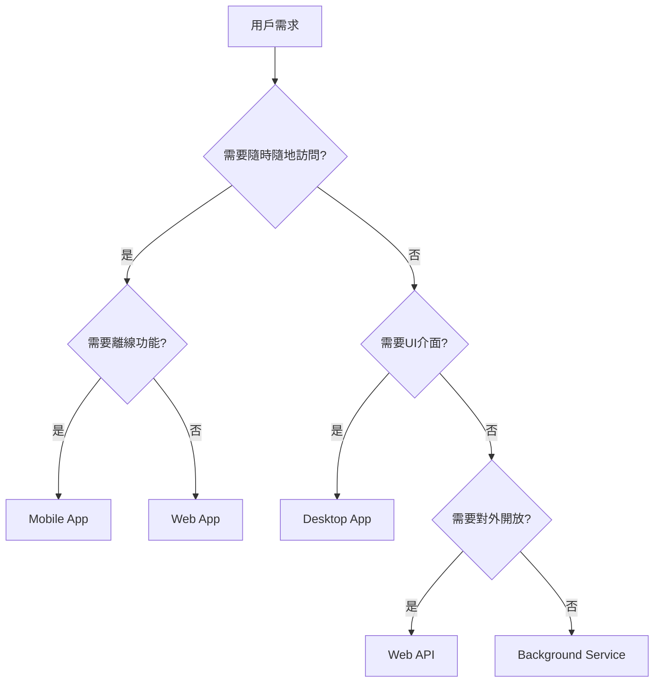
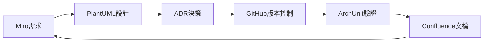

# 第三章：架構流程與應用類型
## Chapter 3: Architecture Process & Application Types

基於 **S4_Slides.pdf** (The Architecture Process)、**S6_Slides.pdf** (Application Types) 及 2025年業界最佳實踐

---

## 🎯 章節目標 (Chapter Objectives)
- 掌握標準化架構設計流程，從需求到交付的完整生命週期
- 精準選擇應用類型，匹配商業場景與技術約束
- 建立架構決策記錄(ADR)習慣，確保設計可追溯

---

## 📊 投影片架構 (5張核心投影片)

### **Slide 1: 開場定位 - 架構的系統化工程**
#### **Architecture as Systematic Engineering**

**麥肯錫風格設計要點：**
- **視覺主軸**：工程流水線圖，展示從原料到成品的轉化過程
- **色系**：深藍(#003A70) + 綠色(#00B388) 進度指示
- **版面配置**：橫向流程圖佔70%，關鍵數據佔30%

**核心訊息（One Key Message）：**
> "架構設計不是藝術創作，是可重複、可預測的工程流程"

**架構成熟度模型（Architecture Maturity Model）：**

| **層級** | **特徵** | **產出品質** | **風險等級** | **2025基準** |
|:---|:---|:---|:---|:---|
| **Level 0<br>混沌** | 無流程<br>靠直覺 | 不可預測 | 極高 | 5%企業 |
| **Level 1<br>起步** | 有基本步驟<br>但不一致 | 品質不穩 | 高 | 25%企業 |
| **Level 2<br>標準化** | 有文件化流程<br>團隊遵循 | 可預期 | 中 | 45%企業 |
| **Level 3<br>優化** | 持續改進<br>度量驅動 | 高品質 | 低 | 20%企業 |
| **Level 4<br>創新** | AI輔助決策<br>自動化驗證 | 卓越 | 極低 | 5%企業 |

**關鍵洞察：**
- 70%的架構失敗源於缺乏標準流程
- 標準化流程可減少60%的返工率
- AI工具在Level 3以上才能發揮最大效益

---

### **Slide 2: 架構設計七步法 - 從願景到實現**
#### **The 7-Step Architecture Process**

**麥肯錫風格設計要點：**
- **視覺框架**：階梯式流程圖，每步有明確輸入輸出
- **圖示系統**：每步驟配專屬圖標和顏色編碼
- **動畫順序**：逐步展開，強調迭代回饋循環

**七步架構流程（The Magnificent Seven）：**

| **階段** | **🎯 目標** | **📥 輸入** | **📤 輸出** | **⏱️ 時間佔比** | **🚨 2025關鍵技術** |
|:---|:---|:---|:---|:---|:---|
| **1. 需求理解<br>Understand** | 釐清What & Why | • 商業目標<br>• User Story | • 功能清單<br>• NFR量表 | 20% | AI需求分析工具 |
| **2. 概念設計<br>Conceptualize** | 邏輯分解 | • 功能需求<br>• 約束條件 | • 組件圖<br>• 數據流 | 15% | Domain Modeling |
| **3. 技術選型<br>Select Tech** | 選擇武器 | • NFR要求<br>• 團隊能力 | • Tech Stack<br>• 決策理由 | 10% | Tech Radar 2025 |
| **4. 詳細設計<br>Design** | 技術藍圖 | • 組件模型<br>• 技術棧 | • 架構圖<br>• API規格 | 25% | C4 Model |
| **5. 驗證評審<br>Validate** | 風險控制 | • 設計文件<br>• NFR指標 | • 風險清單<br>• 緩解方案 | 10% | Architecture Kata |
| **6. 實施指導<br>Guide** | 確保落地 | • 開發計畫<br>• 架構規範 | • Code Review<br>• 指導紀錄 | 15% | Pair Programming |
| **7. 演進優化<br>Evolve** | 持續改善 | • 運行數據<br>• 用戶反饋 | • 優化建議<br>• ADR更新 | 5% | Observability |

**流程優化公式：**
```
架構品質 = Σ(步驟完整度 × 權重) × 迭代次數
返工成本 = 跳過步驟數 × $50K（平均返工成本）
```

---

### **Slide 3: 應用類型決策矩陣**
#### **Application Type Selection Matrix**

**麥肯錫風格設計要點：**
- **視覺呈現**：象限圖 + 決策樹結合
- **互動設計**：點擊場景自動推薦最佳類型
- **數據支撐**：每種類型配2025年市場佔比

**五大應用類型深度剖析：**

| **類型** | **🎯 核心場景** | **💪 優勢** | **⚠️ 劣勢** | **📊 2025趨勢** | **💰 開發成本** |
|:---|:---|:---|:---|:---|:---|
| **🌐 Web App<br>網頁應用** | • 電商平台<br>• 企業門戶<br>• SaaS產品 | • 零安裝<br>• 跨平台<br>• SEO友好 | • 離線能力弱<br>• 性能受限 | PWA崛起<br>45%市佔 | $30-80K |
| **📱 Mobile App<br>行動應用** | • 社交軟體<br>• 遊戲<br>• O2O服務 | • 原生體驗<br>• 離線可用<br>• 推送通知 | • 開發成本高<br>• 審核週期長 | Flutter主流<br>35%市佔 | $50-150K |
| **🔌 Web API<br>後端服務** | • 微服務<br>• 數據中台<br>• 開放平台 | • 前後端分離<br>• 多端復用<br>• 易於擴展 | • 需額外前端<br>• 版本管理複雜 | GraphQL興起<br>必選項 | $20-60K |
| **⚙️ Service<br>背景服務** | • 數據處理<br>• 定時任務<br>• 消息隊列 | • 長時運行<br>• 資源效率高 | • 無UI<br>• 調試困難 | Serverless化<br>15%市佔 | $15-40K |
| **💻 Desktop<br>桌面應用** | • IDE工具<br>• 設計軟體<br>• 重度辦公 | • 硬體控制<br>• 極致性能 | • 分發困難<br>• 更新麻煩 | Electron統一<br>5%市佔 | $40-100K |

**決策流程圖（Decision Flow）：**


---

### **Slide 4: 架構決策記錄(ADR)實戰**
#### **Architecture Decision Records in Practice**

**麥肯錫風格設計要點：**
- **模板展示**：實際ADR文檔範例
- **案例對比**：好vs壞的決策記錄
- **工具集成**：展示GitHub/GitLab整合

**ADR標準模板（2025 Best Practice）：**

| **欄位** | **說明** | **範例** | **重要性** |
|:---|:---|:---|:---|
| **標題** | ADR-編號：決策簡述 | ADR-001: 採用微服務架構 | 🔴 必填 |
| **日期** | 決策日期 | 2025-01-15 | 🔴 必填 |
| **狀態** | 提議/接受/棄用/取代 | 接受(Accepted) | 🔴 必填 |
| **背景** | 為什麼需要這個決策 | 單體應用無法支撐10x增長 | 🔴 必填 |
| **決策** | 我們決定做什麼 | 採用基於K8s的微服務架構 | 🔴 必填 |
| **選項** | 考慮過的其他方案 | 1.垂直擴展 2.模組化單體 | 🟡 建議 |
| **後果** | 正面與負面影響 | +獨立部署 -運維複雜度增加 | 🔴 必填 |
| **參與者** | 決策相關人員 | CTO, 架構師, DevOps Lead | 🟡 建議 |

**ADR反模式警示：**
- ❌ "因為大家都在用微服務" → 缺乏具體理由
- ❌ "選擇最新的技術" → 忽略團隊能力
- ❌ 事後補文檔 → 失去決策上下文
- ✅ 記錄被否決的方案與原因
- ✅ 設定決策重新評估時間點

---

### **Slide 5: 2025架構工具鏈整合**
#### **Modern Architecture Toolchain Integration**

**麥肯錫風格設計要點：**
- **工具地圖**：分類展示各階段工具
- **整合流程**：展示工具間數據流動
- **ROI計算**：工具投資回報分析

**架構師工具箱2025（Architect's Toolkit）：**

| **流程階段** | **🛠️ 推薦工具** | **💡 用途** | **🤖 AI增強** | **💵 成本** |
|:---|:---|:---|:---|:---|
| **需求分析** | • Miro/FigJam<br>• Notion AI<br>• ChatGPT | 需求梳理<br>用例建模 | AI自動生成<br>User Story | Free-$20/月 |
| **架構設計** | • Draw.io/Lucidchart<br>• PlantUML<br>• Structurizr | 架構圖繪製<br>C4建模 | AI輔助<br>圖表生成 | Free-$50/月 |
| **技術選型** | • ThoughtWorks Radar<br>• StackShare<br>• CNCF Landscape | 技術評估<br>趨勢追蹤 | 智能推薦<br>相似場景 | Free |
| **文檔管理** | • Confluence/Notion<br>• GitHub Wiki<br>• ADR Tools | 知識管理<br>決策追蹤 | 自動生成<br>文檔大綱 | $0-30/月 |
| **驗證評審** | • SonarQube<br>• ArchUnit<br>• Structurizr DSL | 架構守護<br>合規檢查 | 自動檢測<br>架構漂移 | $0-150/月 |

**工具選型決策矩陣：**
```
工具價值 = (時間節省小時 × $100) - 月費成本
採用門檻 = 學習曲線天數 + 整合複雜度
ROI = 工具價值 / (採用門檻 × 團隊人數)
```

**整合工作流範例：**


---

## 🎨 麥肯錫簡報設計規範

### 色彩系統（Color System）
- **主色**：深藍 #003A70（專業、流程）
- **強調色**：綠色 #00B388（進度、成功）
- **輔助色**：橙色 #FF6900（警示、決策點）
- **背景色**：淺灰 #F5F5F5、白色 #FFFFFF

### 圖表設計（Chart Design）
- **流程圖**：使用泳道圖展示跨角色協作
- **決策樹**：二元分支，最多3層深度
- **矩陣圖**：2x2象限，軸標籤清晰
- **甘特圖**：展示時間分配與並行任務

### 互動元素（Interactive Elements）
- **場景選擇器**：用戶選擇場景，自動推薦方案
- **成本計算器**：輸入參數，實時計算ROI
- **工具對比表**：可排序、可過濾的比較表格
- **決策助手**：引導式問答生成建議

---

## 📝 演講備註（Speaker Notes）

### 開場勾子（Opening Hook）
> "各位知道嗎？Amazon的架構決策過程只需要6頁文檔，但創造了萬億美元價值。今天我們來解密這個流程。"

### 故事案例（Story Examples）
1. **Spotify的微服務轉型**：如何用ADR記錄從單體到2000+微服務的每個決策
2. **Airbnb的React Native選擇**：為何最終放棄並返回原生開發
3. **Uber的重寫教訓**：從Node.js到Go的架構決策得失

### 互動環節（Interaction Points）
- **即時投票**："你們公司有標準架構流程嗎？"
- **小組練習**："給定場景：外賣平台，30秒決定應用類型"
- **角色扮演**："你是架構師，如何向CEO解釋為何不用最新技術？"

### 關鍵要點總結（Key Takeaways）
1. **流程標準化**：好的架構是流程的產物，不是天才的靈感
2. **類型先於技術**：先決定做什麼類型的應用，再選技術棧
3. **文檔即資產**：ADR是組織的技術記憶，價值隨時間增長

### 結尾金句（Closing Statement）
> "記住：錯誤的架構決策可以返工，但沒有決策記錄的架構永遠在重複同樣的錯誤。"

---

## 🔥 2025年關鍵趨勢

### AI對架構流程的影響
- **需求階段**：AI自動提取和分類需求，準確率達85%
- **設計階段**：基於場景的架構模式推薦
- **評審階段**：自動化架構債務檢測
- **演進階段**：智能化的架構優化建議

### 新興應用類型
- **Super App**：微信/支付寶模式的綜合平台
- **Edge Computing Apps**：邊緣計算應用
- **WebAssembly Apps**：瀏覽器中運行的高性能應用
- **Blockchain DApps**：去中心化應用

### 架構決策的量化趨勢
- **決策延遲成本**：每延遲一天損失$X
- **架構債務度量**：技術債務貨幣化
- **決策成功率**：歷史ADR的準確度追蹤
- **自動化決策**：規則引擎輔助常規決策