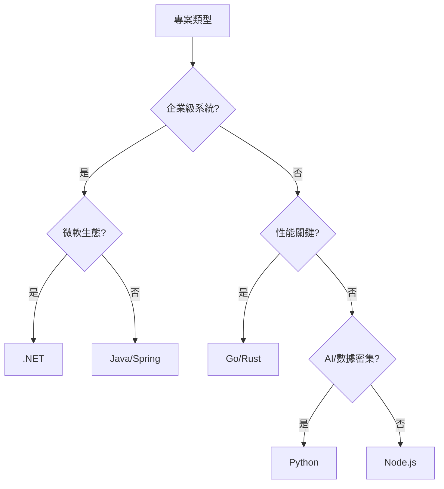

# 第四章：技術選型與資料策略
## Chapter 4: Technology Stack Selection & Data Strategy

基於 **S7_Slides.pdf** (Selecting Technology Stack) 及 2025年業界最佳實踐

---

## 🎯 章節目標 (Chapter Objectives)
- 建立理性的技術選型決策框架，避免履歷驅動開發(RDD)
- 掌握SQL vs NoSQL的深層權衡邏輯
- 理解技術債務的量化評估方法

---

## 📊 投影片架構 (5張核心投影片)

### **Slide 1: 開場定位 - 技術選型的經濟學**
#### **The Economics of Technology Selection**

**麥肯錫風格設計要點：**
- **視覺主軸**：天平模型，平衡技術創新與商業風險
- **色系**：深藍(#003A70) + 金色(#FFB81C) 成本強調
- **版面配置**：上下分割，上方理念，下方數據

**核心訊息（One Key Message）：**
> "選錯程式語言損失50萬，選錯資料庫損失500萬"

**技術選型成本模型（Total Cost of Ownership）：**

| **成本維度** | **顯性成本** | **隱性成本** | **2025基準值** | **案例警示** |
|:---|:---|:---|:---|:---|
| **授權費用** | 軟體授權<br>雲端訂閱 | 合規審計<br>版本鎖定 | $0-50K/年 | Oracle授權陷阱 |
| **人力成本** | 開發者薪資<br>培訓費用 | 招聘困難<br>知識流失 | $150-300K/人年 | COBOL人才荒 |
| **遷移成本** | 系統改寫<br>數據搬遷 | 業務中斷<br>用戶流失 | 初始投資×3-5倍 | Twitter重寫案例 |
| **機會成本** | 延遲上市<br>功能受限 | 競爭劣勢<br>創新停滯 | 每月營收×6 | Friendster失敗 |
| **技術債務** | 維護工時<br>性能優化 | 架構腐化<br>安全漏洞 | 開發成本×40% | LinkedIn單體債 |

**關鍵公式：**
```
技術選型ROI = (業務價值 - TCO) / 轉換成本
決策臨界點 = 當前債務 > 遷移成本×1.5
```

---

### **Slide 2: 後端技術戰場 - 企業級vs敏捷派**
#### **Backend Battlefield: Enterprise vs Agile**

**麥肯錫風格設計要點：**
- **視覺框架**：戰場地圖，不同陣營對峙
- **圖示系統**：各語言Logo配戰力值
- **動畫順序**：由傳統到現代演進

**2025後端技術全景圖：**

| **技術棧** | **🏢 企業級** | **🚀 敏捷派** | **🌟 新興勢力** | **📊 市場份額** | **💰 開發者薪資** |
|:---|:---|:---|:---|:---|:---|
| **Java生態** | • Spring Boot<br>• 銀行/金融首選<br>• 20年+成熟度 | 較少使用 | • Quarkus<br>• GraalVM | 35% | $140K/年 |
| **.NET陣營** | • .NET 8<br>• 微軟生態整合<br>• Azure原生 | • Blazor<br>• 全棧開發 | • MAUI<br>• .NET Aspire | 25% | $135K/年 |
| **Node.js** | 較少使用 | • Express/Fastify<br>• 前後端統一<br>• NPM生態 | • Deno<br>• Bun | 20% | $125K/年 |
| **Python** | • Django企業版<br>• 數據科學 | • FastAPI<br>• 微服務<br>• AI/ML整合 | • Rust綁定<br>• WASM | 15% | $130K/年 |
| **Go** | • 雲原生基礎設施<br>• K8s生態 | • 高性能API<br>• 微服務 | • 系統編程 | 5% | $150K/年 |

**選型決策樹：**


---

### **Slide 3: 前端框架與移動策略**
#### **Frontend Frameworks & Mobile Strategy**

**麥肯錫風格設計要點：**
- **視覺呈現**：技術演進時間軸
- **對比展示**：Native vs Cross-Platform
- **數據圖表**：開發成本vs用戶體驗曲線

**2025前端技術矩陣：**

| **類別** | **技術選項** | **🎯 適用場景** | **⚡ 性能** | **💼 生態** | **📈 2025趨勢** |
|:---|:---|:---|:---|:---|:---|
| **Web框架** |  |  |  |  |  |
| React | Meta支持<br>組件生態豐富 | SPA/複雜交互 | 優秀 | 最大 | 70%市占 |
| Vue 3 | 漸進式<br>易學習 | 中小型專案 | 優秀 | 成長中 | 20%市占 |
| Angular | Google支持<br>企業級 | 大型企業應用 | 良好 | 穩定 | 8%市占 |
| Svelte | 編譯時優化<br>無虛擬DOM | 高性能需求 | 極佳 | 小眾 | 2%市占 |
| **移動開發** |  |  |  |  |  |
| Native | Swift/Kotlin | 極致體驗 | 最佳 | 分裂 | -5%/年 |
| React Native | Facebook支持 | 社交/內容 | 良好 | 成熟 | 35%市占 |
| Flutter | Google支持<br>Dart語言 | 跨平台統一 | 優秀 | 快速成長 | 40%市占 |
| .NET MAUI | 微軟支持 | 企業應用 | 良好 | 整合中 | 10%市占 |
| PWA | Web標準 | 輕量應用 | 中等 | 標準化 | 15%市占 |

**成本效益分析：**
```
開發成本指數：
Native (iOS + Android) = 200
React Native = 120
Flutter = 110
PWA = 70

用戶體驗評分（滿分100）：
Native = 95
Flutter = 85
React Native = 80
PWA = 65
```

---

### **Slide 4: 資料庫決策 - ACID vs BASE的哲學**
#### **Database Decisions: The ACID vs BASE Philosophy**

**麥肯錫風格設計要點：**
- **視覺核心**：CAP定理三角形
- **案例展示**：真實企業的資料庫架構
- **演進路徑**：從單體到分散式

**資料庫選型全景（2025 Edition）：**

| **類型** | **代表產品** | **🎯 核心優勢** | **⚠️ 限制** | **💰 成本模型** | **📊 適用規模** |
|:---|:---|:---|:---|:---|:---|
| **關聯式SQL** |  |  |  |  |  |
| PostgreSQL | 開源之王<br>擴展豐富 | ACID保證<br>JSON支援 | 垂直擴展限制 | 開源免費 | 1TB以下 |
| MySQL/MariaDB | Web標配<br>生態成熟 | 簡單可靠<br>複製容易 | 功能較少 | 開源免費 | 500GB以下 |
| SQL Server | 微軟整合<br>BI強大 | Windows生態<br>分析優秀 | 授權昂貴 | $3K-15K/核 | 10TB以下 |
| Oracle | 企業標準<br>最強功能 | 極致可靠<br>RAC叢集 | 天價授權 | $47K/核 | 100TB以下 |
| **NoSQL家族** |  |  |  |  |  |
| MongoDB | 文檔資料庫<br>靈活Schema | 開發友好<br>橫向擴展 | 事務限制 | $57/月起 | PB級 |
| Cassandra | 列族存儲<br>線性擴展 | 寫入極快<br>高可用 | 查詢受限 | 開源免費 | PB級 |
| Redis | 記憶體資料庫<br>緩存之王 | 極速響應<br>資料結構豐富 | 記憶體成本 | $71/月起 | TB級記憶體 |
| DynamoDB | AWS託管<br>無伺服器 | 零運維<br>自動擴展 | 廠商鎖定 | $0.25/GB/月 | 無限 |
| **新世代** |  |  |  |  |  |
| CockroachDB | 分散式SQL | ACID+擴展 | 較新 | $295/月起 | PB級 |
| TiDB | MySQL相容<br>HTAP | 一站式OLTP+OLAP | 複雜度高 | 開源/商業 | PB級 |

**資料庫選型決策矩陣：**
```
IF 交易一致性關鍵 AND 資料結構固定:
    選擇 PostgreSQL/MySQL
ELIF 需要極致擴展 AND 可容忍最終一致性:
    選擇 Cassandra/DynamoDB
ELIF 文檔型資料 AND 快速迭代:
    選擇 MongoDB
ELIF 高速緩存需求:
    必選 Redis
ELSE 混合負載:
    考慮 TiDB/CockroachDB
```

---

### **Slide 5: 技術債務管理與演進策略**
#### **Technical Debt Management & Evolution Strategy**

**麥肯錫風格設計要點：**
- **債務儀表板**：視覺化技術債務指標
- **演進路線圖**：分階段遷移計畫
- **風險熱力圖**：標示高風險技術組件

**技術債務量化模型：**

| **債務類型** | **識別信號** | **量化指標** | **償還策略** | **2025基準** |
|:---|:---|:---|:---|:---|
| **架構債** | • 單點故障<br>• 擴展瓶頸 | 可用性<99.9%<br>響應>1秒 | 服務拆分<br>引入快取 | 40%系統存在 |
| **代碼債** | • 重複代碼>20%<br>• 圈複雜度>10 | 維護成本增長率 | 重構週期<br>程式碼審查 | 60%代碼庫 |
| **依賴債** | • 過期套件<br>• 安全漏洞 | CVE數量<br>更新延遲月數 | 依賴升級<br>替代方案 | 30%專案 |
| **知識債** | • 文檔缺失<br>• 單人依賴 | 巴士因子<2<br>文檔覆蓋<50% | 知識分享<br>文檔補齊 | 70%團隊 |
| **測試債** | • 覆蓋率<60%<br>• 手動測試 | 缺陷逃逸率<br>回歸時間 | 自動化測試<br>TDD實踐 | 50%專案 |

**技術演進路線圖模板：**
```
第一季：評估與規劃
├── 技術債務審計（2週）
├── 風險評分與優先級（1週）
└── 制定90天改進計畫（1週）

第二季：基礎改進
├── 關鍵依賴升級（4週）
├── 監控體系建立（3週）
└── 自動化測試補充（5週）

第三季：架構優化
├── 服務拆分POC（6週）
├── 資料庫優化（4週）
└── API標準化（2週）

第四季：規模化
├── 漸進式遷移（8週）
├── 性能調優（2週）
└── 知識沉澱（2週）
```

**關鍵決策點檢查清單：**
- [ ] 團隊有相關技術經驗嗎？（-50%風險）
- [ ] 社群活躍度如何？（>1000 contributors）
- [ ] 有成功案例嗎？（同行業3+案例）
- [ ] 人才市場供給充足嗎？（>1000個職缺）
- [ ] 有退出策略嗎？（遷移成本<6個月）
- [ ] 符合合規要求嗎？（GDPR/SOC2）
- [ ] 5年後還會存在嗎？（Gartner預測）

---

## 🎨 麥肯錫簡報設計規範

### 色彩系統（Color System）
- **主色**：深藍 #003A70（理性、專業）
- **對比色**：金色 #FFB81C（價值、重點）
- **警示色**：紅色 #DC3545（風險、成本）
- **成功色**：綠色 #00B388（最佳選擇）

### 視覺元素（Visual Elements）
- **Logo牆**：展示所有技術棧Logo增加識別度
- **雷達圖**：多維度對比技術優劣
- **熱力圖**：展示技術成熟度與風險
- **瀑布圖**：展示成本累積與ROI

### 數據展示（Data Visualization）
- **成本始終用金額**：避免抽象百分比
- **時間始終標註**：2025年數據 vs 歷史趨勢
- **案例始終具名**：Netflix、Uber等真實案例
- **風險始終量化**：高/中/低配具體機率

---

## 📝 演講備註（Speaker Notes）

### 開場勾子（Opening Hook）
> "Facebook用PHP打造了千億帝國，但Twitter重寫Ruby花了5年。技術選型，就是在下一個十年賭注。"

### 故事案例（Story Examples）
1. **WhatsApp的極簡選擇**：50位工程師用Erlang服務10億用戶
2. **Pinterest從Django到Java**：成長痛的技術轉型
3. **Walmart的Node.js賭注**：Black Friday的技術勝利

### 互動環節（Interaction Points）
- **技術信仰調查**："誰是Java派？誰是Python派？"
- **成本猜謎**："猜猜Oracle資料庫一年授權費？"
- **情境模擬**："你是CTO，1000萬預算，怎麼選？"

### 關鍵要點總結（Key Takeaways）
1. **適合的才是最好的**：沒有銀彈，只有權衡
2. **人比技術重要**：團隊會什麼比什麼最新更重要
3. **債務必須量化**：看不見的成本最致命

### 結尾金句（Closing Statement）
> "優秀的架構師不是選擇最好的技術，而是選擇最適合的技術。記住：你是在為商業價值做決策，不是為技術本身。"