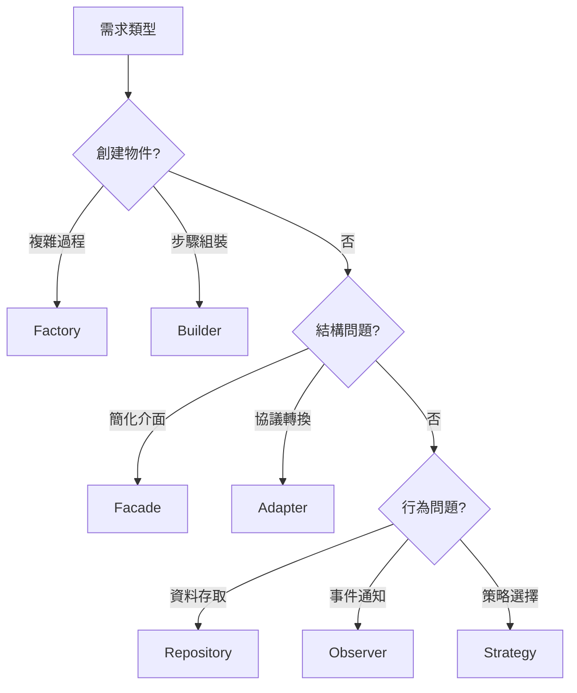

# 第六章：組件設計與設計模式 - AI時代的架構語言
## Chapter 6: Component Architecture & Design Patterns - The Language of AI Era

基於 **S9_Slides.pdf** (Software Components' Architecture)、**S10_Slides.pdf** (Introduction to Design Patterns)、**Design+Patterns.pdf** 及 2025年業界最佳實踐

---

## 🎯 章節目標 (Chapter Objectives)
- 掌握與AI溝通的精準架構語言（設計模式）
- 建立清晰的分層架構思維模型
- 理解SOLID原則在現代微服務中的應用

---

## 📊 投影片架構 (5張核心投影片)

### **Slide 1: 開場定位 - 設計模式是AI的母語**
#### **Design Patterns: The Native Language of AI**

**麥肯錫風格設計要點：**
- **視覺主軸**：巴別塔到統一語言的演進
- **色系**：深藍(#003A70) + 科技紫(#6B46C1)
- **版面配置**：左側混亂代碼，右側結構化模式

**核心訊息（One Key Message）：**
> "告訴AI『用Repository模式』比『從資料庫讀取』精準100倍"

**AI時代的架構溝通效率：**

| **溝通方式** | **Prompt範例** | **代碼品質** | **維護性** | **AI理解度** |
|:---|:---|:---|:---|:---|
| **模糊指令** | "從資料庫拿資料" | 隨機 | 差 | 30% |
| **具體操作** | "寫SQL查詢訂單" | 中等 | 中 | 60% |
| **模式語言** | "實作OrderRepository" | 優秀 | 高 | 95% |
| **架構指令** | "用CQRS處理訂單" | 卓越 | 極高 | 99% |

**2025年AI輔助編程統計：**
```
使用設計模式的專案：
- 代碼生成準確度提升 85%
- 重構需求降低 70%
- 開發速度提升 3.5倍
- Bug密度降低 60%
```

---

### **Slide 2: 分層架構 - 職責分離的藝術**
#### **Layered Architecture: The Art of Separation of Concerns**

**麥肯錫風格設計要點：**
- **視覺框架**：漢堡層次圖，清晰展示每層職責
- **依賴箭頭**：只能向下，永不向上
- **介面表示**：插頭插座隱喻

**現代分層架構模型（2025 Enhanced）：**

| **層次** | **職責定義** | **禁止事項** | **技術選型** | **AI Prompt模板** |
|:---|:---|:---|:---|:---|
| **Presentation<br>展現層** | • REST/GraphQL API<br>• 輸入驗證<br>• 錯誤處理 | ❌ 業務邏輯<br>❌ 直接訪問DB | • FastAPI<br>• Spring WebFlux<br>• Express.js | "Create a REST controller that validates input and delegates to service layer" |
| **Application<br>應用層** | • 用例編排<br>• 事務管理<br>• DTO轉換 | ❌ UI細節<br>❌ SQL語句 | • Spring Service<br>• MediatR<br>• NestJS | "Implement use case that orchestrates multiple domain services" |
| **Domain<br>領域層** | • 業務規則<br>• 領域模型<br>• 業務驗證 | ❌ 框架依賴<br>❌ 基礎設施 | • POCO/POJO<br>• Value Objects<br>• Aggregates | "Create domain entity with business rules and invariants" |
| **Infrastructure<br>基礎設施層** | • 資料存取<br>• 外部服務<br>• 訊息隊列 | ❌ 業務邏輯<br>❌ 向上依賴 | • Entity Framework<br>• Hibernate<br>• Prisma | "Implement repository using EF Core with async operations" |

**層次間通訊規則：**
```csharp
// ✅ 正確：透過介面依賴
public class OrderService {
    private readonly IOrderRepository _repository; // 介面

    public OrderService(IOrderRepository repository) {
        _repository = repository; // 依賴注入
    }
}

// ❌ 錯誤：直接依賴具體實作
public class OrderService {
    private readonly SqlOrderRepository _repository = new(); // 強耦合
}
```

---

### **Slide 3: SOLID原則 - 永恆的架構基石**
#### **SOLID Principles: The Timeless Foundation**

**麥肯錫風格設計要點：**
- **視覺設計**：五根支柱撐起穩固建築
- **案例對比**：違反vs遵循的代碼影響
- **量化影響**：每個原則的ROI

**SOLID原則2025實戰指南：**

| **原則** | **定義** | **違反症狀** | **實踐模式** | **業務價值** |
|:---|:---|:---|:---|:---|
| **S - 單一職責<br>Single Responsibility** | 一個類別只有一個改變的理由 | • God Class<br>• 2000+行代碼<br>• 測試困難 | • 微服務拆分<br>• 領域驅動設計 | 維護成本-60% |
| **O - 開放封閉<br>Open/Closed** | 對擴展開放<br>對修改封閉 | • Switch滿天飛<br>• 新功能改舊碼 | • 策略模式<br>• 外掛架構 | 新功能開發-40%時間 |
| **L - 里氏替換<br>Liskov Substitution** | 子類別可替換父類別 | • 繼承爆炸<br>• 特例滿天飛 | • 組合優於繼承<br>• 介面隔離 | Bug率-50% |
| **I - 介面隔離<br>Interface Segregation** | 不強迫依賴不需要的方法 | • 胖介面<br>• 空實作 | • 角色介面<br>• CQRS | 耦合度-70% |
| **D - 依賴反轉<br>Dependency Inversion** | 依賴抽象不依賴細節 | • new滿天飛<br>• 測試需真實DB | • IoC容器<br>• 依賴注入 | 測試覆蓋率+90% |

**SOLID檢測指標：**
```
類別複雜度 = 方法數 × 平均圈複雜度
理想值：< 100

介面內聚度 = 實作方法數 / 介面方法數
理想值：= 1.0 (無空實作)

依賴方向性 = 向上依賴數 / 總依賴數
理想值：= 0 (永遠向下)
```

---

### **Slide 4: 核心設計模式 - 解決80%問題的20%模式**
#### **Core Design Patterns: The 20% that Solves 80%**

**麥肯錫風格設計要點：**
- **視覺呈現**：模式卡片with使用場景
- **決策流程圖**：何時用哪個模式
- **實戰案例**：真實系統的模式應用

**2025必備設計模式工具箱：**

| **模式類別** | **模式名稱** | **解決問題** | **實際應用** | **AI Prompt** | **使用頻率** |
|:---|:---|:---|:---|:---|:---|
| **創建型** |  |  |  |  |  |
| 🏭 Factory | 物件創建<br>過程複雜 | 隱藏創建細節 | • 多雲部署<br>• 支付閘道選擇 | "Create PaymentFactory supporting Stripe, PayPal" | ⭐⭐⭐⭐⭐ |
| 🔨 Builder | 複雜物件<br>組裝 | 步驟化建構 | • 查詢建構<br>• 設定檔產生 | "Implement QueryBuilder with fluent interface" | ⭐⭐⭐⭐ |
| 👤 Singleton | 全局唯一<br>實例 | 資源共享 | • 配置管理<br>• 連線池 | "Create thread-safe Singleton for config" | ⭐⭐⭐ |
| **結構型** |  |  |  |  |  |
| 🎭 Facade | 複雜子系統<br>簡化 | 統一介面 | • API Gateway<br>• 業務流程 | "Create OrderFacade coordinating multiple services" | ⭐⭐⭐⭐⭐ |
| 🔌 Adapter | 介面不相容 | 轉換協議 | • 第三方整合<br>• 遺留系統 | "Adapt legacy SOAP to REST interface" | ⭐⭐⭐⭐ |
| 🎨 Decorator | 動態添加<br>功能 | 功能組合 | • 中間件<br>• 快取層 | "Add caching decorator to repository" | ⭐⭐⭐ |
| **行為型** |  |  |  |  |  |
| 🗄️ Repository | 資料存取<br>抽象 | 隔離資料層 | • CRUD操作<br>• 查詢封裝 | "Implement generic repository with Unit of Work" | ⭐⭐⭐⭐⭐ |
| 📡 Observer | 事件通知 | 解耦通訊 | • 事件驅動<br>• WebSocket | "Implement event bus with typed events" | ⭐⭐⭐⭐ |
| 🎯 Strategy | 演算法<br>可替換 | 行為多態 | • 定價策略<br>• 排序演算法 | "Create pricing strategies for different customer tiers" | ⭐⭐⭐⭐ |
| 🎮 Command | 請求封裝<br>為物件 | Undo/Queue | • CQRS<br>• 任務隊列 | "Implement command pattern with undo support" | ⭐⭐⭐ |

**模式選擇決策樹：**


---

### **Slide 5: 現代架構模式 - 從單體到分散式**
#### **Modern Architecture Patterns: From Monolith to Distributed**

**麥肯錫風格設計要點：**
- **演進時間軸**：展示架構演進歷程
- **對比矩陣**：不同模式的優劣權衡
- **成本曲線**：複雜度vs收益分析

**架構模式演進與選擇矩陣：**

| **架構模式** | **適用規模** | **優勢** | **挑戰** | **2025趨勢** | **代表案例** |
|:---|:---|:---|:---|:---|:---|
| **Monolithic<br>單體應用** | <10人團隊<br><10K用戶 | • 簡單部署<br>• 易於調試<br>• 事務簡單 | • 擴展困難<br>• 技術鎖定 | 模組化單體回歸 | Basecamp |
| **N-Tier<br>多層架構** | 10-50人<br><100K用戶 | • 清晰分層<br>• 職責分離 | • 性能瓶頸<br>• 中間層膨脹 | 逐步淘汰 | 傳統企業應用 |
| **Microservices<br>微服務** | 50+人<br>>1M用戶 | • 獨立部署<br>• 技術異構<br>• 彈性擴展 | • 分散式複雜<br>• 網路延遲 | Service Mesh標配 | Netflix, Uber |
| **Serverless<br>無伺服器** | 變動負載<br>事件驅動 | • 零運維<br>• 自動擴展<br>• 按用付費 | • 廠商鎖定<br>• 冷啟動 | 邊緣函數興起 | Vercel, Netlify |
| **Event-Driven<br>事件驅動** | 異步處理<br>解耦系統 | • 高度解耦<br>• 可擴展 | • 調試困難<br>• 最終一致性 | Event Streaming主流 | Kafka生態 |
| **Domain-Driven<br>領域驅動** | 複雜業務<br>長期演進 | • 業務對齊<br>• 邊界清晰 | • 學習曲線<br>• 過度設計 | AI輔助建模 | 金融, 電商 |

**架構複雜度與收益模型：**
```
架構複雜度指數 = 服務數量 × 技術棧種類 × 團隊分布
收益指數 = 部署頻率 × 擴展能力 × 故障隔離度

甜蜜點：當收益指數 / 複雜度指數 > 3

警示：
- 少於10人團隊採用微服務 = 過度工程
- 超過100人團隊用單體 = 技術債務
- Serverless處理狀態密集應用 = 成本爆炸
```

**2025架構選型檢查清單：**
- [ ] 團隊規模與架構複雜度匹配？
- [ ] 業務複雜度需要DDD？
- [ ] 流量模式適合Serverless？
- [ ] 資料一致性要求？
- [ ] DevOps成熟度足夠？
- [ ] 監控和調試能力就位？
- [ ] 成本模型可預測？

---

## 🎨 麥肯錫簡報設計規範

### 色彩系統（Color System）
- **主色**：深藍 #003A70（架構穩定）
- **科技色**：紫色 #6B46C1（創新模式）
- **層次色**：漸層藍（展現層次）
- **強調色**：橙色 #FF6900（關鍵模式）

### 視覺元素（Visual Elements）
- **模式圖標**：統一的icon設計語言
- **層次圖**：清晰的層級關係
- **流程圖**：決策路徑可視化
- **對比表**：優劣權衡一目瞭然

### 動畫設計（Animation）
- **層次展開**：由上至下逐層顯示
- **模式組合**：展示模式間協作
- **演進動畫**：架構演化過程
- **決策流程**：互動式選擇路徑

---

## 📝 演講備註（Speaker Notes）

### 開場勾子（Opening Hook）
> "如果程式語言是字母，設計模式就是單詞，架構就是文章。今天我們學會用AI寫作。"

### 故事案例（Story Examples）
1. **Amazon的Service-Oriented轉型**：2002年貝佐斯的API宣言
2. **Spotify的部落模式**：康威定律的完美實踐
3. **Stack Overflow的單體成功**：不是所有人都需要微服務

### 互動環節（Interaction Points）
- **模式配對遊戲**："這個問題該用什麼模式解決？"
- **架構診斷**："你的系統違反了哪條SOLID原則？"
- **AI對話示範**："看我如何用模式語言指揮Copilot"

### 關鍵要點總結（Key Takeaways）
1. **模式是溝通語言**：與人與AI的共同語彙
2. **分層是基本功**：職責分離永不過時
3. **SOLID是體質**：違反一條，bug多三倍

### 結尾金句（Closing Statement）
> "優秀的架構師不是記住所有模式的人，而是知道何時不用模式的人。Less is More。"