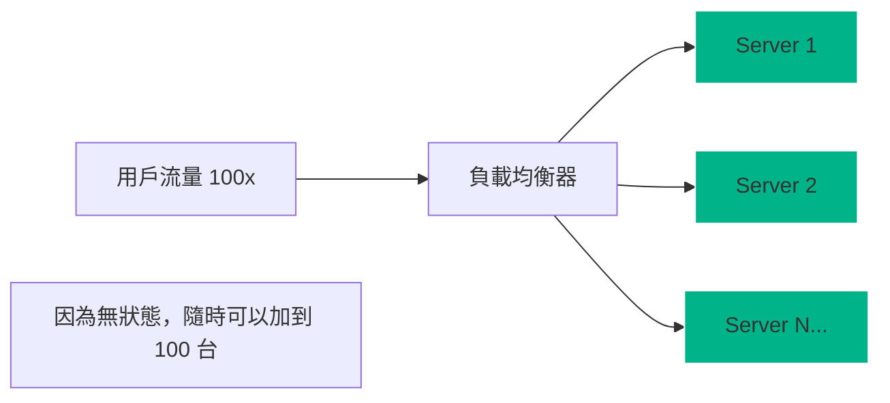

# 第七章：系統架構宏觀視角 - 分散式系統的生存法則
## Chapter 7: System Architecture Macro View - Survival Rules for Distributed Systems

基於 **S11_Slides.pdf** (System Architecture) 及 2025年業界最佳實踐

---

## 🎯 章節目標 (Chapter Objectives)
- 從微觀代碼視角切換至宏觀系統視角
- 掌握分散式系統的五大生存支柱
- 建立以「生存」為核心的架構決策思維

---

## 📊 投影片架構 (5張核心投影片)

### **Slide 1: 開場定位 - 見樹又見林的城市規劃師**
#### **The City Planner: Seeing the Forest for the Trees**

**麥肯錫風格設計要點：**
- **視覺主軸**：複雜的城市交通網 vs 整齊的規劃圖
- **色系**：深藍(#003A70) + 交通綠(#00B388)
- **版面配置**：對比式佈局（左邊混亂，右邊有序）

**核心訊息（One Key Message）：**
> "架構師不設計磚塊（代碼），而是設計交通流（數據流）"

**系統視角轉變（Perspective Shift）：**

| **維度** | **🔍 微觀視角 (Micro)** | **🔭 宏觀視角 (Macro)** | **架構師關注點** |
|:---|:---|:---|:---|
| **關注點** | 類別、函數、變數 | 服務、隊列、緩存 | 組件間的互動 |
| **目標** | 代碼正確性、算法優化 | 系統穩定性、擴展性 | 整體生存能力 |
| **失敗影響** | 拋出 Exception | 服務崩潰、雪崩效應 | 故障隔離與恢復 |
| **工具** | IDE, Debugger | Load Balancer, APM | 流量控制 |

**分散式系統的殘酷現實：**
- 網路是不可靠的
- 延遲不是零
- 頻寬是有限的
- 網路拓撲會改變

---

### **Slide 2: 支柱一與二 - 鬆散耦合與無狀態**
#### **Pillars 1 & 2: Loose Coupling & Statelessness**

**麥肯錫風格設計要點：**
- **視覺框架**：剪斷蜘蛛網（耦合）+ 複製人軍團（無狀態）
- **圖示系統**：解開的繩結、相同的伺服器圖標
- **動畫順序**：展示伺服器隨意增加減少的彈性

**生存法則 A (Survival Rule A)：**

| **法則** | **核心概念** | **實踐模式** | **反模式警示** |
|:---|:---|:---|:---|
| **鬆散耦合**<br>Loose Coupling | **"拒絕蜘蛛網"**<br>組件間不應有硬編碼依賴 | • Service Discovery<br>• API Gateway<br>• Event Bus | ❌ 硬編碼 IP<br>❌ 共享資料庫<br>❌ 循環依賴 |
| **無狀態**<br>Stateless | **"失憶的伺服器"**<br>伺服器不記住用戶是誰 | • Token Auth (JWT)<br>• External Session (Redis)<br>• S3 Storage | ❌ Sticky Session<br>❌ 本地文件存儲<br>❌ 內存狀態 |

**無狀態的威力（Scale-Out Power）：**


---

### **Slide 3: 支柱三與四 - 緩存與通訊**
#### **Pillars 3 & 4: Caching & Messaging**

**麥肯錫風格設計要點：**
- **視覺呈現**：賽車（緩存）vs 郵局（消息隊列）
- **數據對比**：記憶體速度 vs 磁碟速度
- **流程圖**：同步 vs 異步的流量削峰

**生存法則 B (Survival Rule B)：**

| **法則** | **核心概念** | **策略選擇** | **代價 (Trade-off)** |
|:---|:---|:---|:---|
| **快取策略**<br>Caching | **"以空間換時間"**<br>減少昂貴的 DB 讀取 | • In-Memory (Local)<br>• Distributed (Redis)<br>• CDN (Static) | • 資料一致性難題<br>• 緩存雪崩風險<br>• 緩存穿透風險 |
| **通訊機制**<br>Messaging | **"打電話 vs 寄信"**<br>解耦時間與空間 | • Sync (REST/gRPC) - 即時<br>• Async (Queue) - 可靠<br>• Pub/Sub - 廣播 | • 系統複雜度增加<br>• 最終一致性<br>• 訊息順序難題 |

**通訊模式決策矩陣：**
- 需要即時回應？ ➔ **REST/gRPC**
- 允許延遲處理？ ➔ **Message Queue**
- 一對多通知？ ➔ **Pub/Sub**
- 削峰填谷？ ➔ **Message Queue**

---

### **Slide 4: 支柱五 - 日誌與監控的黑盒子**
#### **Pillar 5: Logging, Monitoring & The Black Box**

**麥肯錫風格設計要點：**
- **視覺核心**：X光片掃描系統
- **關鍵圖示**：Correlation ID 的標籤追蹤
- **儀表板**：展示從紅燈變綠燈的過程

**生存法則 C (Survival Rule C)：**

| **挑戰** | **解決方案** | **關鍵技術** | **2025 標準** |
|:---|:---|:---|:---|
| **分散式追蹤**<br>找不到請求去哪了 | **集中化日誌**<br>Centralized Logging | • ELK Stack<br>• Loki<br>• Splunk | 所有服務日誌<br>匯聚單一平台 |
| **請求串聯**<br>跨服務除錯困難 | **關聯 ID**<br>Correlation ID | • OpenTelemetry<br>• Trace Context | 每個 Request<br>必帶 Unique ID |
| **系統健康**<br>不知道誰掛了 | **主動監控**<br>Proactive Monitoring | • Health Checks<br>• Synthetic Trans.<br>• Prometheus | 告警先於<br>用戶投訴 |

**Correlation ID 實戰流轉：**
```
Client -> [API Gateway (Gen ID: abc-123)] -> Service A
                                              |
                                              v
Service B (Log: "Processing abc-123") <-------+
      |
      v
Database (Log: "Query by abc-123")
```

---

### **Slide 5: 宏觀權衡 - 架構師的最終決策**
#### **The Architect's Trade-off: Balancing the System**

**麥肯錫風格設計要點：**
- **視覺工具**：多維度雷達圖
- **決策天平**：一致性 vs 可用性 (CAP)
- **總結清單**：5大支柱的檢查表

**系統架構權衡模型（CAP +）：**

| **想要得到 (Pros)** | **必須付出 (Cons)** | **架構決策範例** |
|:---|:---|:---|
| **極致效能 (Performance)** | 一致性、簡單性 | 引入 Redis + 異步 Queue |
| **極高可用 (Availability)** | 一致性、成本 | 多區部署 + 最終一致性 |
| **快速開發 (Speed)** | 可擴展性、維護性 | 單體架構 (Monolith) |
| **資料強一致 (Consistency)** | 效能、可用性 | 分散式事務 (2PC/Saga) |

**架構師生存檢查清單（Survival Checklist）：**
- [ ] 服務間是否鬆散耦合？(沒有硬依賴)
- [ ] 關鍵服務是否無狀態？(可隨時擴展)
- [ ] 讀取密集型數據是否已緩存？
- [ ] 寫入密集型任務是否已異步化？
- [ ] 所有請求是否可跨服務追蹤？(Correlation ID)

---

## 🎨 麥肯錫簡報設計規範

### 色彩系統（Color System）
- **主色**：深藍 #003A70（穩定、宏觀）
- **支柱色**：青色 #00B388（支撐力量）
- **警示色**：橙色 #FF6900（耦合風險）
- **背景色**：淺灰 #F5F5F5

### 視覺隱喻（Visual Metaphors）
- **城市規劃**：代表宏觀架構
- **蜘蛛網**：代表糟糕的耦合
- **郵局**：代表消息隊列系統
- **儀表板**：代表可觀測性

### 版面原則（Layout Principles）
- **三分法**：左邊問題，中間方案，右邊價值
- **對比強烈**：Before (Monolith) vs After (Distributed)
- **圖標一致**：使用線性風格圖標，保持專業感

---

## 📝 演講備註（Speaker Notes）

### 開場勾子（Opening Hook）
> "如果你的代碼是完美的，但伺服器掛了，你的用戶在乎嗎？架構師的職責，就是確保代碼在不完美的硬體上完美運行。"

### 故事案例（Story Examples）
1. **Amazon的購物車**：為什麼你的購物車永遠不會遺失商品？（DynamoDB的高可用與無狀態）
2. **Netflix的Chaos Monkey**：主動殺死伺服器來驗證「無狀態」和「容錯能力」。
3. **雙11的流量削峰**：為什麼你在搶購時會看到「排隊中」？（Queue的應用）

### 互動環節（Interaction Points）
- **情境題**："如果現在流量暴增 10 倍，你的系統哪裡會先掛掉？"
- **找碴遊戲**：展示一張高度耦合的架構圖，請學員找出「單點故障」。
- **決策練習**："老闆要強一致性又要極致效能，你怎麼回覆？"

### 關鍵要點總結（Key Takeaways）
1. **宏觀 > 微觀**：看系統，別只看代碼。
2. **無狀態是王道**：這是擴展的唯一途徑。
3. **看不見的最重要**：日誌和監控是系統的生命線。

### 結尾金句（Closing Statement）
> "架構沒有對錯，只有取捨。但如果你違反了這五大生存法則，系統的崩潰就不是機率問題，而是時間問題。"