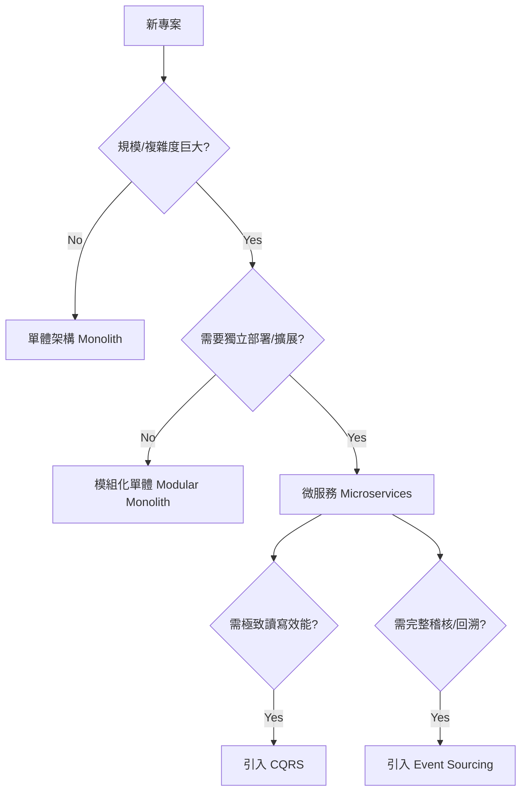

# 第八章：進階架構模式 - 複雜問題的特殊解方
## Chapter 8: Advanced Architecture Patterns - Special Solutions for Complex Problems

基於 **S15_Slides.pdf** (Advanced Architecture Patterns) 及 **Microservices/EventSourcing/CQRS** 閱讀材料

---

## 🎯 章節目標 (Chapter Objectives)
- 理解進階模式（微服務、ES、CQRS）的適用場景與代價
- 破除「新技術=好架構」的迷思
- 掌握複雜度守恆定律：用維運複雜度換取開發靈活性

---

## 📊 投影片架構 (5張核心投影片)

### **Slide 1: 開場定位 - 架構師的核武器庫**
#### **The Architect's Nuclear Arsenal**

**麥肯錫風格設計要點：**
- **視覺主軸**：特種部隊裝備室 vs 普通工具箱
- **色系**：深藍(#003A70) + 警示黃(#FFD700) + 危險黑(#000000)
- **版面配置**：中央警示標語，周圍環繞強大武器

**核心訊息（One Key Message）：**
> "這些模式像核武器：強大，但維護成本極高。非必要，勿使用。"

**複雜度交換律（Complexity Exchange）：**

| **維度** | **📦 單體架構 (Monolith)** | **🚀 進階架構 (Advanced)** | **交換了什麼？** |
|:---|:---|:---|:---|
| **開發難度** | 隨規模指數上升 | 線性增長（理想情況） | **用「分散式複雜度」** |
| **部署難度** | 簡單（Copy & Run） | 極難（Orchestration） | **換取** |
| **擴展性** | 垂直擴展為主 | 水平擴展無限 | **「業務靈活性」** |
| **一致性** | ACID 事務 | BASE 最終一致性 | **與「極致效能」** |

**警示標語（Warning）：**
- **You are not Google.** (除非你有Google的規模)
- **Resume Driven Development.** (拒絕履歷驅動開發)

---

### **Slide 2: 微服務架構 - 獨立與解耦的代價**
#### **Microservices: The Cost of Independence**

**麥肯錫風格設計要點：**
- **視覺框架**：死星（單體）炸裂成艦隊（微服務）
- **對比分析**：單體 vs 微服務的優缺點天平
- **成本曲線**：維運成本隨服務數量指數上升

**微服務決策矩陣（To Be or Not To Be）：**

| **特性** | **✅ 優勢 (Pros)** | **⚠️ 代價 (Cons)** | **2025 生存指南** |
|:---|:---|:---|:---|
| **獨立部署** | 服務 A 掛了不影響 B 發布速度快 | 需要自動化 CI/CD 管道 版本相容性地獄 | 使用 K8s + Helm |
| **技術異構** | 用 Python 做 AI 用 Go 做高併發 | 招聘困難 知識共享壁壘 | 限制 3 種技術棧內 |
| **彈性擴展** | 精準擴展瓶頸服務 | 資源利用率低 基礎設施成本高 | FinOps 成本監控 |
| **組織對齊** | 康威定律 小團隊自治 | 跨團隊溝通成本 缺乏全局視角 | 設立架構委員會 |

**微服務先決條件（Prerequisites）：**
- [ ] 快速配置 (Rapid Provisioning)
- [ ] 基礎監控 (Basic Monitoring)
- [ ] 快速部署 (Rapid Application Deployment)
- [ ] DevOps 文化 (DevOps Culture)

---

### **Slide 3: 事件溯源 - 記錄劇情而非結局**
#### **Event Sourcing: Recording the Plot, Not Just the Ending**

**麥肯錫風格設計要點：**
- **視覺隱喻**：存摺（交易紀錄）vs 錢包（餘額）
- **流程圖**：Event Store 的時間軸回放
- **價值點**：時光機功能的商業價值

**狀態存儲模式對比：**

| **模式** | **傳統 CRUD** | **事件溯源 (Event Sourcing)** | **商業價值** |
|:---|:---|:---|:---|
| **存儲內容** | 當前狀態 (Current State) `Balance: $100` | 事件序列 (Event Stream) `Created: $0` -> `Dep: +$50` -> `Dep: +$50` | 完整的稽核軌跡 (Audit Trail) |
| **資料遺失** | 覆蓋即消失 Update = Destroy | 永遠只有 Append 資料永不丟失 | 數據挖掘與分析 |
| **除錯能力** | 只能看屍體 | 可以重播犯罪現場 (Replay) | 根因分析能力 |
| **複雜度** | 低 (SQL Standard) | 高 (需處理快照/版本) | 合規性 (GDPR/金融) |

**銀行帳戶案例（The Bank Example）：**

---

### **Slide 4: CQRS - 讀寫分離的極致效能**
#### **CQRS: Segregation for Extreme Performance**

**麥肯錫風格設計要點：**
- **視覺核心**：雙行道 vs 單行道
- **模型分離**：Command Model (寫) vs Query Model (讀)
- **同步機制**：展示最終一致性的延遲

**CQRS 架構圖解：**

| **路徑** | **Command Side (寫)** | **Query Side (讀)** | **設計哲學** |
|:---|:---|:---|:---|
| **職責** | 執行業務邏輯 驗證規則 | 快速回傳數據 無需計算 | **各司其職** |
| **資料模型** | 正規化 (3NF) 關聯式資料庫 | 反正規化 (Denormalized) NoSQL / Cache | **讀寫優化** |
| **效能關注** | 事務一致性 (ACID) 寫入吞吐量 | 極致讀取速度 水平擴展能力 | **效能解耦** |
| **同步** | 發布事件 | 訂閱事件更新 View | **最終一致性** |

**適用場景（Sweet Spots）：**
- **讀寫比極高**：如電商商品頁 (1寫 : 10000讀)
- **UI 複雜多變**：需要多種維度的查詢視圖
- **協作領域**：如訂票系統、即時協作工具

---

### **Slide 5: 架構決策樹 - 何時該拔劍？**
#### **The Decision Tree: When to Draw the Sword?**

**麥肯錫風格設計要點：**
- **視覺呈現**：清晰的 Yes/No 決策路徑圖
- **紅綠燈**：Stop (單體), Caution (模組化), Go (微服務)
- **總結**：3個簡單的規則

**進階模式決策流程：**

**架構師的終極建議：**
1. **Default to Monolith**: 預設使用單體，直到它痛到無法忍受。
2. **Evolve, Don't Start**: 從單體演化到微服務，而不是一開始就設計微服務。
3. **Complexity Budget**: 你的團隊有多少「複雜度預算」？沒錢別買法拉利。

---

## 🎨 麥肯錫簡報設計規範

### 色彩系統（Color System）
- **主色**：深藍 #003A70（專業底色）
- **科技色**：霓虹紫 #9D50BB（進階模式）
- **警示色**：黃黑條紋（高複雜度警告）
- **強調色**：白色 #FFFFFF（文字與線條）

### 視覺隱喻（Visual Metaphors）
- **核武器/危險品**：代表進階模式的威力與風險
- **死星/太空艦隊**：代表單體到微服務的拆分
- **時光機/膠捲**：代表 Event Sourcing
- **雙向道**：代表 CQRS

### 版面原則（Layout Principles）
- **警示優先**：在介紹優點前，先列出代價。
- **對比清晰**：左右分割展示 Pattern 前後的差異。
- **流程視覺化**：用簡單線條展示複雜的數據流向。

---

## 📝 演講備註（Speaker Notes）

### 開場勾子（Opening Hook）
> "如果你手上有個錘子，看什麼都像釘子。但今天我要介紹的是雷射切割機——你不會拿它來釘釘子，對吧？"

### 故事案例（Story Examples）
1. **Segment的回歸**：為什麼他們從微服務切回單體，反而減少了開發成本？
2. **Uber的微服務迷宮**：幾千個微服務帶來的維運噩夢與治理挑戰。
3. **LMAX Exchange**：如何用 Event Sourcing 和內存計算做到每秒百萬級交易。

### 互動環節（Interaction Points）
- **投票**："誰曾經被微服務的跨服務除錯搞瘋過？"
- **情境模擬**："設計一個銀行帳務系統，你會用 CRUD 還是 Event Sourcing？為什麼？"
- **找碴**："這個只有 500 人用的內部系統，用了 Kubernetes + CQRS + Event Sourcing，有什麼問題？"

### 關鍵要點總結（Key Takeaways）
1. **非必要勿實體**：複雜度是架構師的敵人。
2. **數據一致性是噩夢**：分散式系統中，強一致性極難達成。
3. **了解代價**：使用這些模式前，先確認團隊付得起維運帳單。

### 結尾金句（Closing Statement）
> "最好的架構師不是懂得最多模式的人，而是知道什麼時候**不該用**這些模式的人。保持簡單，直到你不得不複雜。"