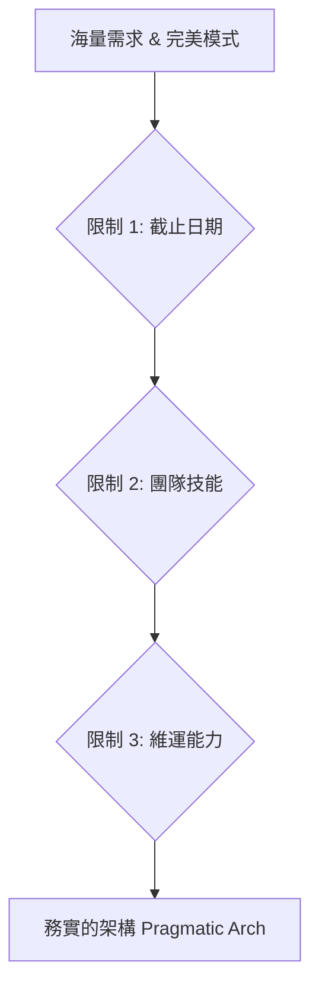
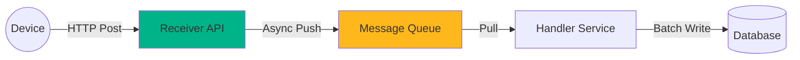

# 第九章：實戰演練與外部考量 - 理論與現實的博弈
## Chapter 9: Case Study & Constraints - Balancing Theory with Reality

基於 **S14_Slides.pdf** (Case Study: IOT) 與 **S12_Slides.pdf** (Additional Considerations)

---

## 🎯 章節目標 (Chapter Objectives)
- 透過 IOT 案例，演示從需求到架構的推導過程
- 學習如何用「數學」驗證架構的可行性
- 掌握非技術因素（Deadline, Skillset）對架構的一票否決權

---

## 📊 投影片架構 (5張核心投影片)

### **Slide 1: 開場定位 - 架構師的實驗室與戰場**
#### **The Lab vs The Battlefield**

**麥肯錫風格設計要點：**
- **視覺主軸**：左邊是完美的藍圖（理論），右邊是泥濘的戰場（現實）
- **色系**：深藍(#003A70) + 泥土色(#8B4513) + 成功綠(#00B388)
- **版面配置**：中間一道裂縫，架構師在搭建橋樑

**核心訊息（One Key Message）：**
> "架構設計的公式：(商業需求 + 數學計算) - (外部限制) = 可行架構"

**決策漏斗（The Decision Funnel）：**

**現實的殘酷（Reality Check）：**
- **Deadline**: 完美的架構如果趕不上死線，就是失敗的架構。
- **Skillset**: 用團隊不會的語言寫出的架構，是技術債務的開始。
- **Support**: 沒有人會維運的系統，上線即死亡。

---

### **Slide 2: IOT 案例分析 - 讓數字說話**
#### **IOT Case Study: Let the Numbers Speak**

**麥肯錫風格設計要點：**
- **視覺框架**：儀表板數據流
- **關鍵數字**：放大顯示 15M, 54GB, 540
- **計算過程**：清晰的推導公式

**需求量化推導（Quantification logic）：**

| **輸入條件** | **計算過程** | **架構隱含意義** |
|:---|:---|:---|
| **訊息量** | 15,000,000 則/月 | **高吞吐量需求** 不能用同步阻塞 IO |
| **資料大小** | 300 Bytes/則 × 15M = 4.5 GB/月 = 54 GB/年 | **存儲壓力不大** 但需考慮長期歸檔策略 |
| **併發請求** | 15M / (30天×24時×60分×60秒) ≈ 5.7 req/s (平均) × 100 (尖峰預估) ≈ 570 req/s | **中等併發** 單台 Server 可能撐不住 需 Load Balancer |
| **SLA 要求** | 99.99% (Platinum) | **無單點故障 (No SPOF)** 必須有備援與自動切換 |

**架構痛點識別：**
- **寫入瓶頸**：570 req/s 直接寫入 DB 風險太高。
- **資料遺失**：網路抖動或 DB 鎖死會導致資料遺失（SLA 不允許）。

---

### **Slide 3: 架構解法 - 佇列的藝術**
#### **The Solution: The Art of Queuing**

**麥肯錫風格設計要點：**
- **視覺呈現**：水壩洩洪（削峰填谷）
- **架構圖**：Receiver -> Queue -> Handler -> DB
- **價值標籤**：可靠性、可擴展性

**IOT 架構模式（The Pattern）：**

**為何這是最佳解？（Why this works?）：**

| **組件** | **角色** | **解決的問題** |
|:---|:---|:---|
| **Receiver (API)** | **收信員** | 快速回應設備，不處理業務邏輯（高吞吐）。 |
| **Queue** | **緩衝區** | **Load Leveling (削峰)**：保護 DB 不被瞬間流量沖垮。 **Reliability (可靠)**：Handler 掛了資料還在。 |
| **Handler** | **處理工** | 依照 DB 能力慢慢處理，可彈性擴展 (Scale Workers)。 |
| **Database** | **倉庫** | 安全落地資料，專注於存儲而非高併發寫入。 |

---

### **Slide 4: 外部考量濾鏡 - 現實的否決權**
#### **Constraint Filters: The Veto Power of Reality**

**麥肯錫風格設計要點：**
- **視覺核心**：三個紅綠燈或檢查哨
- **案例對比**：理想 vs 妥協
- **互動元素**：每個限制條件下的決策分支

**三大限制條件（The Big Three）：**

| **限制 (Constraint)** | **架構師的自問 (Self-Check)** | **決策影響 (Impact)** | **真實案例** |
|:---|:---|:---|:---|
| **📅 時間與預算** Time & Cost | "我們買得起這個架構嗎？ 能在雙11前上線嗎？" | **Buy vs Build** 放棄自建 Kafka，改用 AWS SQS。 | "Deadline 是第一生產力，也是架構殺手。" |
| **👥 團隊技能** Skillset | "團隊會寫 Go 嗎？ 學習曲線要多久？" | **Tech Stack Selection** 放棄 Go，用團隊熟悉的 Java。 (即使 Go 效能更好) | "用平庸的技術寫出好代碼，勝過用頂尖技術寫出爛代碼。" |
| **🛠️ 維運支援** IT Support | "半夜 3 點誰起來修？ DBA 懂 Cassandra 嗎？" | **Ops Complexity** 放棄 NoSQL，用受管的 SQL。 (為了好睡覺) | "沒有 Ops 支援的微服務，就是一場災難。" |

**架構妥協矩陣：**
- 預算不足 ➔ 犧牲可用性 (降級 SLA)
- 時間不足 ➔ 犧牲功能完整性 (MVP) / 犧牲架構優雅 (技術債)
- 技能不足 ➔ 犧牲效能 (選熟悉的技術)

---

### **Slide 5: 最終決策 - 務實的完美**
#### **Final Decision: Pragmatic Perfection**

**麥肯錫風格設計要點：**
- **視覺工具**：雷達圖前後對比（理想 vs 現實）
- **總結清單**：最終架構的規格書
- **金句展示**：架構即政治

**從理想到落地的變形記：**

| **維度** | **💭 理想架構 (Ideal)** | **🔍 限制後架構 (Pragmatic)** | **理由 (Reasoning)** |
|:---|:---|:---|:---|
| **通訊** | 自建 Kafka Cluster | Azure Service Bus | **限制：維運人力不足** 選用 PaaS 服務省心。 |
| **語言** | Rust (極致效能) | C# / .NET Core | **限制：團隊技能** 團隊 100% 是 .NET 背景。 |
| **資料庫** | Cassandra (高寫入) | SQL Server | **限制：授權費/技能** 公司已有 SQL Server 企業授權。 |
| **部署** | Kubernetes | App Service | **限制：時間緊迫** 沒時間搭建 K8s 環境。 |

**架構師的宣言：**
> "這個架構不是最快的，也不是最潮的。但它是最適合我們團隊，最能在預算內按時上線，並且晚上能讓我們睡好覺的架構。"

---

## 🎨 麥肯錫簡報設計規範

### 色彩系統（Color System）
- **主色**：深藍 #003A70（專業決策）
- **數據色**：橙色 #FF6900（IOT 數據流）
- **限制色**：紅色 #DC3545（停止/警告）
- **落地色**：綠色 #00B388（可行性）

### 視覺隱喻（Visual Metaphors）
- **水壩**：Queue 的削峰填谷作用
- **漏斗**：層層過濾限制條件
- **濾鏡/眼鏡**：透過不同視角看架構
- **橋樑**：連接需求與落地

### 版面原則（Layout Principles）
- **數據先行**：用大字體展示 IOT 的關鍵量級。
- **對比鮮明**：左邊理論，右邊現實，中間決策。
- **邏輯連貫**：從需求 -> 計算 -> 模式 -> 限制 -> 定案。

---

## 📝 演講備註（Speaker Notes）

### 開場勾子（Opening Hook）
> "很多人以為架構設計是在白板上畫畫，其實更多時候，我們是在計算機和 Excel 表格前度過的。讓我們來算算這筆帳。"

### 故事案例（Story Examples）
1. **Instagram的Python傳奇**：為什麼擁有數億用戶的 Instagram 堅持用「慢吞吞」的 Python？（因為開發效率 > 執行效率）
2. **某新創的 Kubernetes 之死**：3 個人的團隊硬上 K8s，結果花 80% 時間在修環境，產品延期半年。
3. **IOT 溫溼度計**：如果資料庫鎖死 10 秒，這 10 秒的溫度資料去哪了？（解釋 Queue 的必要性）

### 互動環節（Interaction Points）
- **計算題**："1500 萬訊息除以 30 天...大家拿出手機算算看每秒幾則？"
- **二選一**："如果明天就要上線，你會選熟悉的 SQL Server 還是高效能但沒用過的 MongoDB？"
- **角色扮演**："你是 Ops 主管，我要導入 Kafka，請你用維運角度刁難我。"

### 關鍵要點總結（Key Takeaways）
1. **算出來的架構**：沒有量化，就沒有設計。
2. **Queue 是神隊友**：解決了效能，也解決了可靠性。
3. **現實大於理論**：尊重限制條件，這才是成熟架構師的標誌。

### 結尾金句（Closing Statement）
> "完美的架構只存在於教科書裡。在現實世界中，我們追求的是『足夠好』且『可落地』的架構。Pragmatism beats Purity."