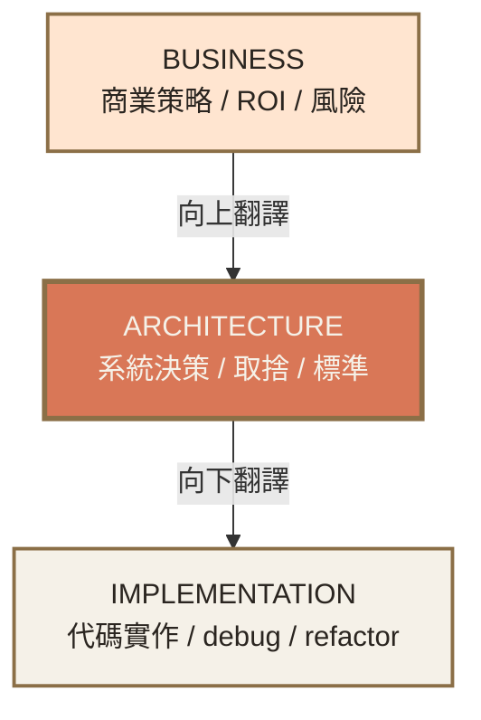
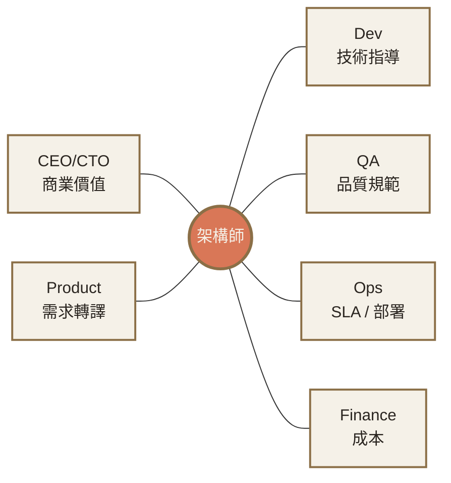

# Ch.1 · Role & Value · 圖像 Prompts

> Style guide: [`../0_STYLE_GUIDE.md`](../0_STYLE_GUIDE.md)
> Save images to: `software_architect/ppt/assets/diagrams/01-role-value/`

**本章圖像總覽**：4 張 · P1 × 2 · P2 × 2 · A × 1 · B × 1 · D × 2

---

## Image 01 · Hero · 章首封面

- **Type**: A
- **Priority**: P1
- **Slide**: `01-role-value/00_overview.md`
- **Save as**: `software_architect/ppt/assets/diagrams/01-role-value/00_hero.png`
- **Aspect**: 16:9
- **Prompt**:
  ```
  An editorial illustration of a calm, composed architect standing at the center of a wide hall, holding architectural plans rolled in one hand and a small laptop in the other; behind them are three vertical panels labeled with abstract symbols for "business strategy", "system decisions", and "code implementation", connected by faint lines flowing through the architect. The figure is rendered minimally, more iconic than realistic.
  Composition: centered figure occupying middle one-third; three vertical panels behind, slightly receding; ample whitespace; warm sidelight from upper-left; the architect's posture relaxed but attentive.
  editorial illustration, hand-drawn technical sketch style, warm color palette featuring cream off-white #F5F1E8 background and warm orange #D97757 accents with deep brown #8B6F47 secondary lines, minimalist flat vector with subtle paper texture, clean geometric lines, ample whitespace, educational diagram style, calm composed mood.
  --ar 16:9 --style raw --no photo-realistic, 3d render, neon, gradient glow, cluttered text, watermark, kawaii, anime
  ```

---

## Image 02 · Mental Model · 架構師三層責任

- **Type**: B + E (Mermaid 主推)
- **Priority**: P1
- **Slide**: `01-role-value/00_overview.md` · MENTAL MODEL section
- **Save as**: `software_architect/ppt/assets/diagrams/01-role-value/00_mental_model.png`
- **Aspect**: 16:9

**Mermaid 原始碼**：


- **Note**: 全章核心 mental model。架構師 = 中間層 + 雙向翻譯。

---

## Image 03 · Mindset Shift · 五維轉換矩陣

- **Type**: D · 對照矩陣
- **Priority**: P2
- **Slide**: `01-role-value/02_mindset_shift.md` · 五維矩陣 section
- **Save as**: `software_architect/ppt/assets/diagrams/01-role-value/02_mindset_shift_01_matrix.png`
- **Aspect**: 16:9
- **建議用 Excalidraw 製作**（含字較多，AI 處理不準）：5 行 × 3 欄表格
  - 行：價值焦點 / 問題框架 / 技術選型 / 成功指標 / 知識深度
  - 欄左：開發者模式（用警告色 `#E8634F` 區塊）
  - 欄中：箭頭 → （`#D97757`）
  - 欄右：架構師模式（用成功色 `#5B9770` 區塊）

---

## Image 04 · Influence Map · 360° 利害關係人

- **Type**: D · 中心輻射圖
- **Priority**: P2
- **Slide**: `01-role-value/03_value_pillars.md` · 影響力地圖
- **Save as**: `software_architect/ppt/assets/diagrams/01-role-value/03_value_01_influence_map.png`
- **Aspect**: 16:9

**Mermaid 原始碼**：

