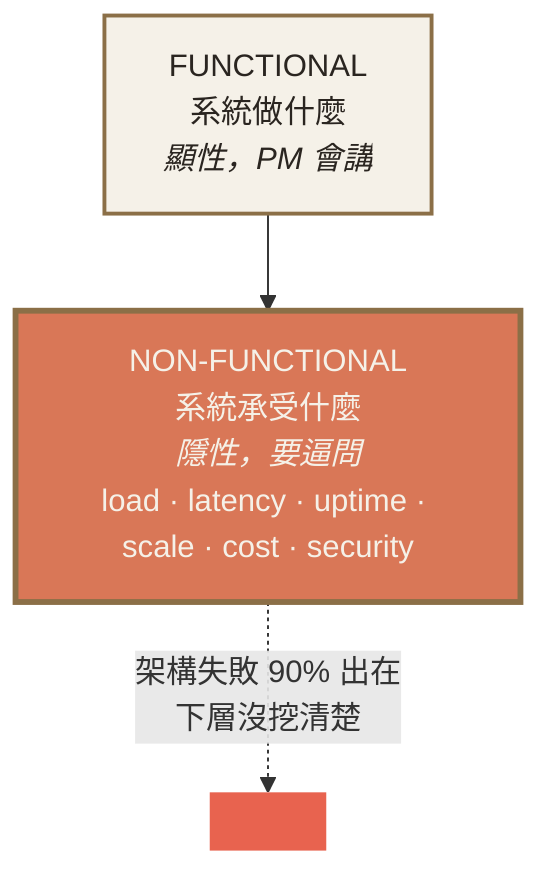

# Ch.2 · Requirements & SLA · 圖像 Prompts

> Style guide: [`../0_STYLE_GUIDE.md`](../0_STYLE_GUIDE.md)
> Save images to: `software_architect/ppt/assets/diagrams/02-requirements-sla/`

**本章圖像總覽**：4 張 · P1 × 2 · P2 × 2 · A × 1 · B × 1 · C × 2

---

## Image 01 · Hero · 章首封面

- **Type**: A
- **Priority**: P1
- **Save as**: `software_architect/ppt/assets/diagrams/02-requirements-sla/00_hero.png`
- **Aspect**: 16:9
- **Prompt**:
  ```
  An editorial illustration of a vintage measuring scale on the left holding an abstract cloud labeled "fast / stable / many users", and on the right side three small precise weights labeled "P99 200ms", "99.95%", "5000 QPS"; the scale tips toward the right side, suggesting that quantification gives weight (and meaning) to vague requirements.
  Composition: centered scale occupying middle 60%; cloud on left, weights on right; warm orange highlight on the weights; calm composed mood.
  editorial illustration, hand-drawn technical sketch style, warm color palette featuring cream off-white #F5F1E8 background and warm orange #D97757 accents with deep brown #8B6F47 secondary lines, minimalist flat vector with subtle paper texture, clean geometric lines, ample whitespace, educational diagram style, calm composed mood.
  --ar 16:9 --style raw --no photo-realistic, 3d render, neon, gradient glow, cluttered text, watermark, kawaii, anime
  ```

---

## Image 02 · Mental Model · 功能 vs 非功能兩層

- **Type**: B
- **Priority**: P1
- **Save as**: `software_architect/ppt/assets/diagrams/02-requirements-sla/00_mental_model.png`
- **Aspect**: 16:9

**Mermaid 原始碼**：


---

## Image 03 · SLA · 9 對照表視覺化

- **Type**: C · 視覺化表格
- **Priority**: P2
- **Slide**: `02-requirements-sla/02_sla_math.md` · 9 對照表
- **Save as**: `software_architect/ppt/assets/diagrams/02-requirements-sla/02_sla_math_01_nines.png`
- **Aspect**: 16:9
- **建議用 Excalidraw**：水平 bar chart
  - X 軸：99% / 99.9% / 99.95% / 99.99% / 99.999%
  - Y 軸：年停機時間（log scale）
  - 每個 bar 上方標：87h / 8.76h / 4.38h / 52min / 5.26min
  - 額外標註：成本相對值 1× / 2× / 5× / 10× / 25×（用警告色 `#E8634F` 標示）

---

## Image 04 · Throughput · 三種流量曲線

- **Type**: C · line chart
- **Priority**: P2
- **Slide**: `02-requirements-sla/03_throughput_vs_load.md` · 三種流量曲線
- **Save as**: `software_architect/ppt/assets/diagrams/02-requirements-sla/03_throughput_01_curves.png`
- **Aspect**: 16:9
- **建議用 Excalidraw**：3 條 time-series 曲線重疊
  1. 穩態：±20% 平坦線 - 中性色
  2. 日週期：sin 波形 - 強調色 `#D97757`
  3. 尖峰突發：平緩 + 突然 10× spike - 警告色 `#E8634F`
  - 三條曲線標註對應「容量規劃用 average」/「LB + auto-scale」/「預先擴容 + 限流」
