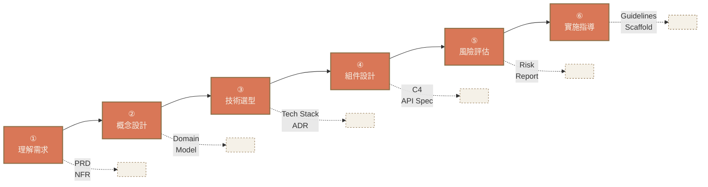
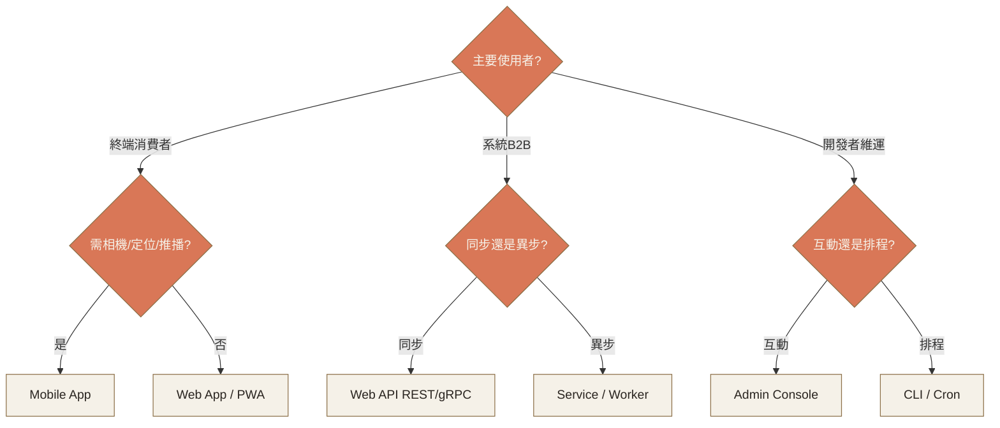

# Ch.3 · Process & App Types · 圖像 Prompts

> Style guide: [`../0_STYLE_GUIDE.md`](../0_STYLE_GUIDE.md)
> Save images to: `software_architect/ppt/assets/diagrams/03-process-app-types/`

**本章圖像總覽**：3 張 · P1 × 2 · P2 × 1 · A × 1 · B × 1 · E × 1

---

## Image 01 · Hero · 章首封面

- **Type**: A
- **Priority**: P1
- **Save as**: `software_architect/ppt/assets/diagrams/03-process-app-types/00_hero.png`
- **Aspect**: 16:9
- **Prompt**:
  ```
  An editorial illustration of a workflow diagram drawn on parchment, showing six interconnected nodes representing the architectural design process — each node a distinct geometric shape (circle, square, diamond, hexagon, octagon, star) connected by hand-drawn arrows; in the corner, a magnifying glass hovers over one node, emphasizing the inspection and verification aspect of architecture work.
  Composition: top-down parchment view; six nodes flowing left-to-right in gentle curve; warm orange highlights on connecting arrows; magnifying glass in upper-right; ample whitespace.
  editorial illustration, hand-drawn technical sketch style, warm color palette featuring cream off-white #F5F1E8 background and warm orange #D97757 accents with deep brown #8B6F47 secondary lines, minimalist flat vector with subtle paper texture, clean geometric lines, ample whitespace, educational diagram style, calm composed mood.
  --ar 16:9 --style raw --no photo-realistic, 3d render, neon, gradient glow, cluttered text, watermark, kawaii, anime
  ```

---

## Image 02 · Mental Model · 設計六步流程

- **Type**: B + E (Mermaid 主推)
- **Priority**: P1
- **Save as**: `software_architect/ppt/assets/diagrams/03-process-app-types/00_mental_model.png`
- **Aspect**: 16:9

**Mermaid 原始碼**：


---

## Image 03 · App Type Selection · 決策樹

- **Type**: E · Mermaid
- **Priority**: P2
- **Slide**: `03-process-app-types/02_app_type_strategy.md` · 決策樹
- **Save as**: `software_architect/ppt/assets/diagrams/03-process-app-types/02_app_type_01_tree.png`
- **Aspect**: 16:9

**Mermaid 原始碼**：

