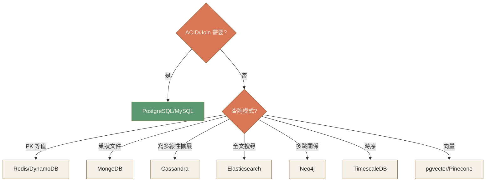
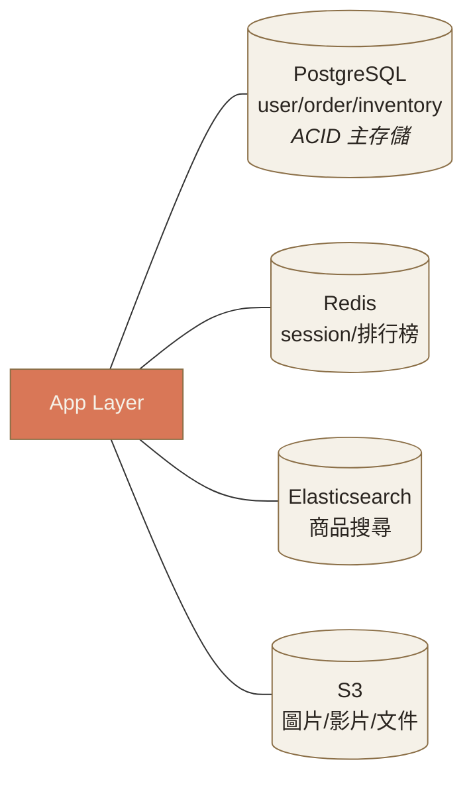

# Ch.4 · Tech Stack & Data · 圖像 Prompts

> Style guide: [`../0_STYLE_GUIDE.md`](../0_STYLE_GUIDE.md)
> Save images to: `software_architect/ppt/assets/diagrams/04-tech-stack-data/`

**本章圖像總覽**：4 張 · P1 × 2 · P2 × 1 · P3 × 1 · A × 1 · B × 1 · E × 1 · D × 1

---

## Image 01 · Hero · 章首封面

- **Type**: A
- **Priority**: P1
- **Save as**: `software_architect/ppt/assets/diagrams/04-tech-stack-data/00_hero.png`
- **Aspect**: 16:9
- **Prompt**:
  ```
  An editorial illustration of a procurement manager's clipboard with a hand ticking off boxes next to a row of technology icons (a database cylinder, a server, a code symbol, a cloud); on the side, a hand pushes away a flashy "new and shiny" item with a stamp, while keeping the boring proven items — metaphor for rational selection over hype-driven decisions.
  Composition: clipboard centered, occupying middle 50%; icons in a vertical column; "new shiny" item being rejected on the right side; warm orange accents on the ticked checkmarks.
  editorial illustration, hand-drawn technical sketch style, warm color palette featuring cream off-white #F5F1E8 background and warm orange #D97757 accents with deep brown #8B6F47 secondary lines, minimalist flat vector with subtle paper texture, clean geometric lines, ample whitespace, educational diagram style, calm composed mood.
  --ar 16:9 --style raw --no photo-realistic, 3d render, neon, gradient glow, cluttered text, watermark, kawaii, anime
  ```

---

## Image 02 · Mental Model · 採購清單心態

- **Type**: B
- **Priority**: P1
- **Save as**: `software_architect/ppt/assets/diagrams/04-tech-stack-data/00_mental_model.png`
- **Aspect**: 16:9
- **建議用 Excalidraw**：六維雷達圖
  - 六軸：適用性 / 成熟度 / 社群 / 人才 / 成本 / 演進路徑
  - 兩個多邊形對照：實線 = 該選的；虛線 = 該拒的
  - 中心標題：「TCO Score」

---

## Image 03 · DB Selection · 決策樹

- **Type**: E · Mermaid
- **Priority**: P2
- **Slide**: `04-tech-stack-data/02_sql_vs_nosql.md` · 決策樹
- **Save as**: `software_architect/ppt/assets/diagrams/04-tech-stack-data/02_sql_nosql_01_tree.png`
- **Aspect**: 16:9

**Mermaid 原始碼**：


- **Note**: PG 用成功色（綠）強調是「90% 系統首選」。

---

## Image 04 · Polyglot · 多 DB 混用範例

- **Type**: D · 對照組合
- **Priority**: P3
- **Slide**: `04-tech-stack-data/02_sql_vs_nosql.md` · Polyglot Persistence
- **Save as**: `software_architect/ppt/assets/diagrams/04-tech-stack-data/02_sql_nosql_02_polyglot.png`
- **Aspect**: 16:9

**Mermaid 原始碼**：

