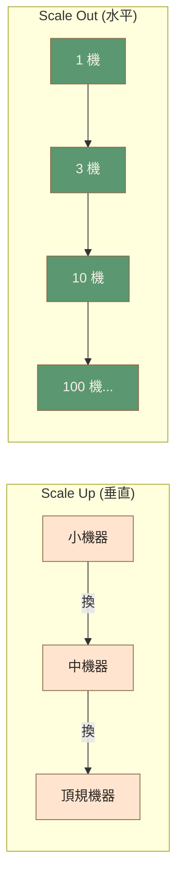

# Ch.5 · *-ilities · 圖像 Prompts

> Style guide: [`../0_STYLE_GUIDE.md`](../0_STYLE_GUIDE.md)
> Save images to: `software_architect/ppt/assets/diagrams/05-ilities/`

**本章圖像總覽**：4 張 · P1 × 2 · P2 × 2 · A × 1 · B × 1 · D × 1 · C × 1

---

## Image 01 · Hero · 章首封面

- **Type**: A
- **Priority**: P1
- **Save as**: `software_architect/ppt/assets/diagrams/05-ilities/00_hero.png`
- **Aspect**: 16:9
- **Prompt**:
  ```
  An editorial illustration of a medical health-check chart on a clipboard, but instead of body vital signs, the rows are labeled "Scalability", "Reliability", "Testability", "Modularity", "Observability"; a stethoscope rests on top, and an architect's hand holds a pen, marking checkmarks next to each entry. Implies architectural quality is something you actively measure, not assume.
  Composition: clipboard angled slightly to the right, occupying middle 60%; stethoscope draped over; warm orange checkmarks; calm sidelight.
  editorial illustration, hand-drawn technical sketch style, warm color palette featuring cream off-white #F5F1E8 background and warm orange #D97757 accents with deep brown #8B6F47 secondary lines, minimalist flat vector with subtle paper texture, clean geometric lines, ample whitespace, educational diagram style, calm composed mood.
  --ar 16:9 --style raw --no photo-realistic, 3d render, neon, gradient glow, cluttered text, watermark, kawaii, anime
  ```

---

## Image 02 · Mental Model · 品質屬性優先級

- **Type**: B + C
- **Priority**: P1
- **Save as**: `software_architect/ppt/assets/diagrams/05-ilities/00_mental_model.png`
- **Aspect**: 16:9
- **建議用 Excalidraw**：三層金字塔
  - 頂層：「業務生死」— Scalability / Reliability / Security（警告色 `#E8634F`）
  - 中層：「工程效率」— Testability / Maintainability / Modularity（強調色 `#D97757`）
  - 底層：「上線生存」— Observability / Manageability（次要色 `#8B6F47`）
  - 側註：「好架構 ≠ 全頂滿，而是知道哪兩個是命門」

---

## Image 03 · Scalability · Scale Up vs Out

- **Type**: D · 對照
- **Priority**: P2
- **Slide**: `05-ilities/01_scalability.md`
- **Save as**: `software_architect/ppt/assets/diagrams/05-ilities/01_scalability_01_up_vs_out.png`
- **Aspect**: 16:9

**Mermaid 原始碼**：


- **Note**: 垂直用淺橘表示「有上限」，水平用綠色表示「線性無限」。

---

## Image 04 · Testability · 測試金字塔

- **Type**: C · 金字塔圖
- **Priority**: P2
- **Slide**: `05-ilities/02_testability.md` · 測試金字塔
- **Save as**: `software_architect/ppt/assets/diagrams/05-ilities/02_testability_01_pyramid.png`
- **Aspect**: 16:9
- **建議用 Excalidraw**：金字塔
  - 頂端：E2E (5%) — 警告色 `#E8634F`
  - 中段：Integration (15%) — `#D97757`
  - 底層：Unit (80%) — `#5B9770`
  - 右側註解：每層的工具（Cypress / Postman / Jest）
  - 底部反模式註：「比例倒過來會死」
