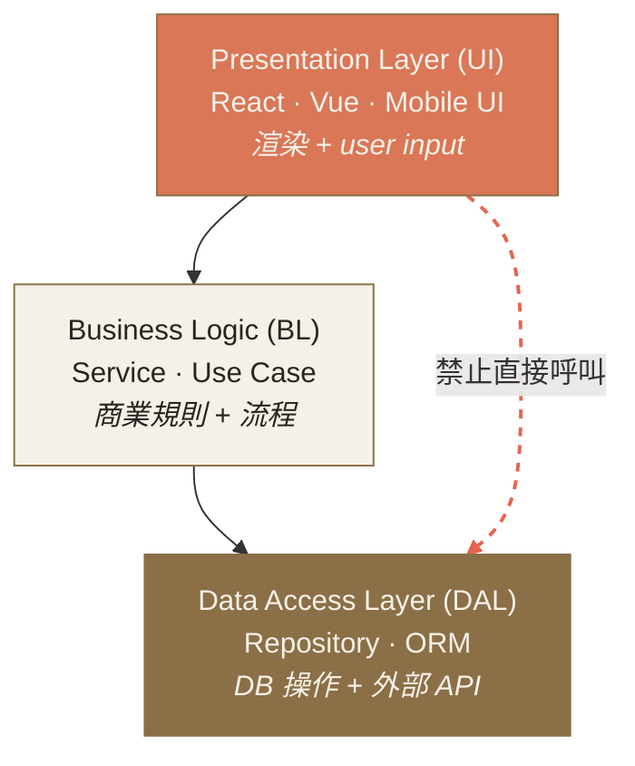

# Ch.6 · Components & Patterns · 圖像 Prompts

> Style guide: [`../0_STYLE_GUIDE.md`](../0_STYLE_GUIDE.md)
> Save images to: `software_architect/ppt/assets/diagrams/06-components-patterns/`

**本章圖像總覽**：3 張 · P1 × 2 · P2 × 1 · A × 1 · B × 1 · C × 1

---

## Image 01 · Hero · 章首封面

- **Type**: A
- **Priority**: P1
- **Save as**: `software_architect/ppt/assets/diagrams/06-components-patterns/00_hero.png`
- **Aspect**: 16:9
- **Prompt**:
  ```
  An editorial illustration of a craftsman's workbench with neatly arranged carpentry templates (each labeled subtly as Factory, Strategy, Observer, Adapter, Repository), being used to assemble a small wooden architectural model in the center; the templates are the patterns, the model is the system. Hands visible only at the edges.
  Composition: top-down view of workbench; templates arranged on left half; model assembly on right half; warm wood texture; clean geometric lines.
  editorial illustration, hand-drawn technical sketch style, warm color palette featuring cream off-white #F5F1E8 background and warm orange #D97757 accents with deep brown #8B6F47 secondary lines, minimalist flat vector with subtle paper texture, clean geometric lines, ample whitespace, educational diagram style, calm composed mood.
  --ar 16:9 --style raw --no photo-realistic, 3d render, neon, gradient glow, cluttered text, watermark, kawaii, anime
  ```

---

## Image 02 · Mental Model · 模式=溝通協議

- **Type**: B
- **Priority**: P1
- **Save as**: `software_architect/ppt/assets/diagrams/06-components-patterns/00_mental_model.png`
- **Aspect**: 16:9
- **建議用 Excalidraw**：兩欄對比
  - 左欄：「沒模式詞彙」— 大量散亂文字、箭頭混亂、雙方眉頭緊鎖
  - 右欄：「用模式詞彙」— 簡潔的標籤（"Strategy"、"Adapter"）、清楚的箭頭、雙方點頭
  - 中間：分隔線 + 「AI prompt accuracy: 1× vs 10×」字樣

---

## Image 03 · Layered Architecture · 三層架構標準圖

- **Type**: C · 結構圖
- **Priority**: P2
- **Slide**: `06-components-patterns/01_layered.md`
- **Save as**: `software_architect/ppt/assets/diagrams/06-components-patterns/01_layered_01_three_tier.png`
- **Aspect**: 16:9

**Mermaid 原始碼**：


- **Note**: 用紅色虛線標出禁止跨層呼叫的反模式。
