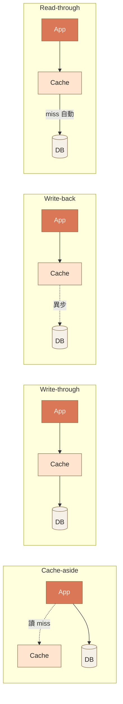
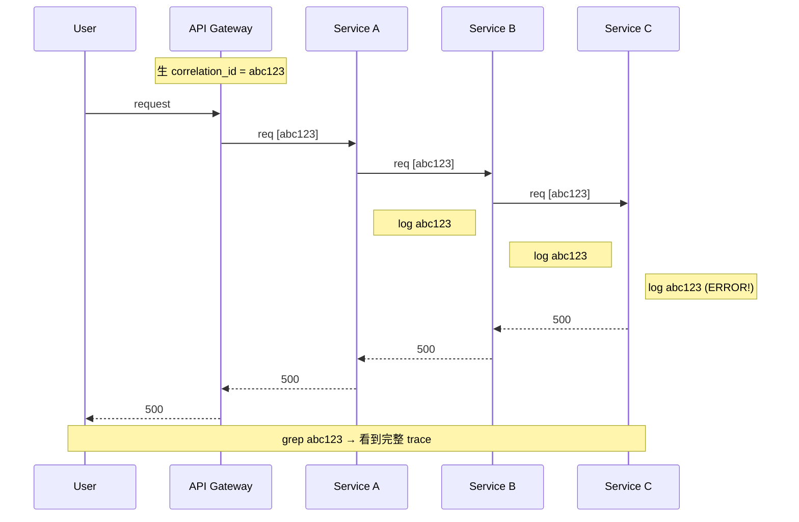

# Ch.7 · System Architecture · 圖像 Prompts

> Style guide: [`../0_STYLE_GUIDE.md`](../0_STYLE_GUIDE.md)
> Save images to: `software_architect/ppt/assets/diagrams/07-system-architecture/`

**本章圖像總覽**：4 張 · P1 × 2 · P2 × 2 · A × 1 · B × 1 · C × 2

---

## Image 01 · Hero · 章首封面

- **Type**: A
- **Priority**: P1
- **Save as**: `software_architect/ppt/assets/diagrams/07-system-architecture/00_hero.png`
- **Aspect**: 16:9
- **Prompt**:
  ```
  An editorial illustration of a single monolithic building gradually fragmenting into multiple smaller, well-organized buildings connected by thin lines representing API calls; the transformation flows from left (one big block) to right (many small blocks). On the ground, faint dotted lines connect the buildings to a shared underground utility network (databases, message queues).
  Composition: horizontal flow left-to-right; monolith on left occupying 20%; distributed buildings on right occupying 50%; ample whitespace below for caption area; warm orange accents on the API connection lines.
  editorial illustration, hand-drawn technical sketch style, warm color palette featuring cream off-white #F5F1E8 background and warm orange #D97757 accents with deep brown #8B6F47 secondary lines, minimalist flat vector with subtle paper texture, clean geometric lines, ample whitespace, educational diagram style, calm composed mood.
  --ar 16:9 --style raw --no photo-realistic, 3d render, neon, gradient glow, cluttered text, watermark, kawaii, anime
  ```

---

## Image 02 · Mental Model · 單體到分散式

- **Type**: B
- **Priority**: P1
- **Save as**: `software_architect/ppt/assets/diagrams/07-system-architecture/00_mental_model.png`
- **Aspect**: 16:9
- **建議用 Excalidraw**：兩欄對照
  - 左欄「單體」：一個 process / 一份 memory / call function / 一份 log / 一個事務
  - 右欄「分散式」：N 個 process / 多份 + 一致性問題 / call API|queue / 多份 + correlation ID / 分散事務 Saga
  - 底部標語：「90% 系統不該主動拆 → 撐不住才拆」

---

## Image 03 · Cache · 四模式對照

- **Type**: C · 對照組合
- **Priority**: P2
- **Slide**: `07-system-architecture/02_cache_queue.md` · Cache 四模式
- **Save as**: `software_architect/ppt/assets/diagrams/07-system-architecture/02_cache_01_patterns.png`
- **Aspect**: 16:9

**Mermaid 原始碼**：


---

## Image 04 · Correlation ID · 分散式追蹤

- **Type**: C · 序列圖
- **Priority**: P2
- **Slide**: `07-system-architecture/03_logging_monitoring.md` · Correlation ID
- **Save as**: `software_architect/ppt/assets/diagrams/07-system-architecture/03_logging_01_correlation.png`
- **Aspect**: 16:9

**Mermaid 原始碼**：

