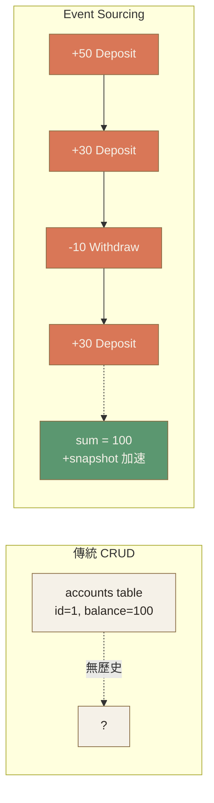

# Ch.8 · Advanced Patterns · 圖像 Prompts

> Style guide: [`../0_STYLE_GUIDE.md`](../0_STYLE_GUIDE.md)
> Save images to: `software_architect/ppt/assets/diagrams/08-advanced-patterns/`

**本章圖像總覽**：4 張 · P1 × 2 · P2 × 2 · A × 1 · B × 1 · D × 1 · C × 1

---

## Image 01 · Hero · 章首封面

- **Type**: A
- **Priority**: P1
- **Save as**: `software_architect/ppt/assets/diagrams/08-advanced-patterns/00_hero.png`
- **Aspect**: 16:9
- **Prompt**:
  ```
  An editorial illustration of an old-fashioned key cabinet, where each key represents an advanced pattern (Microservices, Event Sourcing, CQRS, Saga); some keys are clearly labeled and accessible, but most are kept behind glass with a small sign reading "Only use when relevant" — emphasizing that advanced patterns are tools to be selected carefully, not defaults.
  Composition: front view of key cabinet; keys arranged in a 3x3 grid; glass cover with subtle reflection; warm sidelight; sign visible on top.
  editorial illustration, hand-drawn technical sketch style, warm color palette featuring cream off-white #F5F1E8 background and warm orange #D97757 accents with deep brown #8B6F47 secondary lines, minimalist flat vector with subtle paper texture, clean geometric lines, ample whitespace, educational diagram style, calm composed mood.
  --ar 16:9 --style raw --no photo-realistic, 3d render, neon, gradient glow, cluttered text, watermark, kawaii, anime
  ```

---

## Image 02 · Mental Model · 進階模式金字塔

- **Type**: B · 金字塔
- **Priority**: P1
- **Save as**: `software_architect/ppt/assets/diagrams/08-advanced-patterns/00_mental_model.png`
- **Aspect**: 16:9
- **建議用 Excalidraw**：倒金字塔（寬→窄）
  - 底層 (80%)：單體 + 經典 3 層 — 成功色 `#5B9770`
  - 中層 (15%)：單體模組化 + 部分事件驅動 — `#D97757`
  - 頂層 (5%)：微服務 + Event Sourcing + CQRS — 警告色 `#E8634F`
  - 右側標語：「這 5% 是面試會考、工作不一定遇到的部分」
  - 底部標語：「架構師的功課：知道什麼時候**不要**用它們」

---

## Image 03 · Microservices · 拆 vs 不拆

- **Type**: D · 對照
- **Priority**: P2
- **Slide**: `08-advanced-patterns/01_microservices.md`
- **Save as**: `software_architect/ppt/assets/diagrams/08-advanced-patterns/01_microservices_01_split.png`
- **Aspect**: 16:9
- **建議用 Excalidraw**：2 欄對照表
  - 左欄「該拆」(綠 `#5B9770`)：團隊>30 / release 頻率差10×/ scaling 需求差大 / 已有 K8s + observability
  - 右欄「不該拆」(紅 `#E8634F`)：團隊<15 / 沒 K8s 經驗 / 監控未到位 / 「未來可能」/ 追潮流
  - 中下方：「Modular Monolith 是 90% 系統的最佳解」加粗強調

---

## Image 04 · Event Sourcing · CRUD vs ES

- **Type**: C · 對照表
- **Priority**: P2
- **Slide**: `08-advanced-patterns/02_event_sourcing.md`
- **Save as**: `software_architect/ppt/assets/diagrams/08-advanced-patterns/02_es_01_crud_vs_es.png`
- **Aspect**: 16:9

**Mermaid 原始碼**：

