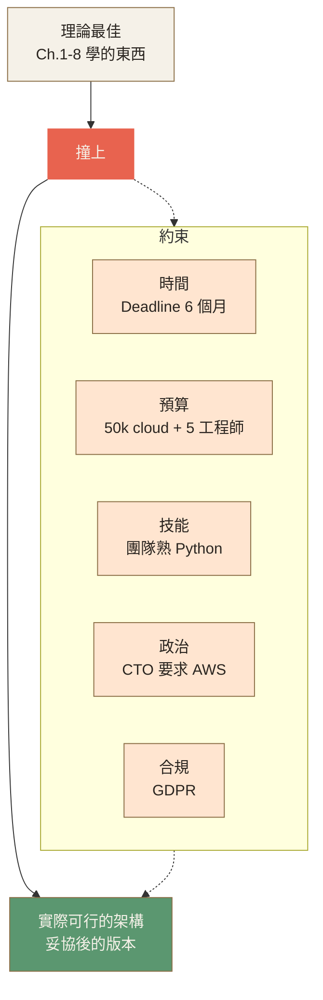
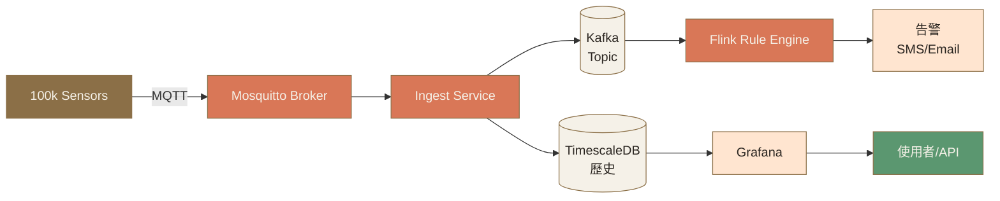

# Ch.9 · Case Study · 圖像 Prompts

> Style guide: [`../0_STYLE_GUIDE.md`](../0_STYLE_GUIDE.md)
> Save images to: `software_architect/ppt/assets/diagrams/09-case-study/`

**本章圖像總覽**：3 張 · P1 × 2 · P2 × 2 · A × 1 · B × 1 · C × 1 · D × 1

---

## Image 01 · Hero · 章首封面

- **Type**: A
- **Priority**: P1
- **Save as**: `software_architect/ppt/assets/diagrams/09-case-study/00_hero.png`
- **Aspect**: 16:9
- **Prompt**:
  ```
  An editorial illustration of a sandbox arena where an architect's design (a delicate paper model) is being stress-tested by real-world constraint cards labeled "DEADLINE", "BUDGET", "TEAM SKILLS", "COMPLIANCE", "POLITICS" being pushed against it; the model bends but doesn't break, hinting at the difference between theoretical optimum and practical viability.
  Composition: top-down sandbox view; model centered; constraint cards on four sides closing in; warm orange tension lines between cards and model; ample whitespace.
  editorial illustration, hand-drawn technical sketch style, warm color palette featuring cream off-white #F5F1E8 background and warm orange #D97757 accents with deep brown #8B6F47 secondary lines, minimalist flat vector with subtle paper texture, clean geometric lines, ample whitespace, educational diagram style, calm composed mood.
  --ar 16:9 --style raw --no photo-realistic, 3d render, neon, gradient glow, cluttered text, watermark, kawaii, anime
  ```

---

## Image 02 · Mental Model · 理論碰上約束

- **Type**: B
- **Priority**: P1
- **Save as**: `software_architect/ppt/assets/diagrams/09-case-study/00_mental_model.png`
- **Aspect**: 16:9

**Mermaid 原始碼**：


---

## Image 03 · IoT · 整體架構圖

- **Type**: C · 系統架構
- **Priority**: P2
- **Slide**: `09-case-study/01_iot_case.md`
- **Save as**: `software_architect/ppt/assets/diagrams/09-case-study/01_iot_01_architecture.png`
- **Aspect**: 16:9

**Mermaid 原始碼**：


---

## Image 04 · Cost · 三軸取捨三角形

- **Type**: D · 三角圖
- **Priority**: P2
- **Slide**: `09-case-study/02_cost_timeline.md`
- **Save as**: `software_architect/ppt/assets/diagrams/09-case-study/02_cost_01_triangle.png`
- **Aspect**: 16:9
- **建議用 Excalidraw**：經典三角形
  - 三頂點：Quality（品質）/ Speed（速度）/ Cost（成本）
  - 中央標：「三選二，第三必然犧牲」
  - 三條邊各標一個情境：
    - 品質+速度邊 → 犧牲成本（「緊急上線」）
    - 速度+成本邊 → 犧牲品質（「MVP/創業」）
    - 品質+成本邊 → 犧牲速度（「銀行/醫療」）
