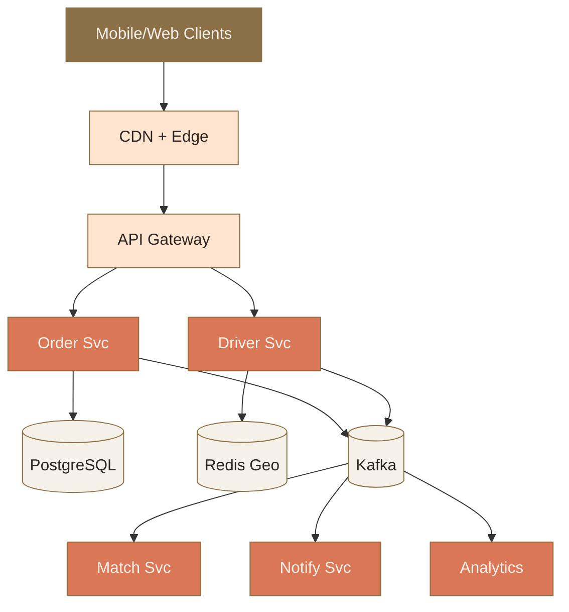

# Appendix · 圖像 Prompts

> Style guide: [`../0_STYLE_GUIDE.md`](../0_STYLE_GUIDE.md)
> Save images to: `software_architect/ppt/assets/diagrams/90-appendix/`

**本章圖像總覽**：3 張 · P3 × 3 · A × 2 · C × 1

---

## Image 01 · Capstone Hero · 案例研究封面

- **Type**: A
- **Priority**: P3
- **Save as**: `software_architect/ppt/assets/diagrams/90-appendix/00_capstone_hero.png`
- **Aspect**: 16:9
- **Prompt**:
  ```
  An editorial illustration of a whiteboard during a system design interview, with a hand-drawn architecture diagram partially complete; sticky notes around the edges with constraints like "1000M DAU", "5 continents", "P99 < 500ms"; an open notebook on the side showing the "5-step interview method".
  Composition: angled view of whiteboard; sticky notes scattered; warm orange marker strokes on the diagram; ample whitespace at top.
  editorial illustration, hand-drawn technical sketch style, warm color palette featuring cream off-white #F5F1E8 background and warm orange #D97757 accents with deep brown #8B6F47 secondary lines, minimalist flat vector with subtle paper texture, clean geometric lines, ample whitespace, educational diagram style, calm composed mood.
  --ar 16:9 --style raw --no photo-realistic, 3d render, neon, gradient glow, cluttered text, watermark, kawaii, anime
  ```

---

## Image 02 · Capstone · Uber Eats 架構

- **Type**: C · 系統架構
- **Priority**: P3
- **Slide**: `90-appendix/00_capstone.md` · HIGH-LEVEL section
- **Save as**: `software_architect/ppt/assets/diagrams/90-appendix/00_capstone_01_architecture.png`
- **Aspect**: 16:9

**Mermaid 原始碼**：


---

## Image 03 · Cheatsheet Hero · 速查表封面

- **Type**: A
- **Priority**: P3
- **Save as**: `software_architect/ppt/assets/diagrams/90-appendix/01_cheatsheet_hero.png`
- **Aspect**: 16:9
- **Prompt**:
  ```
  An editorial illustration of a pocket-sized reference card / flip book opened on a desk, with tabs labeled "NFR / SLA / DB / Patterns / Interview"; a hand reaches for the SLA tab. The card is dense but tidy, like a well-loved pocket reference used by professionals.
  Composition: top-down view; card centered; tabs visible on the right edge; warm sidelight; hand entering from lower-right corner; calm composed mood.
  editorial illustration, hand-drawn technical sketch style, warm color palette featuring cream off-white #F5F1E8 background and warm orange #D97757 accents with deep brown #8B6F47 secondary lines, minimalist flat vector with subtle paper texture, clean geometric lines, ample whitespace, educational diagram style, calm composed mood.
  --ar 16:9 --style raw --no photo-realistic, 3d render, neon, gradient glow, cluttered text, watermark, kawaii, anime
  ```
