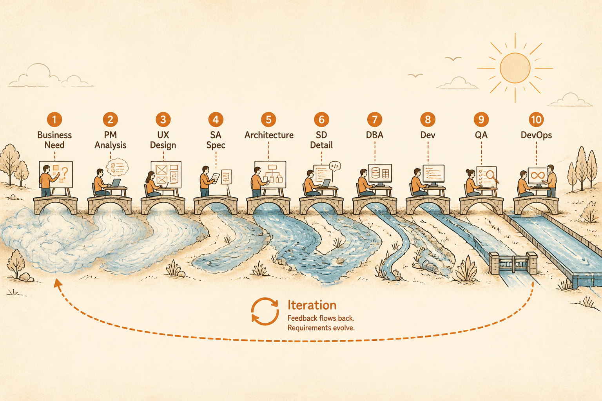

<!-- _class: chapter -->

<div class="ch-no">CHAPTER · 01 · TOPIC 02</div>

# SDLC 完整地圖
## *Software Development Lifecycle*


---


## SDLC · WHY

<span class="kicker">SECTION 1 · WHY</span>

# 為什麼要看「整張流程」？

<br>

<div class="highlight">

**因為小白最容易犯的錯，就是只看到一個切片**：
看到 PM 就以為是寫 Excel 的、看到工程師就以為都在寫 code、
看到 DevOps 就以為是 IT。

**整張地圖看下來**，你才知道每個角色卡在哪一段。

</div>

<br>

<span class="muted">這張地圖是經典 Waterfall + Agile 混合視角——實務上不會這麼線性，但邏輯關係是真的。</span>

> Source: _source/braindump.md · §SDLC 全流程


---


## SDLC · 完整流程

```
   商業需求
      ↓
   需求分析（PM）              「為什麼要做」
      ↓
   體驗設計（UX / UI）         「使用者怎麼走」
      ↓
   系統分析（SA）              「系統怎麼判斷」
      ↓
   架構設計（Architect）       「系統怎麼活下去」
      ↓
   技術設計（SD）              「模組怎麼長」
      ↓
   資料庫設計（DBA）           「資料怎麼存」
      ↓
   前後端開發（Dev）           「真的把它做出來」
      ↓
   測試（QA）                  「確認沒壞」
      ↓
   部署（DevOps）              「上線」
      ↓
   維運（SRE）                 「活著」
      ↓
   迭代（回到 PM）             「持續演進」
```

> Source: _source/braindump.md · §SDLC 全流程


---


<!-- _class: cover -->

<div style="text-align:center;">



</div>


---


## SDLC · 兩種開發節奏

# Waterfall vs Agile

<div class="tradeoff">
  <div class="pro">
    <h3>Waterfall（瀑布）</h3>
    <ul>
      <li>階段清楚、文件重</li>
      <li>大公司、政府專案愛用</li>
      <li>需求穩定時最有效</li>
      <li>適合 1 年以上專案</li>
      <li>反向找 bug 很貴</li>
    </ul>
  </div>
  <div class="con">
    <h3>Agile（敏捷）</h3>
    <ul>
      <li>小步快跑、快速迭代</li>
      <li>新創、互聯網主流</li>
      <li>需求易變時有效</li>
      <li>Sprint 2 週為單位</li>
      <li>文件少、要靠對話</li>
    </ul>
  </div>
</div>

<span class="muted">兩者都需要 9 個角色——只是**節奏與文件量不同**。本教材以 Agile 為主，但概念兩邊都通用。</span>

> Source: _source/braindump.md · §AI 時代的本質沒變


---


## SDLC · 實務上不是線性

<div class="highlight">

**真實的開發節奏**：箭頭會往回拉。

</div>

```
   PM 寫 PRD  ─────►  UX 拉 Wireframe  ─────►  SA 分析
                                                  │
   ◄────────────  「這個流程行不通」（往回打）  ─┘
                                                  │
   ◄────────────  「成本太高，PM 要重排優先級」 ─┘
                                                  │
   Architect 出架構  ◄──────  SA 對齊 ◄─────────┘
```

<span class="muted">**新手最大的誤解**：以為流程是一條單線。真實是**多向回饋的網狀**。Ch.11 會講協作怎麼跑。</span>

> Source: _source/braindump.md · §三層 flow 翻譯


---


<!-- _class: end -->

# SDLC 地圖 完
## *地圖看完，問為什麼要這麼多角色。*

<br>

<span class="lead">→ 1.3 不確定性階梯</span>
