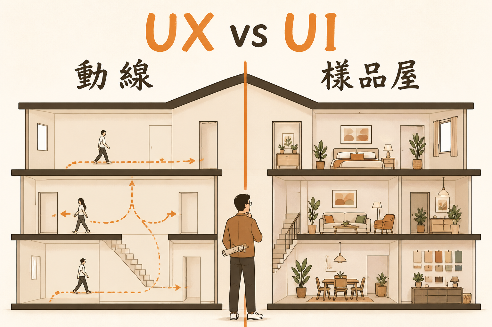

<!-- _class: chapter -->

<div class="ch-no">CHAPTER · 03 · TOPIC 01</div>

# UX / UI 經典產出
## *動線與樣品屋·五個經典產出*


---


## OUTPUTS · UX vs UI 差別

<span class="kicker">SECTION 1 · INSIGHT</span>

# UX 是動線·UI 是樣品屋

<div class="tradeoff">
  <div class="pro">
    <h3>UX（體驗）</h3>
    <ul>
      <li>使用者怎麼完成任務才順</li>
      <li>User Flow / Journey Map</li>
      <li>Wireframe / Prototype</li>
      <li>可用性測試</li>
      <li>關鍵字：動線、順手</li>
    </ul>
  </div>
  <div class="con">
    <h3>UI（介面）</h3>
    <ul>
      <li>畫面清楚、可操作、符合品牌</li>
      <li>Mockup / 視覺稿</li>
      <li>Component Library</li>
      <li>Style Guide</li>
      <li>關鍵字：好看、一致</li>
    </ul>
  </div>
</div>

<span class="muted">**核心金句**：UX 決定「能不能順利做完」，UI 決定「看起來想不想做」。</span>

> Source: _source/braindump.md · §UX vs UI


---


<!-- _class: cover -->

<div style="text-align:center;">



</div>


---


<!-- _class: compact -->

## OUTPUTS · 5 個經典產出

| 產出 | 一句話用途 | 看起來像什麼 |
|---|---|---|
| **User Journey** | 使用者完整體驗地圖 | 時間軸 + 情緒曲線 |
| **Wireframe** | 畫面骨架（無視覺） | 灰階線框圖 |
| **Prototype** | 可點擊互動原型 | Figma 連結 / 模擬 App |
| **Mockup** | 高保真視覺稿 | 含顏色 / 字型 / 圖片 |
| **Design System** | 元件庫 + 規範 | Button / Color / Spacing |

<br>

<span class="muted">**順序**：Journey → Wireframe → Prototype → Mockup → 沉澱成 Design System。</span>

> Source: _source/braindump.md · §UX vs UI


---


## OUTPUTS · Wireframe 長什麼樣

```
┌─────────────────────────────────────┐
│  [Logo]            登入  註冊        │
├─────────────────────────────────────┤
│                                      │
│   忘記密碼？                          │
│                                      │
│   輸入註冊用 email：                  │
│   ┌──────────────────────────┐       │
│   │ ____________________     │       │
│   └──────────────────────────┘       │
│                                      │
│   [ 寄送重設連結 ]                    │
│                                      │
│   <- 回登入                           │
└─────────────────────────────────────┘
```

<span class="muted">Wireframe 不關心顏色字型，只關心**有什麼欄位、按鈕在哪、層級對不對**。</span>

> Source: _source/braindump.md · §UX vs UI


---


## OUTPUTS · 為何 AI 取代不了

<div class="highlight">

**AI 畫得出 Mockup，但畫不出**：

- 這個流程在第 3 步會不會讓阿公阿嬤卡住？
- 品牌調性是「專業冷靜」還是「年輕活潑」？
- 三個方案測下來，使用者真的會用哪一個？

</div>

<br>

- **品味**：知道什麼叫「乾淨」「擁擠」「廉價感」
- **同理心**：站在不熟科技的人的角度看畫面
- **可用性測試**：真的找人來點、看哪裡卡住

<br>

<span class="muted">AI 是 UX/UI 的快速草稿產生器，不是替代——它幫你**畫**得快，不幫你**判斷**好不好用。</span>

> Source: _source/braindump.md · §AI 時代的本質沒變


---


<!-- _class: end -->

# Outputs 完
## *產出講完，看 UX/UI 跟誰打交道。*

<br>

<span class="lead">→ 3.2 UX / UI 邊界</span>
