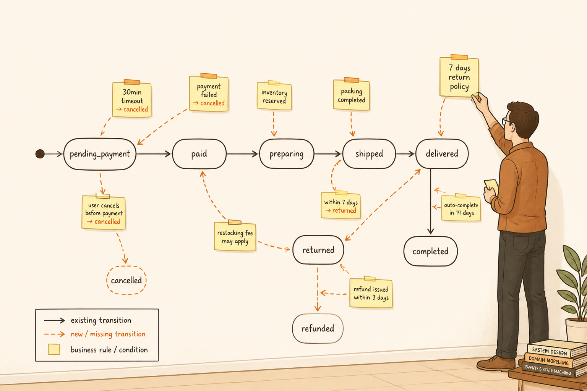

<!-- _class: chapter -->

<div class="ch-no">CHAPTER · 04 · TOPIC 01</div>

# SA 經典產出
## *補規則的縫隙·六個經典產出*


---


## OUTPUTS · 核心心法

<span class="kicker">SECTION 1 · INSIGHT</span>

# SA 在補「規則的縫隙」

<br>

<div class="highlight">

PM 說：「做一個訂單系統。」
UX 畫了結帳流程。

**但沒人說**：30 分鐘不付款怎辦？付完才發現庫存不夠怎辦？
退款超過 7 天還能退嗎？

**這些縫隙 SA 必須補完，Dev 才寫得下去。**

</div>

<br>

<span class="muted">**核心金句**：SA = **補規則的縫隙**——把模糊的需求變成不會卡住的系統。</span>

> Source: _source/braindump.md · §SA · System Analyst


---


<!-- _class: compact -->

## OUTPUTS · 6 個經典產出

| 產出 | 一句話用途 | 看起來像什麼 |
|---|---|---|
| **Use Case** | 使用案例 | UML use case 圖 + 描述表 |
| **State Diagram** | 狀態轉換 | 圓圈 + 箭頭（pending→paid） |
| **Business Rule** | 商業規則 | 條列式規則清單 |
| **Data Dictionary** | 資料字典 | 欄位 + 型別 + 約束表 |
| **Permission Matrix** | 權限矩陣 | 角色 × 操作的核取表 |
| **Exception Flow** | 例外流程 | 失敗 / 邊界情境流程圖 |

<br>

<span class="muted">**Use Case 是 SA 的靈魂**——其他五個都是把 Use Case 拆細的副產物。</span>

> Source: _source/braindump.md · §SA 經典產出


---


## OUTPUTS · 訂單狀態實例

```
pending_payment → paid → preparing → shipped → completed
```

**SA 補的規則**（這才是 SA 的價值）：

- 若 **30 分鐘內未付款** → 自動取消訂單
- 若 **付款成功但庫存不足** → 進入人工處理
- 若 **使用者取消但商品已出貨** → 不允許取消
- 若 **退款申請超過 7 天** → 不允許退款

<br>

<div class="alert">

PM 給的只是箭頭，**SA 給的是箭頭旁邊的條件**——這是新手最容易漏掉的層次。

</div>

> Source: _source/braindump.md · §SA 補規則的範例


---


<!-- _class: cover -->

<div style="text-align:center;">



</div>


---


## OUTPUTS · 為何 AI 取代不了

<div class="highlight">

**AI 寫得出 Use Case，但寫不出**：

- 這家公司「退款 7 天」是業界慣例還是公司政策？
- 超商取貨逾期沒拿，要不要罰錢？罰多少？
- 海外訂單跟國內訂單規則一樣嗎？

</div>

<br>

- **領域知識**：電商 / 金融 / 醫療每行規則不同
- **邊界情境**：靠經驗想到「萬一 A 又 B 又 C 怎辦」
- **跨部門協調**：跟客服 / 法務 / 財務確認規則

<br>

<span class="muted">AI 幫你**整理**已知規則很快，但**挖出未知規則**還是要靠人問、靠人想。</span>

> Source: _source/braindump.md · §AI 時代的本質沒變


---


<!-- _class: end -->

# Outputs 完
## *產出講完，看 SA 跟誰打交道。*

<br>

<span class="lead">→ 4.2 SA 邊界</span>
