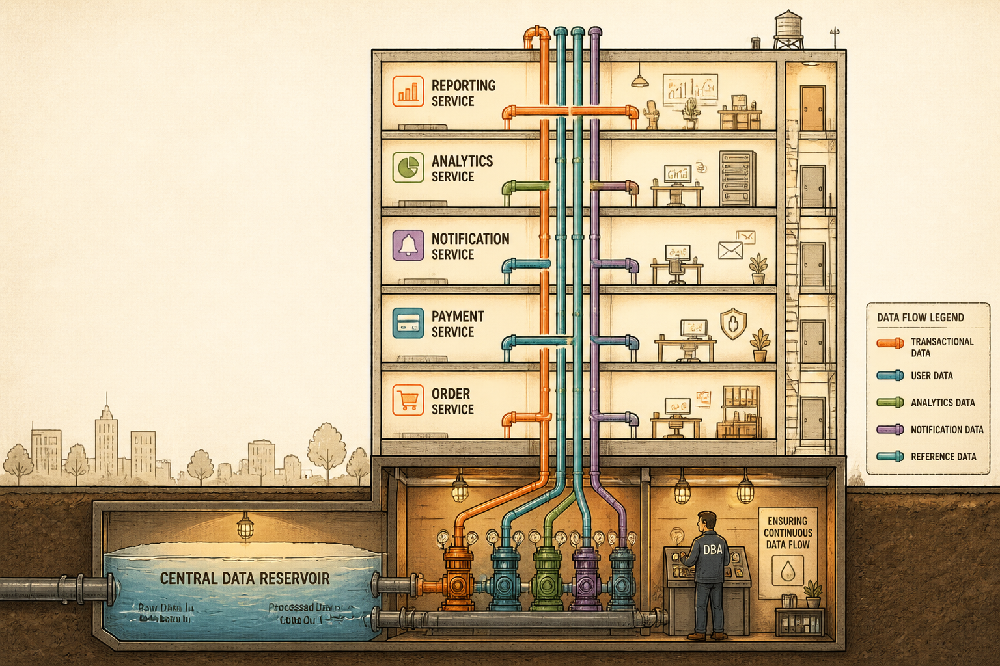

<!-- _class: chapter -->

<div class="ch-no">CHAPTER · 07 · TOPIC 01</div>

# DBA 經典產出
## *資料怎麼存·怎麼活·怎麼回得來*


---


<!-- _class: cover -->

<div style="text-align:center;">



</div>


---


## OUTPUTS · 5 個經典產出

<span class="kicker">SECTION 1 · DELIVERABLES</span>

# DBA 不是只交一張表

<!-- _class: compact -->

| 產出 | 一句話用途 | 看起來像什麼 |
|---|---|---|
| **ERD** | 資料實體關聯圖 | dbdiagram.io / draw.io 圖 |
| **Schema + Index** | 表結構 + 索引策略 | DDL 腳本 + 索引註解 |
| **Transaction 策略** | 多步驟一致性方案 | Saga / Outbox / 鎖表規則 |
| **Backup Plan** | 備份還原計劃 | RPO / RTO / PITR 文件 |
| **Data Governance** | 保留 / 稽核 / 權限 | retention policy + ACL |

<br>

<span class="muted">**核心**：DBA 不是寫 `CREATE TABLE` 完就結束，是把這 5 件事連在一起設計。</span>

> Source: _source/braindump.md · §DBA 介入時機


---


## OUTPUTS · ERD / Schema 長這樣

```
┌─────────────┐         ┌──────────────┐
│   orders    │ 1     N │ order_items  │
├─────────────┤────────►├──────────────┤
│ order_no PK │         │ id PK        │
│ user_id FK  │         │ order_no FK  │
│ status      │         │ sku_id FK    │
│ created_at  │         │ qty / price  │
└─────────────┘         └──────────────┘
        │
        │ 1     N
        ▼
┌─────────────┐
│payment_recs │   index: (status, updated_at)
├─────────────┤   index: (user_id, created_at)
│ id PK       │   partition: by created_at (month)
│ order_no FK │
│ amount      │
└─────────────┘
```

<span class="muted">**重點不在畫得漂亮**，而是：寫入瓶頸在哪？查詢熱點是什麼？要不要 partition？</span>

> Source: _source/braindump.md · §訂單系統實例（Ch.12 baseline）


---


## OUTPUTS · 複合索引與一致性

<div class="highlight">

**索引不是越多越好**——每加一個索引，寫入就慢一點。
複合索引的**欄位順序**會決定它能不能被用上。

</div>

<br>

**例**：`(status, updated_at)` vs `(updated_at, status)`
→ 查「待處理的最新訂單」用前者；查「最近一週的所有訂單」用後者。

<br>

**一致性**：訂單付款扣庫存——同一個 transaction 還是分散在兩個服務？
- **單庫**：用 DB transaction 鎖一鎖就好
- **跨服務**：必須用 **Saga / Outbox Pattern** 補償，不能假裝 transaction 存在

<br>

<span class="muted">**這就是 DBA 的判斷**：哪裡能鎖、哪裡不能鎖、哪裡要補償。</span>

> Source: _source/braindump.md · §訂單系統實例（Ch.12 baseline）


---


## OUTPUTS · 為何 AI 取代不了

<div class="highlight">

**AI 寫得出 DDL，但寫不出**：

- 這個欄位要不要建索引？建了寫入會慢多少？
- 這張表三年後會長到多大？要不要 partition？
- 這個 transaction 邊界畫在哪裡才不會死鎖？

</div>

<br>

- **業務 context**：訂單跟金流不是技術問題，是業務一致性問題
- **效能經驗**：慢查詢一看 execution plan 就知道哪錯
- **災難判斷**：備份還原不是「有跑就好」，是「真出事還回得來」

<br>

<span class="muted">AI 是 DBA 的助手——它幫你**寫**得快，不幫你**判斷**資料對不對得回來。</span>

> Source: _source/braindump.md · §AI 時代的本質沒變


---


<!-- _class: end -->

# Outputs 完
## *產出講完，看 DBA 跟誰打交道。*

<br>

<span class="lead">→ 7.2 DBA 邊界</span>
