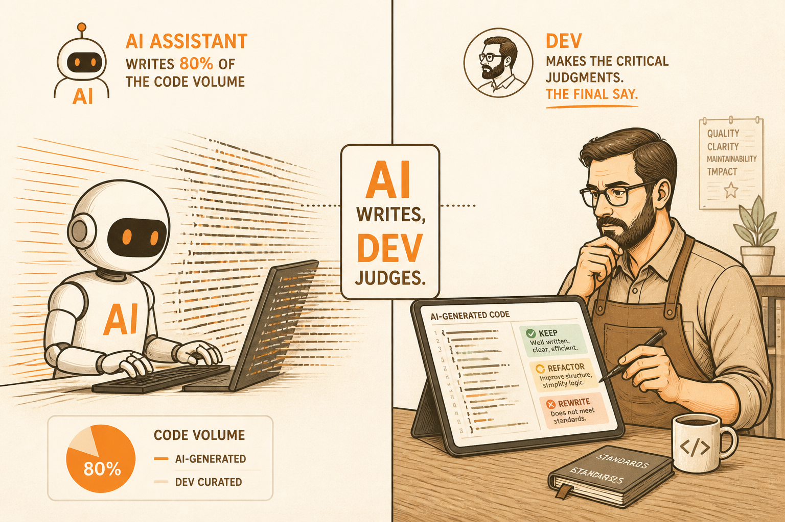

<!-- _class: chapter -->

<div class="ch-no">CHAPTER · 08 · TOPIC 01</div>

# Dev 經典產出
## *Code 之外·還要交什麼*


---


## OUTPUTS · 5 個經典產出

<span class="kicker">SECTION 1 · DELIVERABLES</span>

# Dev 不是只交 code

<!-- _class: compact -->

| 產出 | 一句話用途 | 看起來像什麼 |
|---|---|---|
| **Code (PR diff)** | 可運行的程式碼 | GitHub PR / GitLab MR |
| **Unit Tests** | 驗證自己寫的單元 | 跟 PR 一起進去的 test 檔 |
| **Documentation** | 留給未來的自己 | README / docstring / ADR |
| **Build Artifacts** | 可部署的產物 | Docker image / npm package |
| **Tech Spike / PoC** | 不確定方案先試 | 一個小 demo repo + 心得 |

<br>

<span class="muted">**核心**：只交 code 不交 test 跟文件的 Dev——是工人，不是師傅。</span>

> Source: _source/braindump.md · §開發流程（以前）


---


## OUTPUTS · PR + Commit 長這樣

```
feat(order): add idempotent cancel order API

Why:
- Mobile retries on flaky network were creating duplicate
  cancel requests, causing refund_records mismatch.

How:
- Add idempotency_key column to cancel_requests
- Wrap state transition + refund write in single tx
- Return 200 with original result if key already seen

Test:
- Unit: state machine transition table (12 cases)
- Integration: concurrent duplicate cancel → single refund

Risk:
- Existing in-flight cancels not affected (new column nullable)

Closes #482
```

<span class="muted">**好的 PR** 講 **Why** 不只 What——Code Review 才看得快。</span>

> Source: _source/braindump.md · §開發流程（以前）


---


## OUTPUTS · 核心概念（一語帶過）

<div class="highlight">

這些概念是 Dev 的**基本功**，不是面試題：

</div>

<br>

- **Layered Architecture**：Controller → Service → Repository → DB——責任分層
- **SOLID**：5 個物件導向原則——讓 code 改起來不痛
- **Clean Code**：命名 / 函式短 / 沒副作用——讀的人比寫的人多 10 倍
- **Design Pattern**：Factory / Strategy / Observer…——是**詞彙**，不是套用模板

<br>

<span class="muted">**重點**：這些不是拿來秀的，是拿來**讓三年後的你不恨自己**的。本教材不展開——挑一本經典書讀。</span>

> Source: _source/braindump.md · §開發流程（以前）


---


<!-- _class: cover -->

<div style="text-align:center;">



</div>


---


## OUTPUTS · 為何 AI 取代不了

<div class="highlight">

**重要轉折**：AI 可以寫 80% 的 code——這是事實。
但剩下的 20%，是 Dev 真正的價值。

</div>

<br>

- **架構 fit**：這段 AI 寫的 code 塞進我們的 codebase 合不合？
- **Debug**：production 出事 3am，AI 告訴你五個可能、你得**選一個下手**
- **業務理解**：訂單為什麼這時候要鎖、那時候不能鎖
- **Code Review**：別人寫的（含 AI 的）能不能合進主幹
- **命名**：`getUserData()` vs `fetchActiveSubscribers()`——AI 不知道哪個對

<br>

<span class="muted">**核心金句**：AI 時代，Dev 的價值從「**寫 code**」變成「**判斷該寫什麼 code**」。</span>

> Source: _source/braindump.md · §AI 時代的本質沒變


---


<!-- _class: end -->

# Outputs 完
## *產出講完，看 Dev 跟誰打交道。*

<br>

<span class="lead">→ 8.2 Dev 邊界</span>
