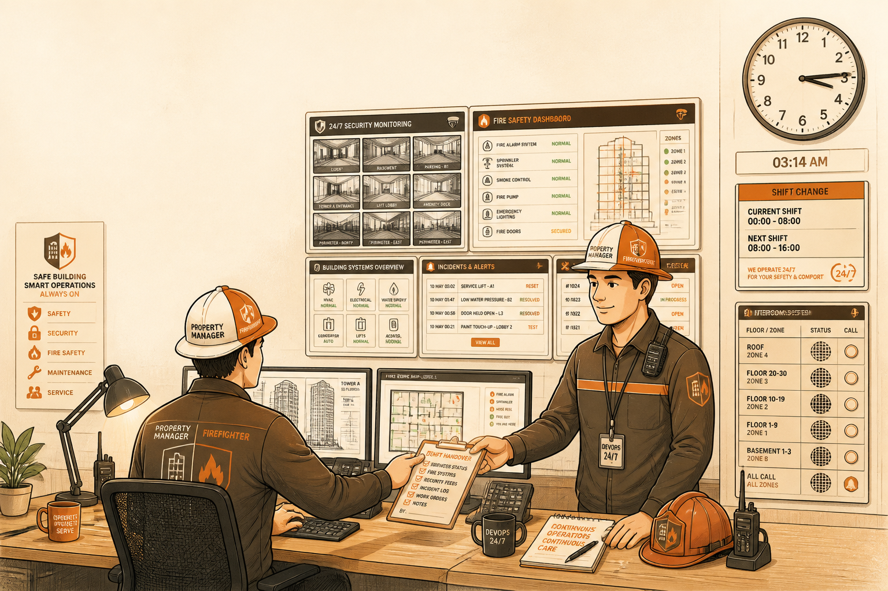

<!-- _class: chapter -->

<div class="ch-no">CHAPTER · 10 · OVERVIEW</div>

# DevOps / SRE
## *物業管理·不是水電工*


---


<!-- _class: cover -->

<div style="text-align:center;">



</div>


---


## ROLE · 蓋房子對應

<span class="kicker">METAPHOR ANCHOR</span>

# DevOps / SRE = 物業 + 24h 保全 + 消防

<div class="stack">
  <div class="layer client">PM / UX / SA　 決定要蓋什麼、規則怎麼跑</div>
  <div class="layer app">Architect / SD / DBA　 結構、模組、資料</div>
  <div class="layer data">Dev / QA　 工班把樓蓋起來、驗收員把關</div>
  <div class="layer infra"><strong>DevOps / SRE ← 你在這</strong>　 上線後讓系統持續活著</div>
</div>

<br>

<span class="muted">**一句話**：上線後讓系統持續活著——CI/CD、監控、on-call、災難演練。</span>

> Source: _source/braindump.md · §DevOps / SRE 視角


---


## ROLE · DevOps vs SRE 一句話講完

<div class="alert">

**最常見誤解**：以為 DevOps 就是「裝完伺服器就走的水電工」。

</div>

水電工：來通一次水管、接好電就結束。
**DevOps 是物業管理**——24h on-call、定期消防演練、突發停水搶修、跨樓層協調。

<br>

- **DevOps** = **文化 + 工具鏈**（Dev 與 Ops 不分家、自動化一切）
- **SRE** = **Google 命名的角色**，強調用**可靠性指標**（SLO / Error Budget）管理運維
- 實務上常合稱，大公司 SRE 偏資深、定 SLO；中小公司一個人扛全部

<br>

<span class="muted">**核心金句**：DevOps 不是裝完就走的水電工，是**24 小時待命的物業管理**。</span>

> Source: _source/braindump.md · §DevOps / SRE 視角


---


## ROLE · 一天時間分配

# 真實 DevOps / SRE 一天大概在幹嘛

```
   CI/CD pipeline 維護        ███████       22%
   監控告警 / 看 dashboard    ██████        18%
   on-call / 處理 incident    ██████        18%
   Infra as Code 編寫         █████         15%
   容量規劃 / cost 優化       ████          12%
   跨團隊協調（Dev/QA/SA）    ███           10%
   災難演練 / runbook         █             5%
```

<br>

<span class="muted">**反差**：平時看似閒，**半夜 alert 響起時，整個公司的營收都壓在你身上**。</span>

> Source: _source/braindump.md · §DevOps / SRE 視角


---


## OBJECTIVES · 學習目標

# 看完 Ch.10 你能回答

<div class="stack">
  <div class="layer client"><strong>① DevOps 跟 SRE 差在哪？</strong>　 文化 vs 角色命名</div>
  <div class="layer app"><strong>② 5 個經典產出？</strong>　 CI/CD / IaC / Monitor / Runbook / Incident</div>
  <div class="layer data"><strong>③ SLO / SLA / SLI 是什麼？</strong>　 為什麼要 Error Budget</div>
  <div class="layer infra"><strong>④ 半夜 alert 響，誰先 on-call？</strong>　 Dev 還是 DevOps</div>
</div>

> Source: _source/braindump.md · §DevOps / SRE 視角


---


<!-- _class: end -->

# Overview 完
## *看完角色，看具體產出。*

<br>

<span class="lead">→ 10.1 DevOps / SRE 經典產出</span>
