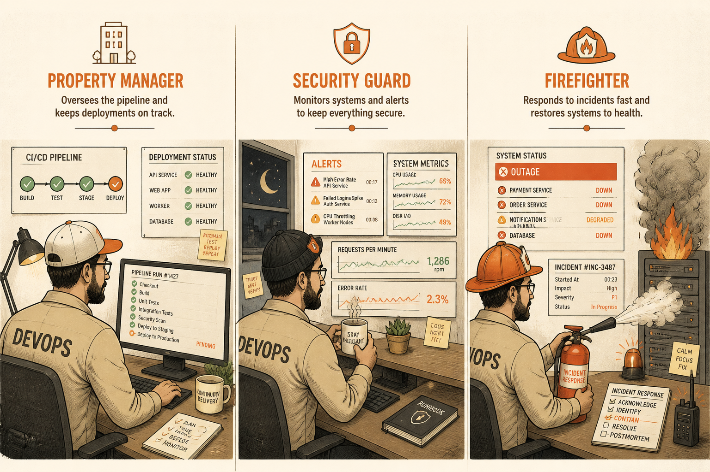

<!-- _class: chapter -->

<div class="ch-no">CHAPTER · 10 · TOPIC 01</div>

# DevOps / SRE 經典產出
## *把運維變成可重複的程式碼*


---


<!-- _class: cover -->

<div style="text-align:center;">



</div>


---


<!-- _class: compact -->

## OUTPUTS · 5 個經典產出

<span class="kicker">SECTION 1 · ARTIFACTS</span>

| 產出 | 一句話用途 | 看起來像什麼 |
|---|---|---|
| **CI/CD Pipeline** | 自動測試 + 部署 | `.gitlab-ci.yml` / GitHub Actions |
| **Infra as Code** | 用程式定義基礎設施 | Terraform / Ansible / Helm |
| **Monitoring Dashboard** | 系統健康即時可見 | Grafana / Datadog / CloudWatch |
| **Runbook** | 出事時誰按哪個鈕 | Confluence SOP / on-call playbook |
| **Incident Report** | 事後檢討（Postmortem） | RCA + 行動項 + 對誰責任 |

<br>

<span class="muted">**核心**：產出不是「裝好機器」，是**讓運維本身可被版本控制、可被重複**。</span>

> Source: _source/braindump.md · §DevOps / SRE 視角


---


## OUTPUTS · CI/CD Pipeline 長什麼樣

```yaml
# .github/workflows/deploy.yml
stages:
  - lint        # 程式風格檢查
  - test        # 跑 unit + integration（Dev/QA 產出）
  - build       # 打包 Docker image
  - scan        # SAST / 漏洞掃描
  - deploy_stg  # 部署到 staging（自動）
  - e2e         # 跑 QA 的 E2E suite
  - deploy_prod # 部署到 production（需手動 approve）
  - smoke       # 上線後 smoke test
  - notify      # 通知 Slack + 更新 release notes
```

<span class="muted">**重點**：每次 commit 都跑這條 pipeline——**從 code 到上線完全自動化、可追溯、可 rollback**。</span>

> Source: _source/braindump.md · §開發流程（以前）


---


<!-- _class: compact -->

## OUTPUTS · SLO / SLA / SLI / Error Budget

| 名詞 | 一句話 | 範例 |
|---|---|---|
| **SLI** | 量測指標 | 「API 回應 < 300ms 的比例」 |
| **SLO** | 內部目標 | 「99.9% 的請求 < 300ms」 |
| **SLA** | 對外承諾（賠錢條款） | 「99.5% 否則退錢 10%」 |
| **Error Budget** | 允許壞掉的額度 | 99.9% SLO → 每月可壞 43 分鐘 |
| **Blue-Green** | 兩套環境切換部署 | 出錯秒切回舊版 |
| **Canary** | 流量先放 1% 試水 | 安全才放大到 100% |

<br>

<span class="muted">**核心**：**SLA > SLO > SLI**——對外承諾最嚴格，內部目標留 buffer，指標是基礎量測。</span>

> Source: _source/braindump.md · §Availability


---


## OUTPUTS · 為何 AI 取代不了

<div class="highlight">

**AI 寫得出 Terraform，但寫不出**：

- 半夜 3 點 alert，是 DB 慢、CDN 掛、還是被 DDoS？
- 黑五流量會是平日 5 倍還是 50 倍？容量要備多少？
- Dev 想推這個 hotfix、SRE 想 block——誰贏？

</div>

<br>

- **Incident 判斷**：靠多年踩坑的直覺，AI 沒被 paged 過
- **容量規劃**：商業節奏 + 成本 + 風險的三方權衡
- **跨團隊政治**：說服 Dev 接受 release gate 需要信任

<br>

<span class="muted">AI 是 DevOps 的助手——它幫你**寫 YAML**，不幫你決定**該不該 deploy**。</span>

> Source: _source/braindump.md · §AI 時代的本質沒變


---


<!-- _class: end -->

# Outputs 完
## *產出講完，看 DevOps 跟誰打交道。*

<br>

<span class="lead">→ 10.2 DevOps 邊界</span>
