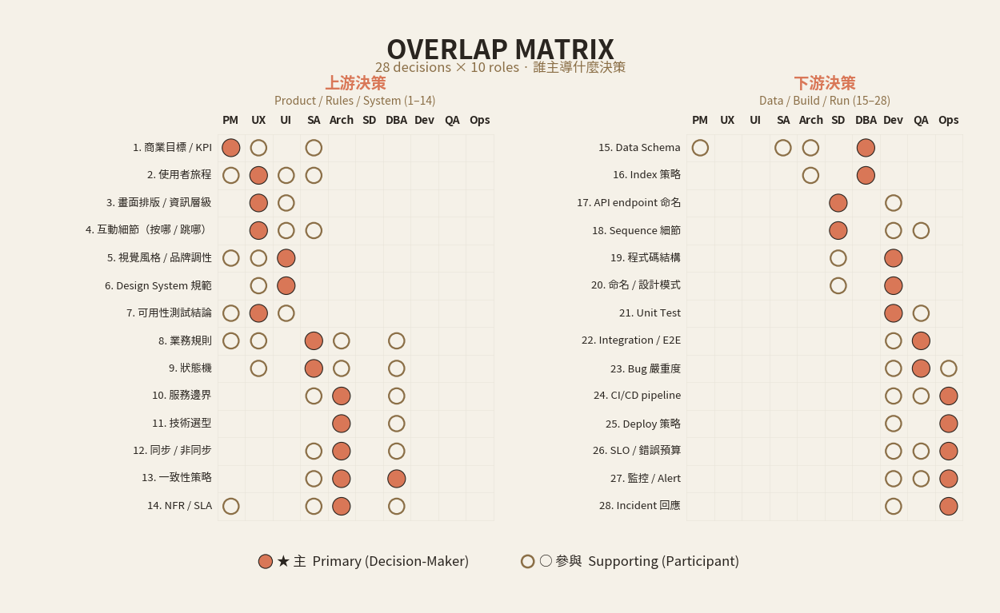

<!-- _class: chapter -->

CHAPTER · 11 · TOPIC 02

# Overlap 矩陣
## *誰主導什麼決策*

---

## MATRIX · WHY

SECTION 1 · WHY

# 為什麼角色會 overlap？

 

**很多事情不只一個角色碰**：
API 名稱 SD / Dev / Architect 都會講
資料 schema PM / SA / Architect / DBA / Dev 都會講
測試案例 SA / Dev / QA 都會講

**Overlap 不是壞事**——是必要的多重視角。
**問題不是 overlap，是 overlap 時誰拍板。**

> Source: _source/braindump.md · §SA vs Architect

---

<!-- _class: compact -->

## MATRIX · ① 產品與體驗層

| 決策 | PM | UX | UI | SA |
|---|---|---|---|---|
| 商業目標 / KPI | ★ 主 | 參與 | – | 參與 |
| 使用者旅程 | 參與 | ★ 主 | 參與 | 參與 |
| 畫面排版 / 資訊層級 | – | ★ 主 | 參與 | – |
| 互動細節（按哪 / 跳哪） | – | ★ 主 | 參與 | 參與 |
| 視覺風格 / 品牌調性 | 參與 | 參與 | ★ 主 | – |
| Design System 規範 | – | 參與 | ★ 主 | – |
| 可用性測試結論 | 參與 | ★ 主 | 參與 | – |

**UX vs UI 的分界**：動線與骨架歸 UX，視覺與元件歸 UI。**兩個都不主導業務規則**——那是 SA 的事。

> Source: _source/braindump.md · §UX vs UI

---

<!-- _class: compact -->

## MATRIX · ② 規則與系統層

| 決策 | PM | UX | SA | Arch | DBA |
|---|---|---|---|---|---|
| 業務規則 | 參與 | 參與 | ★ 主 | 參與 | 參與 |
| 狀態機 | – | 參與 | ★ 主 | 參與 | 參與 |
| 服務邊界 | – | – | 參與 | ★ 主 | 參與 |
| 技術選型 | – | – | – | ★ 主 | 參與 |
| 同步 / 非同步 | – | – | 參與 | ★ 主 | 參與 |
| Data Schema | 參與 | – | 參與 | 參與 | ★ 主 |
| Index 策略 | – | – | – | 參與 | ★ 主 |
| 一致性策略 | – | – | 參與 | ★ 主 | ★ 主 |
| NFR / SLA | 參與 | – | 參與 | ★ 主 | 參與 |

**NFR / SLA 由 Architect 定設計目標**；上線後的 **SLO / 錯誤預算由 DevOps 定運行門檻**（見表 ③）——同一件事的兩面。

> Source: _source/braindump.md · §SA vs Architect

---

<!-- _class: compact -->

## MATRIX · ③ 實作與交付層

| 決策 | SD | Dev | QA | DevOps |
|---|---|---|---|---|
| API endpoint 命名 | ★ 主 | 參與 | – | – |
| Sequence 細節 | ★ 主 | 參與 | 參與 | – |
| 程式碼結構 | 參與 | ★ 主 | – | – |
| 命名 / 設計模式 | 參與 | ★ 主 | – | – |
| Unit Test | – | ★ 主 | 參與 | – |
| Integration / E2E | – | 參與 | ★ 主 | – |
| Bug 嚴重度 | – | 參與 | ★ 主 | 參與 |

**Dev vs QA 的分界**：Dev 主導 unit（單一單元對），QA 主導 integration / E2E（整棟樓不會塌）。

> Source: _source/braindump.md · §SDLC 全流程

---

<!-- _class: compact -->

## MATRIX · ④ 維運與可靠性層

| 決策 | SD | Dev | QA | DevOps |
|---|---|---|---|---|
| CI/CD pipeline | – | 參與 | 參與 | ★ 主 |
| Deploy 策略 | – | 參與 | – | ★ 主 |
| SLO / 錯誤預算 | – | 參與 | 參與 | ★ 主 |
| 監控 / Alert | – | 參與 | 參與 | ★ 主 |
| Incident 回應 | – | 參與 | – | ★ 主 |

**這一層 DevOps 全部是 ★ 主**——但每一格 Dev 都「參與」。維運不是丟給 DevOps 就沒事，**寫 code 的人要看得懂自己的 alert**。

> Source: _source/braindump.md · §DevOps / SRE 視角

---

<!-- _class: cover -->

---

## MATRIX · 看懂這個矩陣

**讀法 1 · 直看**：找一個決策，看「★ 主」是誰——那是拍板人。

**讀法 2 · 橫看**：找一個角色，看他主導哪些決策——這是 JD 的本質。

**讀法 3 · 看 overlap**：一致性策略 Architect / DBA 都是 ★ 主——這就是 Ch.11.4 衝突場景的雷區。

 

**核心**：好的團隊讓「★ 主」之外的「參與」角色**真的有聲音**——不是橡皮圖章。

> Source: _source/braindump.md · §角色 = 消除不確定性

---

<!-- _class: end -->

# Overlap Matrix 完
## *看完矩陣，看三層 Flow 翻譯。*

 

→ 11.3 Three Views
